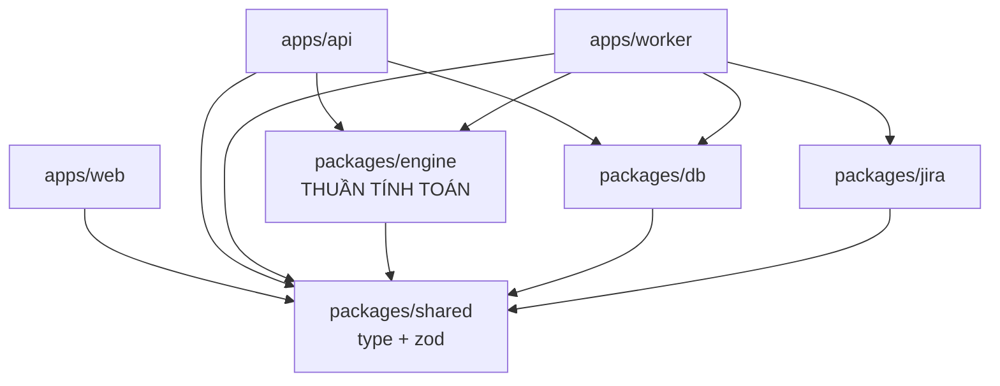

# Kiến trúc thư mục & ranh giới module

Tài liệu này chốt **cấu trúc thư mục** và **quy tắc phụ thuộc** của dự án.
Nguồn sự thật về nghiệp vụ vẫn là [PRD](./PRD_Burndown_Engine.md); tài liệu này chỉ nói về chỗ để code.

> **Vì sao phải chốt trước khi viết task card:** trường `touches:` trong mỗi card là cơ chế phát hiện xung đột khi chạy nhiều agent song song. Nếu cấu trúc thư mục đổi giữa chừng thì mọi `touches` đã viết đều sai.

---

## 1. Cây thư mục

```
ProgressTracking/
├── apps/
│   ├── api/                 REST API (Fastify) — chỉ điều phối, không chứa logic nghiệp vụ
│   │   └── src/
│   │       ├── routes/      1 file / nhóm endpoint
│   │       ├── plugins/     auth, error handler, request logger
│   │       └── server.ts
│   ├── worker/              BullMQ worker: job đêm, backfill, recompute
│   │   └── src/
│   │       ├── jobs/        1 file / loại job
│   │       ├── scheduler.ts CRON 00:01
│   │       └── main.ts
│   └── web/                 React + Vite SPA
│       └── src/
│           ├── pages/       1 thư mục / màn hình
│           ├── components/  dùng lại được, không gọi API trực tiếp
│           ├── api/         TanStack Query hooks — chỗ DUY NHẤT gọi fetch
│           └── main.tsx
│
├── packages/
│   ├── engine/              THUẦN TÍNH TOÁN — trái tim của hệ thống
│   │   └── src/
│   │       ├── parser/      tách tiêu đề Task & Sub-task (PRD §2.2, §2.9)
│   │       ├── calendar/    ngày làm việc, múi giờ (PRD §9.4)
│   │       ├── remaining/   3 quy tắc tính Remaining (PRD §4.3.2)
│   │       ├── rollup/      tổng hợp ngày Phase (PRD §2.7)
│   │       ├── planned/     đường Kế hoạch (PRD §4.3.1)
│   │       ├── snapshot/    dựng snapshot 1 ngày (PRD §4.4)
│   │       └── signboard/   cây quyết định trạng thái (PRD §6.3)
│   ├── db/                  Prisma schema, migration, query
│   │   ├── prisma/schema.prisma
│   │   └── src/repositories/
│   ├── jira/                Jira client: auth, phân trang, rate limit, retry
│   │   └── src/
│   └── shared/              type + zod schema dùng chung FE và BE
│       └── src/
│
├── config/
│   └── jira-fields.yaml     ánh xạ custom field wbs_* (PRD §2.8)
│
└── docs/
    ├── PRD_Burndown_Engine.md
    ├── ARCHITECTURE.md      ← file này
    └── tasks/
        ├── _TEMPLATE.md
        ├── CONVENTIONS.md
        ├── README.md        bảng tổng hợp + sơ đồ phụ thuộc
        └── T-NN-*.md        task card
```

---

## 2. Quy tắc phụ thuộc — một chiều, không có ngoại lệ



| Được phép | Bị cấm |
|---|---|
| `api` → `engine`, `db`, `shared` | `engine` → `db` hoặc `jira` |
| `api` → `jira` **chỉ để tra cứu ngắn** (xem dưới) | `db` → `jira` hoặc `engine` |
| `worker` → `engine`, `db`, `jira`, `shared` | `shared` → bất cứ package nào |
| `engine` → `shared` (và **chỉ** `shared`) | `web` → `engine`, `db`, `jira` |
| `db` → `shared` | |

### `api` → `jira`: cho phép hẹp, có điều kiện

*(Bổ sung khi làm T-10, 2026-08-03. Bản đầu cấm hẳn.)*

Hai endpoint **bắt buộc** phải hỏi Jira ngay trong request, không thể đẩy sang worker:

| Endpoint | Vì sao phải đồng bộ |
|---|---|
| `POST /api/epics/validate` | PM dán một danh sách key và cần thấy kết quả từng dòng **ngay**. Đẩy sang worker rồi bắt hỏi lại là biến một hộp thoại thành một quy trình chờ đợi |
| `GET /api/epics/browse` | Duyệt Epic của project để tích chọn — không có gì trong database để đọc, vì đây đúng là những Epic **chưa** được theo dõi |

**Điều kiện, không được nới thêm:**

1. **Chỉ đọc, và phải có giới hạn cứng** — tối đa 100 key mỗi lần, `browse` bắt buộc phân trang. Không có vòng lặp nào chạy theo số Epic.
2. **Số lần gọi không được tăng theo số key.** `validate` dùng đúng 3 lần `POST /search` dù có 1 hay 100 key.
3. **Mọi việc dài hơi vẫn thuộc worker** — đồng bộ, backfill, tính lại. Những thứ đó mất vài phút và sẽ làm request timeout.
4. **Tầng service không được biết tới Jira.** Nó chỉ nhìn thấy cổng `JiraEpicPort`; chỉ đúng một file bộ chuyển đổi được import `@app/jira`. Nhờ vậy service vẫn test được mà không cần Jira sandbox — đó mới là lý do thật sự của ràng buộc này.

> Lý do gốc của lệnh cấm là **không để việc dài hơi lọt vào đường request đồng bộ**, chứ không phải bản thân việc import. Hai endpoint trên không vi phạm điều đó.

### Vì sao `engine` không được đụng `db` và `jira`

Đây là ràng buộc quan trọng nhất trong dự án.

`packages/engine` chứa toàn bộ logic mà PRD kiểm chứng bằng **20 golden dataset** (PRD §8.2). Nếu engine import `db` hay `jira`, muốn chạy test sẽ phải dựng PostgreSQL và một Jira sandbox — bộ test đang từ vài giây thành vài phút, và sẽ không ai chạy nó nữa.

Giữ engine thuần nghĩa là: **đầu vào là dữ liệu đã nạp sẵn trong RAM, đầu ra là dữ liệu**. Không đọc file, không gọi mạng, không đọc đồng hồ hệ thống.

**Bắt buộc có lint rule chặn:**

```jsonc
// .eslintrc — trong packages/engine
"no-restricted-imports": ["error", {
  "patterns": ["@app/db*", "@app/jira*", "**/db/**", "**/jira/**"]
}]
```

### `engine` không được đọc đồng hồ

Mọi hàm cần "hôm nay" đều phải **nhận ngày qua tham số**, không gọi `new Date()` hay `Date.now()`.

```typescript
// SAI — không test được, và sẽ hỏng theo thời gian
function resolveStatus(sub: Subtask): SignboardStatus {
  const today = new Date();
  ...
}

// ĐÚNG — test đóng băng được đồng hồ, gọi lúc nào cũng ra kết quả cũ
function resolveStatus(sub: Subtask, asOfDate: string, tz: string): SignboardStatus {
  ...
}
```

Lý do cụ thể: trạng thái Signboard phụ thuộc *hôm nay là ngày nào* (PRD §6.3). Test không đóng băng đồng hồ sẽ xanh hôm nay và đỏ tuần sau. Xem PRD §8.1.

**Lint rule bắt buộc:**

```jsonc
// .eslintrc — trong packages/engine
"no-restricted-globals": ["error", "Date"],
"no-restricted-syntax": ["error", {
  "selector": "NewExpression[callee.name='Date']",
  "message": "engine/ không được đọc đồng hồ. Nhận ngày qua tham số."
}]
```

### Ranh giới xác thực (bổ sung khi lắp SSO, 2026-08-09)

`apps/api` **không tự đăng nhập người dùng**. Một auth proxy (SSO/OIDC) đứng trước, đặt header danh tính `x-user-id` = email đã xác thực và **xoá mọi `x-user-*`** client tự gửi. API chỉ tin danh tính đó rồi **tra vai trò ở bảng `app_user`** — KHÔNG tin `role` từ header. Vai trò/`projects` là dữ liệu của hệ thống (bảng `app_user`, `project`), không suy từ Jira.

Danh tính được phân giải một lần mỗi request trong một hook `onRequest` (`apps/api/src/adapters/principal.ts`), nên tầng route vẫn đọc `resolvePrincipal(req)` đồng bộ như cũ. Chi tiết: [AUTH.md](./AUTH.md); cấu hình cổng: [`config/auth-proxy/`](../config/auth-proxy/).

---

## 3. Bảng phân vùng — dùng cho trường `touches:` của task card

| Vùng | Đường dẫn | Ai đụng |
|---|---|---|
| Schema DB | `packages/db/prisma/**` | Chỉ T-02. Card khác cần đổi schema → tạo migration mới, **không sửa migration cũ** |
| Repository | `packages/db/src/repositories/**` | Nhiều card, mỗi card một file riêng |
| Jira client | `packages/jira/src/**` | T-03, T-04, T-05 |
| Engine — parser | `packages/engine/src/parser/**` | T-07, T-08 |
| Engine — calendar | `packages/engine/src/calendar/**` | T-12 |
| Engine — remaining | `packages/engine/src/remaining/**` | T-13 |
| Engine — rollup | `packages/engine/src/rollup/**` | T-14, T-15 |
| Engine — planned | `packages/engine/src/planned/**` | T-16 |
| Engine — snapshot | `packages/engine/src/snapshot/**` | T-17 |
| Engine — signboard | `packages/engine/src/signboard/**` | T-22 |
| API routes | `apps/api/src/routes/**` | Mỗi card một file route riêng |
| Worker jobs | `apps/worker/src/jobs/**` | T-11, T-18 |
| Web | `apps/web/src/**` | T-20, T-21 |
| Type dùng chung | `packages/shared/src/**` | **Nhiều card cùng đụng** — xem cảnh báo dưới |

> ⚠️ **`packages/shared` là điểm nghẽn xung đột.** Gần như card nào cũng cần thêm type vào đây. Quy ước: **mỗi card tạo một file riêng** (`shared/src/phase.ts`, `shared/src/signboard.ts`…), và chỉ thêm một dòng export vào `index.ts`. Không gom mọi type vào một file.

---

## 4. Công cụ đã chốt

| Hạng mục | Lựa chọn | Ghi chú |
|---|---|---|
| Monorepo | pnpm workspaces | Nhẹ, không cần Nx/Turborepo cho quy mô này |
| Ngôn ngữ | TypeScript, `strict: true` | Cấm `any` trong `packages/engine` (PRD §8.5) |
| API framework | Fastify | Nhẹ, có sẵn schema validation |
| ORM | Prisma | Migration có versioning, rollback được |
| Hàng đợi | BullMQ (trên Redis) | PRD §4.1 |
| Ngày giờ | **luxon** | Bắt buộc, cấm tự cộng offset (PRD §9.4) |
| Regex an toàn | **re2** | Cho regex do người dùng nhập (PRD E-20) |
| Validate | zod | Dùng chung FE-BE qua `packages/shared` |
| Test | Vitest + Testcontainers | PRD §8.1 |
| E2E | Playwright | PRD §8.1 |
| Frontend | React + Vite + TanStack Query | Biểu đồ: Recharts |

---

## 5. Lệnh chuẩn (mọi task card đều dùng)

| Lệnh | Việc |
|---|---|
| `pnpm typecheck` | `tsc --noEmit` toàn workspace |
| `pnpm lint` | ESLint, gồm cả lint rule chặn import và chặn `new Date()` |
| `pnpm test` | Vitest toàn bộ |
| `pnpm test -- <path>` | Chạy một file test |
| `pnpm test:engine` | **Chỉ** `packages/engine` — phải chạy < 10 giây, không cần DB |
| `pnpm e2e` | Playwright |
| `pnpm db:migrate` | Áp migration |
| `pnpm auth:grant` | Cấp/đổi vai trò người dùng (ADMIN/PM/VIEWER) — xem [AUTH.md](./AUTH.md) |
| `pnpm dev` | Chạy api + worker + web song song |
