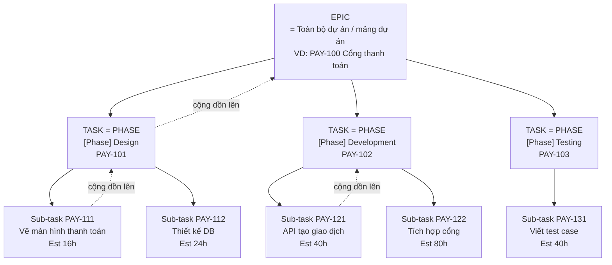
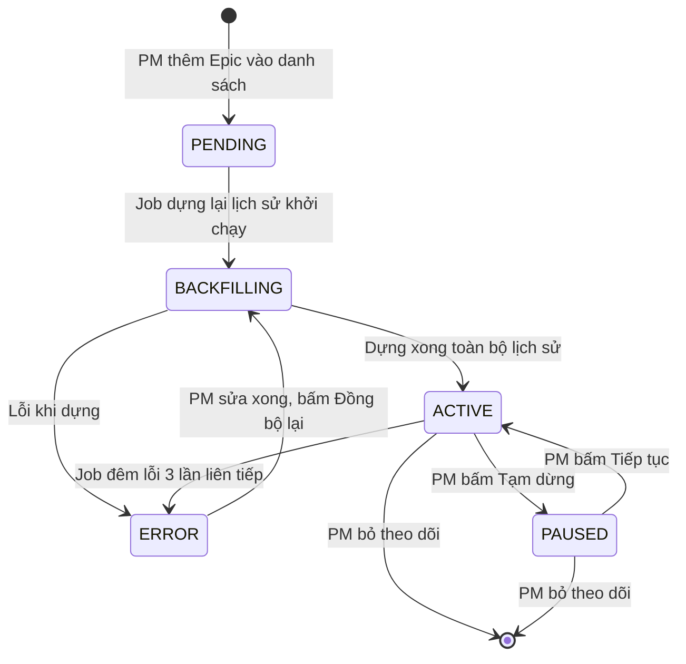
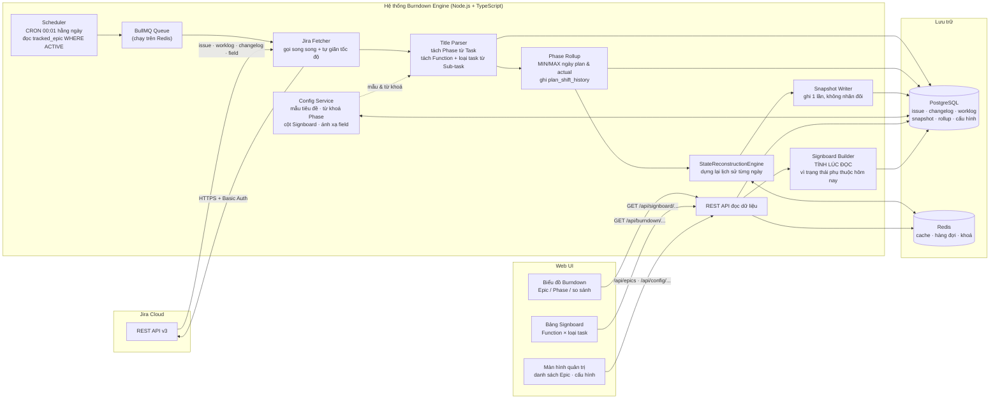
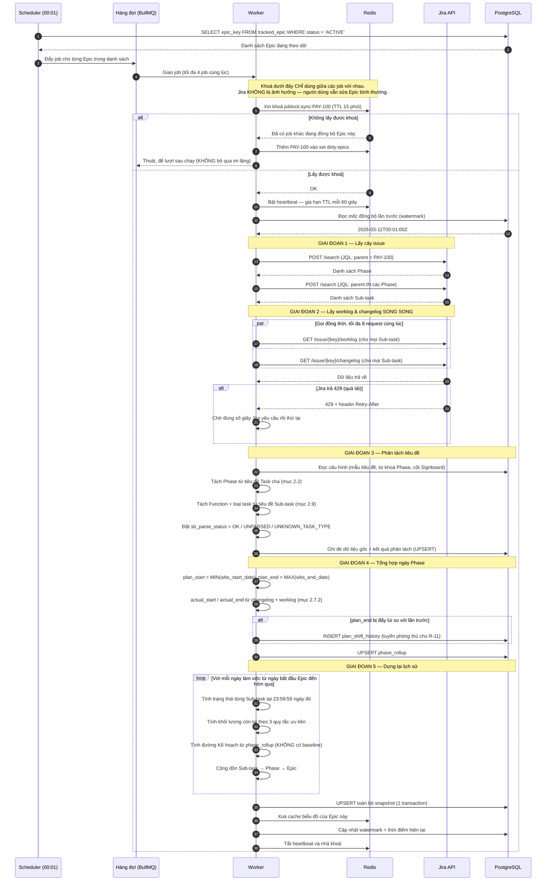

# PRD — Biểu đồ Burndown Liên tục & Động
### (Continuous & Dynamic Burndown Chart Engine — tích hợp Jira Cloud REST API v3)

---

## 0. Bảng thuật ngữ (đọc phần này trước)

Tài liệu này cố gắng dùng tiếng Việt dễ hiểu. Nhưng có một số từ tiếng Anh **bắt buộc phải giữ nguyên**, vì đó chính là tên trường dữ liệu trong Jira — đổi sang tiếng Việt sẽ không tra cứu được.

| Từ giữ nguyên | Nghĩa dễ hiểu |
|---|---|
| **Epic** | Cả một dự án / một mảng lớn. Tầng cao nhất. |
| **Task** | Ở dự án này, Task = **một Giai đoạn (Phase)** của dự án. Ví dụ: giai đoạn Thiết kế. |
| **Sub-task** | Đầu việc thật sự, người ta ngồi làm và log giờ vào đây. |
| **Original Estimate** (`timeoriginalestimate`) | Ước lượng ban đầu: "việc này dự kiến làm hết bao nhiêu giờ". |
| **Remaining Estimate** (`timeestimate`) | Ước lượng còn lại: "tính đến giờ, việc này còn bao nhiêu giờ nữa mới xong". |
| **Time Spent** (`timespent`) | Số giờ đã thực sự bỏ ra. |
| **Worklog** | Nhật ký log giờ. Mỗi lần ai đó bấm "Log work" là sinh ra 1 bản ghi. |
| **Changelog** | Nhật ký thay đổi. Jira tự ghi lại mọi lần một trường bị đổi giá trị (đổi trạng thái, đổi ước lượng...). Đây là "camera hành trình" của issue. |
| **statusCategory** | Nhóm trạng thái. Jira chỉ có đúng 3 nhóm: `To Do`, `In Progress`, `Done`. Tên trạng thái hiển thị có thể là tiếng Nhật (`完了`), nhưng nhóm thì luôn là 3 giá trị tiếng Anh này. |
| **JQL** | Ngôn ngữ truy vấn của Jira, giống SQL nhưng dành riêng cho Jira. |
| **Snapshot** | Ảnh chụp số liệu tại một thời điểm. Ở đây là "chốt sổ cuối ngày". |
| **Baseline** | Bản kế hoạch gốc đóng băng. **Hệ thống này KHÔNG dùng baseline** — đường Kế hoạch luôn tổng hợp lại từ dữ liệu Sub-task mới nhất. Xem mục 4.3 và rủi ro R-11. |
| **Roll-up** (tổng hợp lên) | Gộp số liệu từ tầng dưới lên tầng trên: Sub-task → Phase → Epic. Ngày của Phase cũng tổng hợp kiểu này (mục 2.7). |
| `wbs_start_date` / `wbs_end_date` | Hai custom field trên Jira chứa ngày bắt đầu / kết thúc **theo kế hoạch** của một Sub-task. Mã field khai trong file config vì mỗi Jira một mã khác nhau. |
| **Tạm tính** (provisional) | Giá trị chưa chốt, còn có thể đổi. Ví dụ ngày kết thúc thực tế của Sub-task chưa Done thì chỉ là tạm tính. |
| **Function** | Một chức năng nghiệp vụ (màn hình Đăng nhập, màn hình Thanh toán…). Lấy từ phần `[FunctionName]` trong tiêu đề Sub-task. Là **hàng** của bảng Signboard. Xem mục 2.9. |
| **Signboard** | Bảng ma trận Function × loại task, cho thấy từng function đang kẹt ở khâu nào. Xem mục 6. |
| **Loại task** | Khâu trong quy trình của một Function: `Create` (tạo mới), `BALReview` (BAL soát), `FixCommentBAL` (sửa theo BAL), `JMReview` (JM soát), `FixCommentJM` (sửa theo JM). Là **cột** của Signboard. |
| **NYS** | Not Yet Started — chưa tới ngày kế hoạch bắt đầu nên chưa làm. Đây là trạng thái **bình thường**, không phải trễ. |
| **NoPlan** | Sub-task thiếu `wbs_start_date`/`wbs_end_date` nên không có mốc để so sánh sớm/trễ. Trạng thái này **được thêm ngoài** 5 trạng thái ban đầu — xem mục 6.4. |
| **Backfill** | Chạy bù. Dựng lại số liệu của những ngày trong quá khứ. |
| **$T_d$** | Thời điểm chốt sổ của ngày `d`, tức **23:59:59 giờ địa phương** của ngày đó. |
| **429 / Rate limit** | Lỗi Jira trả về khi ta gọi API quá nhiều lần trong thời gian ngắn. Nghĩa là "chậm lại giùm". |
| **Idempotent** | Chạy 1 lần hay chạy 10 lần thì kết quả vẫn y hệt, không bị nhân đôi dữ liệu. |
| **Job mutex** (khoá job) | Cơ chế đảm bảo cùng một lúc chỉ có một tiến trình xử lý một việc. **Nằm trong hệ thống của mình, KHÔNG phải khoá trên Jira** — người dùng vẫn sửa Jira bình thường. Xem mục 4.2.1. |
| **Stale overwrite** | Ghi đè dữ liệu mới bằng dữ liệu cũ hơn, do thứ tự ghi không khớp thứ tự đọc. Xem tình huống E-19. |
| **Heartbeat** | Tín hiệu phát đều đặn để báo "tôi vẫn đang chạy". Ở đây dùng để gia hạn thời gian sống của khoá. |
| **NFKC** | Một cách chuẩn hoá chữ Unicode. Gộp chữ toàn giác và bán giác về cùng một dạng: `ﾃｽﾄ` → `テスト`, `Ａ` → `A`. Bắt buộc dùng khi so khớp tiếng Nhật. Xem mục 2.2.2. |
| **ReDoS** | Regex viết xấu khiến máy chạy hàng phút cho một chuỗi ngắn, làm treo hệ thống. Rủi ro có thật vì regex ở đây do người dùng tự nhập. Xem tình huống E-20. |

---

## 1. Thông tin tài liệu & Tóm tắt

### 1.1. Thông tin tài liệu

| Mục | Nội dung |
|---|---|
| Tên tài liệu | PRD — Biểu đồ Burndown Liên tục & Động |
| Phiên bản | **1.4** |
| Trạng thái | Draft — chờ duyệt |
| Ngày tạo | 2026-08-02 |
| Cập nhật lần cuối | 2026-08-03 |
| Người soạn | Technical Product Manager |
| Người duyệt | Engineering Manager, Tech Lead, PMO |
| Đối tượng đọc | Backend Dev, Frontend Dev, QA, DevOps, PM |
| Hệ thống liên quan | Jira Cloud (REST API v3), PostgreSQL, Redis |

**Lịch sử sửa đổi:**

| Phiên bản | Ngày | Thay đổi chính | Ảnh hưởng |
|---|---|---|---|
| 1.0 | 2026-08-02 | Bản đầu: engine dựng lại lịch sử, biểu đồ Burndown cấp Epic, 18 tình huống đặc biệt | 9 tuần |
| 1.1 | 2026-08-02 | **Cấu hình nhận diện Phase** — 2 tầng (mẫu tiêu đề + từ khoá), màn hình quản trị, Xem thử, lịch sử version, ghi đè theo project. Thêm E-20→E-22 | 10 tuần |
| 1.2 | 2026-08-02 | **Bỏ hẳn baseline** — đường Kế hoạch tổng hợp lại liên tục. Xoá bảng `epic_baseline`, viết lại US-03, E-01, E-15, công thức 4.3.1. Thêm rủi ro **R-11** | — |
| 1.3 | 2026-08-02 | **Sổ đăng ký Epic** (`tracked_epic`) + **burndown theo Phase** + **tổng hợp ngày Phase từ Sub-task** (`wbs_start_date`/`wbs_end_date`). Thêm E-23→E-26, US-10→US-12 | 11 tuần |
| **1.4** | **2026-08-03** | **Bảng Signboard tiến độ theo Function** — phân tách tiêu đề Sub-task (mục 2.9), ma trận Function × loại task (mục 6), 6 trạng thái. Thêm E-27→E-31, US-13→US-15. Rà soát toàn văn: sửa mâu thuẫn NFR/Signboard và tiêu chí đo trễ tiến độ | **12 tuần** |

> **Lưu ý cho người đọc bản cũ:** từ **v1.2**, hệ thống **không còn dùng baseline**. Nếu bạn đọc bản 1.0 hoặc 1.1, mọi mô tả về "kế hoạch đóng băng" đã bị gỡ bỏ — xem mục 4.3 và rủi ro R-11 để hiểu hệ quả.

### 1.2. Vấn đề đang gặp

Biểu đồ Burndown mặc định của Jira hoạt động theo kiểu **"bậc thang"**: khối lượng công việc còn lại **chỉ giảm khi một task được kéo sang trạng thái `Done`**.

Hậu quả thực tế:

- Một Sub-task ước lượng 40 giờ, dev làm miệt mài 4 ngày. Trên biểu đồ Jira: **đường thẳng nằm ngang, không nhúc nhích**.
- Đến ngày thứ 5 task xong → đường tụt thẳng đứng 40 giờ một phát.
- Nhìn tổng thể, biểu đồ trông như một cái **thác nước** ("water-burndown"): phẳng lì rồi rơi tự do.

Vì vậy:

| Hệ quả | Mô tả |
|---|---|
| Không thấy tiến độ hằng ngày | PM không biết hôm nay team làm được bao nhiêu. |
| Phát hiện trễ tiến độ quá muộn | Chỉ khi task "đáng lẽ xong hôm nay" mà chưa xong thì mới biết — lúc đó đã trễ rồi. |
| Không so sánh được với kế hoạch | Không có đường kế hoạch liên tục để đối chiếu từng ngày. |
| Báo cáo thiếu tin cậy | Số liệu nhảy giật cục, khó dùng để báo cáo cho khách hàng. |

### 1.3. Giải pháp đề xuất

Xây một **engine dựng lại lịch sử** (State Reconstruction Engine). Engine này đọc `changelog` và `worklog` của Jira, rồi tự tính lại: *"Vào cuối ngày X, thực tế còn lại bao nhiêu giờ công việc?"* — cho **từng ngày một**.

Hệ thống cho ra **hai màn hình bổ trợ nhau**:

**1. Biểu đồ Burndown** — trả lời *"cả Phase đang nhanh hay chậm?"*. Gồm 2 đường mượt:

| Đường | Ý nghĩa | Cách tính |
|---|---|---|
| **Đường Kế hoạch** (Planned) | Nếu làm đúng kế hoạch thì mỗi ngày phải còn lại bao nhiêu | Chia đều Original Estimate cho số ngày làm việc của từng Phase. Ngày của Phase **tổng hợp từ `wbs_*` của Sub-task** và **tính lại liên tục**, không đóng băng (mục 2.7, 4.3) |
| **Đường Thực tế** (Actual) | Thực tế còn lại bao nhiêu | Dựng lại từ changelog + worklog, chốt vào 23:59:59 mỗi ngày |

**2. Bảng Signboard** — trả lời câu cụ thể hơn: ***"Function nào đang kẹt ở khâu nào?"***

Ma trận **Function × loại task**: hàng là chức năng nghiệp vụ (lấy từ tiêu đề Sub-task), cột là các khâu `Create → BALReview → FixCommentBAL → JMReview → FixCommentJM`. Mỗi ô hiện ngày kế hoạch và một trong 6 trạng thái: `Completed`, `OnSchedule`, `NYS`, `Delay Start`, `Delay End`, `NoPlan`. Xem mục 6.

> **Vì sao cần cả hai.** Biểu đồ cho cái nhìn tổng thể nhưng vì không dùng baseline nên đường Kế hoạch trôi theo thực tế (rủi ro **R-11**). Bảng Signboard so từng Sub-task với `wbs_*` của chính nó nên **không bị baseline trôi làm nhiễu** — đây mới là chỗ phát hiện trễ đáng tin cậy nhất.

### 1.4. Phạm vi

**Làm (In scope):**

- **Quản lý danh sách Epic muốn theo dõi** — thêm bằng cách dán key hoặc duyệt chọn từ project; tạm dừng, đồng bộ lại, bỏ theo dõi (mục 2.6).
- Biểu đồ Burndown ở cấp **Epic** (một Epic = một dự án / một mảng dự án).
- **Chọn từng Phase để xem biểu đồ riêng của Phase đó**, kèm chế độ so sánh nhiều Phase (mục 5).
- **Bảng Signboard tiến độ theo Function** — ma trận Function × loại task (Create, BALReview, FixCommentBAL, JMReview, FixCommentJM), mỗi ô hiện ngày kế hoạch và trạng thái sớm/đúng/trễ (mục 6).
- **Tự tổng hợp ngày bắt đầu / kết thúc của Phase** từ `wbs_start_date` / `wbs_end_date` của các Sub-task, cả kế hoạch lẫn thực tế (mục 2.7).
- Tự động nhận diện Phase từ tiêu đề Task, **quy tắc do PM tự cấu hình** (mục 2.2).
- Job chạy tự động lúc **00:01 sáng** hằng ngày để chốt sổ ngày hôm trước.
- Chạy bù (backfill) lịch sử khi thêm Epic mới vào hệ thống.
- Hỗ trợ dự án Jira hiển thị tiếng Nhật.
- API đọc dữ liệu biểu đồ cho frontend.

**Không làm (Out of scope) — ở phiên bản 1.0:**

| Không làm | Lý do |
|---|---|
| Burndown theo Sprint | Dự án này quản lý theo Phase, không dùng Sprint. |
| **Cập nhật realtime qua webhook Jira** | Biểu đồ dùng snapshot chốt cuối ngày. Đổi Phase trên UI thì chart đổi ngay, nhưng **số liệu** chỉ mới tới lần đồng bộ gần nhất. Làm realtime cần webhook + hàng đợi riêng + WebSocket — để phiên bản sau. |
| **Baseline / kế hoạch đóng băng** | Đường Kế hoạch luôn tổng hợp lại từ dữ liệu Sub-task mới nhất. Xem mục 4.3 và rủi ro **R-11** để hiểu hệ quả. |
| Ghi ngược dữ liệu vào Jira | Hệ thống chỉ **đọc**, không sửa gì trên Jira. |
| Story Point | Dự án ước lượng bằng **giờ**, không dùng Story Point. |
| Đa khách hàng (multi-tenant) | Phiên bản 1.0 là công cụ nội bộ, dùng 1 tài khoản dịch vụ. |
| Dự báo bằng AI | Để phiên bản sau. |

### 1.5. Tiêu chí đo thành công

| Chỉ số | Mục tiêu |
|---|---|
| Độ chính xác đường Actual | Sai lệch so với tính tay ≤ **0.5 giờ** trên mỗi Epic |
| Thời gian tải biểu đồ | ≤ **800ms** (p95), với Epic có 500 Sub-task |
| Thời gian tải bảng Signboard | ≤ **500ms** (p95) |
| Thời gian chạy job đêm | ≤ **10 phút** cho 20 Epic |
| Tỉ lệ job đêm chạy thành công | ≥ **99%** trong 30 ngày |
| **Phát hiện trễ tiến độ sớm hơn** | Trung bình sớm hơn **3 ngày làm việc** so với dùng Jira mặc định — đo qua **bảng Signboard** (ô chuyển sang `Delay Start` / `Delay End`) và **Lịch sử dịch chuyển kế hoạch** |
| Tỉ lệ Sub-task lên được Signboard | ≥ **80%** (`sb_parse_status = 'OK'`) sau 1 tháng vận hành |

> **Vì sao đo qua Signboard chứ không qua biểu đồ Burndown.** Hệ thống này **không dùng baseline** — đường Kế hoạch tổng hợp lại liên tục nên nó *trôi theo* thực tế (xem mục 4.3 và rủi ro **R-11**). Một Epic bị lùi hạn liên tục vẫn có thể trông "đúng tiến độ" trên biểu đồ.
>
> Thứ thật sự phát hiện trễ trong thiết kế này là:
> 1. **Bảng Signboard** — so từng Sub-task với `wbs_*` của chính nó, không bị baseline trôi làm nhiễu.
> 2. **Lịch sử dịch chuyển kế hoạch** — đếm số lần và số ngày kế hoạch bị lùi.
>
> Đây là hệ quả trực tiếp của quyết định bỏ baseline, cần nêu rõ để tránh cam kết nhầm với stakeholder.

---

## 2. Cấu trúc Jira & Cách nhận diện Phase

### 2.1. Cấu trúc 3 tầng



**Nguyên tắc vàng:**

> **Chỉ Sub-task mới mang số liệu thật.** Task (Phase) và Epic **không tự có** số giờ riêng — số của chúng là **tổng cộng dồn** từ các Sub-task bên dưới. Nếu ai đó lỡ nhập Original Estimate trực tiếp vào Task, hệ thống **bỏ qua** giá trị đó để tránh đếm 2 lần.

### 2.2. Quy tắc nhận diện Phase từ tiêu đề

Hệ thống đọc tiêu đề (`summary`) của Task và so khớp để biết đó là giai đoạn nào.

> **Nguyên tắc bắt buộc:** **Toàn bộ quy tắc nhận diện Phase đều là cấu hình, không có gì viết cứng trong mã nguồn.** PM tự sửa qua màn hình quản trị, xem thử kết quả rồi mới lưu — không cần nhờ dev, không cần deploy lại.
>
> Thứ duy nhất cố định là mã `UNCLASSIFIED` (dành cho Task không nhận diện được).

#### 2.2.1. Hai tầng cấu hình

Tách làm 2 tầng vì hai thứ này có tần suất sửa và độ khó rất khác nhau:

| Tầng | Làm gì | Ai sửa | Tần suất |
|---|---|---|---|
| **Tầng 1 — Mẫu tiêu đề** | Bóc tên giai đoạn ra khỏi tiêu đề Task | PM | Ít, nhưng khi cần thì rất cấp bách |
| **Tầng 2 — Từ khoá** | Đổi tên vừa bóc ra thành mã Phase chuẩn | PM | Thường xuyên |

**Ví dụ chạy qua 2 tầng:**

```
Tiêu đề Jira:  "[Phase] 基本設計"
      │
      ├─ Tầng 1: mẫu "[Phase] {name}"  →  bóc ra:  "基本設計"
      │
      └─ Tầng 2: từ khoá "基本設計"     →  kết quả:  DESIGN (hiển thị "Thiết kế")
```

**Cú pháp mẫu tiêu đề — chỗ này quan trọng nhất, vì nó giúp PM không phải học regex.**

PM chỉ cần gõ đúng **hình dạng** tiêu đề thật, dùng ô giữ chỗ `{name}` cho phần tên giai đoạn. Mọi ký tự còn lại được hiểu là chữ nguyên văn:

| PM gõ | Khớp được tiêu đề | Bóc ra |
|---|---|---|
| `[Phase] {name}` | `[Phase] Design` | `Design` |
| `【{name}】` | `【基本設計】画面一覧` | `基本設計` |
| `{name} フェーズ` | `テスト フェーズ` | `テスト` |
| `{no}. {name}` | `01. Thiết kế` | `Thiết kế` |
| `Giai đoạn {no} - {name}` | `Giai đoạn 2 - Phát triển` | `Phát triển` |

Hệ thống tự dịch sang regex: `{name}` → `(?<name>.+?)`, `{no}` → `(?<no>\d+)`, và **escape toàn bộ phần còn lại** (nên các ký tự `[`, `]`, `.`, `-` được hiểu đúng như chữ thường, PM không cần biết gì về ký tự đặc biệt).

Cho phép khai **nhiều mẫu**, hệ thống thử lần lượt từ trên xuống, mẫu nào khớp trước thì dùng.

Kèm một ô tích, **mặc định BẬT**:

> ☑ *Nếu không mẫu nào khớp → thử tìm từ khoá trên toàn bộ tiêu đề*

Đây là lưới an toàn cho project không dùng tiền tố nào cả. Ví dụ tiêu đề chỉ là `詳細設計` (không có `[Phase]`) thì vẫn nhận ra được `DESIGN`.

#### 2.2.2. Chuẩn hoá chuỗi trước khi so khớp

Bước này **bắt buộc**, vì dữ liệu Jira tiếng Nhật rất hay lẫn lộn chữ toàn giác và bán giác. Bỏ qua bước này thì việc "chứa từ khoá" sẽ trượt hàng loạt trên dữ liệu thật.

Thứ tự xử lý, áp dụng cho **cả tiêu đề lẫn từ khoá**:

| Bước | Việc làm | Ví dụ |
|---|---|---|
| 1 | Chuẩn hoá Unicode **NFKC** | `ﾃｽﾄ` → `テスト`, `Ａ` → `A`, `１` → `1` |
| 2 | Chuyển hết về chữ thường | `Design` → `design` |
| 3 | Gộp nhiều khoảng trắng liên tiếp thành một | `Thiết   kế` → `Thiết kế` |
| 4 | Cắt khoảng trắng đầu và cuối | ` Design ` → `Design` |

#### 2.2.3. Khi một tiêu đề khớp nhiều từ khoá thì lấy cái nào?

Đây là ca xảy ra thường xuyên. Ví dụ `[Phase] Design Review` khớp cả từ khoá `Design` lẫn `Review`.

Trước hết phải tách bạch **hai khái niệm rất dễ bị lẫn**:

| Trường | Nghĩa |
|---|---|
| `display_order` | Thứ tự **hiển thị trên biểu đồ** — Thiết kế đứng trước Phát triển |
| `match_priority` | Thứ tự **ưu tiên khi so khớp** — số nhỏ hơn thì thắng |

Hai thứ này độc lập nhau. Một Phase có thể hiện ở cuối biểu đồ nhưng lại được ưu tiên khớp trước.

**Quy tắc quyết định, xét lần lượt:**

1. `match_priority` **nhỏ hơn** thì thắng.
2. Nếu bằng nhau → **từ khoá dài hơn thắng**. Cụ thể hơn thì đúng hơn.
3. Nếu vẫn bằng → lấy dòng trên cùng, đồng thời ghi cảnh báo `AMBIGUOUS_PHASE_RULE` để PM biết mà sửa.

**Nhờ quy tắc 2, ca `[Phase] Design Review` tự động khớp `Design Review` (13 ký tự) thay vì `Design` (6 ký tự) — PM không phải cấu hình gì thêm.**

Màn hình Xem thử luôn hiện rõ **dòng luật nào đã thắng** cho từng Task, để PM kiểm chứng chứ không phải đoán.

#### 2.2.4. Màn hình quản trị cấu hình

```
┌─ Cấu hình nhận diện Phase ────────────────── [ Mặc định ▼ ] ──┐
│                                                                │
│  ① MẪU TIÊU ĐỀ  (thử lần lượt từ trên xuống)                  │
│  ┌──────────────────────────────────────────────────┐         │
│  │ ≡  [Phase] {name}                          [🗑]  │         │
│  │ ≡  【{name}】                               [🗑]  │         │
│  │                                    [ + Thêm mẫu ] │         │
│  └──────────────────────────────────────────────────┘         │
│  ☑ Nếu không mẫu nào khớp → tìm từ khoá trên cả tiêu đề        │
│                                                                │
│  ② DANH SÁCH PHASE  (kéo ≡ để đổi thứ tự hiển thị)            │
│  ┌────┬─────────────┬────────────┬──────────┬───────┐         │
│  │    │ Mã          │ Tên (VI)   │ Tên (JA) │ Màu   │         │
│  ├────┼─────────────┼────────────┼──────────┼───────┤         │
│  │ ≡  │ REQUIREMENT │ Yêu cầu    │ 要件定義  │ ■ #6B │         │
│  │ ≡  │ DESIGN      │ Thiết kế   │ 設計      │ ■ #4A │         │
│  │ ≡  │ DEVELOPMENT │ Phát triển │ 開発      │ ■ #2E │         │
│  │ ≡  │ TESTING     │ Kiểm thử   │ テスト    │ ■ #E8 │         │
│  └────┴─────────────┴────────────┴──────────┴───────┘         │
│                                          [ + Thêm Phase ]      │
│                                                                │
│  ③ LUẬT KHỚP TỪ KHOÁ                                          │
│  ┌───────────────┬─────────┬─────────────┬─────────┐          │
│  │ Từ khoá       │ Chế độ  │ → Phase     │ Ưu tiên │          │
│  ├───────────────┼─────────┼─────────────┼─────────┤          │
│  │ Design Review │ chứa    │ TESTING     │   10    │          │
│  │ Design        │ chứa    │ DESIGN      │   50    │          │
│  │ 基本設計       │ chứa    │ DESIGN      │   50    │          │
│  │ 詳細設計       │ chứa    │ DESIGN      │   50    │          │
│  │ Dev           │ chứa    │ DEVELOPMENT │   50    │          │
│  │ 開発          │ chứa    │ DEVELOPMENT │   50    │          │
│  │ ^SP-\d+       │ regex   │ SUPPORT     │   20    │          │
│  └───────────────┴─────────┴─────────────┴─────────┘          │
│                                          [ + Thêm luật ]       │
│                                                                │
├────────────────────────────────────────────────────────────────┤
│   [ 👁 Xem thử ]        [ Lịch sử ]           [ 💾 Lưu ]        │
└────────────────────────────────────────────────────────────────┘
```

**Kiểm tra hợp lệ khi bấm Lưu:**

| Kiểm tra | Mức |
|---|---|
| Có ít nhất 1 Phase được định nghĩa | ❌ Chặn lưu |
| `phase_code` không trùng nhau | ❌ Chặn lưu |
| Luật khớp trỏ tới `phase_code` có tồn tại | ❌ Chặn lưu |
| Regex biên dịch được, độ dài ≤ 200 ký tự | ❌ Chặn lưu |
| Mẫu tiêu đề có đúng một ô `{name}` | ❌ Chặn lưu |
| Cùng một từ khoá trỏ về 2 Phase khác nhau | ⚠️ Cảnh báo |
| Xem thử cho ra > 20% Task `UNCLASSIFIED` | ⚠️ Cảnh báo, vẫn cho lưu |

#### 2.2.5. Xem thử trước khi lưu

Đây là tính năng **bắt buộc phải có**. Không có nó thì PM sửa xong phải đợi tới job đêm hôm sau mới biết đúng hay sai — và config "đơn giản" trở thành không dùng được trên thực tế.

Bấm **Xem thử** → hệ thống chạy cấu hình **nháp** (chưa lưu) trên các Task thật của project, trả về:

```
Xem thử trên project PAY — 12 Task

┌──────────────────────┬──────────────┬───────────┬───────────────┬─────────────┬──────────┐
│ Tiêu đề gốc          │ Mẫu khớp     │ Bóc ra    │ Luật thắng    │ → Phase     │ Kết quả  │
├──────────────────────┼──────────────┼───────────┼───────────────┼─────────────┼──────────┤
│ [Phase] Design       │ [Phase]{name}│ Design    │ Design (50)   │ DESIGN      │ giữ nguyên│
│ [Phase] Design Review│ [Phase]{name}│ Des.Review│ Design Review │ TESTING     │ ĐỔI ⚠    │
│ 【基本設計】画面一覧   │ 【{name}】    │ 基本設計   │ 基本設計 (50)  │ DESIGN      │ ĐỔI ⚠    │
│ 詳細設計              │ (cả tiêu đề) │ 詳細設計   │ 詳細設計 (50)  │ DESIGN      │ ĐỔI ⚠    │
│ 打ち合わせ準備         │ —            │ —         │ —             │UNCLASSIFIED │ chưa nhận│
└──────────────────────┴──────────────┴───────────┴───────────────┴─────────────┴──────────┘

Tổng kết: 12 Task — 8 đổi phân loại, 1 vẫn chưa nhận diện được.
Lưu cấu hình này sẽ phải tính lại 3 Epic (~2 phút).

                                        [ Quay lại sửa ]  [ Xác nhận lưu ]
```

#### 2.2.6. Cấu hình chung và ghi đè theo project

Có một bộ **Mặc định** dùng cho mọi project. Project nào có quy ước đặt tên riêng thì tạo bộ ghi đè — **chỉ cần khai phần khác biệt**, phần không khai sẽ tự kế thừa.

```mermaid
flowchart TD
    G["BỘ MẶC ĐỊNH (GLOBAL)<br/>Mẫu: &#91;Phase&#93; {name}<br/>Phase: REQUIREMENT, DESIGN, DEVELOPMENT, TESTING<br/>Từ khoá: Design, 設計, Dev, 開発, Test, テスト"]

    G -->|"kế thừa toàn bộ"| A["Project PAY<br/>Không khai gì<br/>→ dùng y hệt mặc định"]

    G -->|"kế thừa Phase + từ khoá"| B["Project SHOP<br/>GHI ĐÈ mẫu tiêu đề:<br/>【{name}】<br/>(Phase và từ khoá vẫn kế thừa)"]

    G -->|"kế thừa mẫu + Phase"| C["Project CRM<br/>GHI ĐÈ từ khoá:<br/>thêm 'Migration' → DEVELOPMENT<br/>(mẫu và Phase vẫn kế thừa)"]
```



Ba phần (mẫu tiêu đề / danh sách Phase / luật khớp) **kế thừa độc lập nhau**. Ghi đè phần nào thì chỉ phần đó bị thay, hai phần kia vẫn lấy từ bộ mặc định.

Trên UI, các phần chưa ghi đè hiện nhãn mờ *"kế thừa từ Mặc định"* kèm nút **Ghi đè cho project này**.

#### 2.2.7. Lưu cấu hình xong thì chuyện gì xảy ra

```
PM bấm Lưu
   │
   ├─ 1. Kiểm tra hợp lệ (bảng ở mục 2.2.4)
   ├─ 2. Lưu thành VERSION MỚI — version cũ giữ nguyên để quay lại
   ├─ 3. Xoá cache Redis meta:phaseconfig:* NGAY LẬP TỨC
   ├─ 4. Tìm mọi Epic bị ảnh hưởng (thuộc project vừa sửa config)
   ├─ 5. Đẩy các Epic đó vào set dirty:epics
   └─ 6. Job tính lại chạy → phân loại lại Phase cho TOÀN BỘ lịch sử
                            → ghi đè per_phase trong daily_snapshot
                            → xoá cache biểu đồ
```

**Hai điểm quan trọng:**

- **Tính lại toàn bộ lịch sử, không chỉ từ hôm nay.** Nếu chỉ áp dụng từ hôm nay, biểu đồ theo Phase sẽ đứt đoạn giữa chừng và không giải thích được với khách hàng. Cách xử lý này nhất quán với **E-09** (đổi tiêu đề Task) và **E-21**.
- **Không gọi lại Jira.** Dữ liệu gốc (issue, changelog, worklog) đã nằm sẵn trong PostgreSQL — việc tính lại chỉ là phân loại lại `phase_code` rồi cộng dồn lại. Nhờ vậy thao tác này **nhanh và không tốn quota API**.

#### 2.2.8. Quy tắc xử lý khi không nhận diện được

| Tình huống | Xử lý |
|---|---|
| Không mẫu tiêu đề nào khớp, và cũng không tìm thấy từ khoá | Gán `UNCLASSIFIED`. **Vẫn tính vào tổng của Epic** (vì công việc là có thật), nhưng gắn cờ cảnh báo. |
| Bóc được tên nhưng không khớp từ khoá nào | Gán `UNCLASSIFIED`, ghi tên gốc vào cột `raw_phase_label`. Tên này hiện lên màn hình quản trị (`GET /api/config/phase/unmatched`) để PM biết cần thêm từ khoá gì. |
| Hai Task cùng một mã Phase | Cho phép. Gộp chung, tên hiển thị nối bằng dấu `+`. |
| Số Task `UNCLASSIFIED` > 20% tổng số Task | Hiện banner cảnh báo trên UI: *"Quy ước đặt tên Phase chưa chuẩn — biểu đồ có thể thiếu chính xác."* kèm nút dẫn thẳng sang màn hình cấu hình. |

### 2.3. Ánh xạ trạng thái — Quy tắc quan trọng nhất khi làm với Jira tiếng Nhật

Dự án đích hiển thị trạng thái bằng tiếng Nhật. Tên hiển thị có thể là `完了`, `対応中`, `未対応`, và **có thể bị đổi bất cứ lúc nào** bởi admin Jira.

> **Bắt buộc:** Chỉ được đọc trường `fields.status.statusCategory.key`.
> **Tuyệt đối cấm:** So sánh chuỗi tên trạng thái (`status.name`).

| `statusCategory.key` | `statusCategory.name` | Ví dụ tên hiển thị tiếng Nhật | Ý nghĩa trong engine |
|---|---|---|---|
| `new` | To Do | `未対応`, `未着手` | Chưa bắt đầu |
| `indeterminate` | In Progress | `対応中`, `レビュー中` | Đang làm |
| `done` | Done | `完了`, `クローズ` | Đã xong → **khối lượng còn lại = 0** |

**Lưu ý cho dev:** trong `changelog`, khi trạng thái đổi, Jira ghi vào field `status` với `from`/`to` là **status ID dạng số** (ví dụ `"10001"`), *không phải* statusCategory. Vì vậy hệ thống phải:

1. Gọi 1 lần `/rest/api/3/status` lúc khởi động để lấy toàn bộ bảng `status_id → statusCategory`.
2. Cache bảng này trong Redis (TTL 24 giờ).
3. Khi đọc changelog, tra ID sang statusCategory qua bảng cache đó.

### 2.4. Cách cộng dồn số liệu

Cộng dồn theo đúng 3 tầng, tính lần lượt từ dưới lên:

```
Số liệu của Phase  = TỔNG số liệu của tất cả Sub-task thuộc Phase đó
Số liệu của Epic   = TỔNG số liệu của tất cả Phase thuộc Epic đó
```

Các số liệu được cộng dồn:

| Chỉ số | Ý nghĩa |
|---|---|
| `total_original_estimate` | Tổng ước lượng ban đầu |
| `total_remaining` | Tổng còn lại (tại thời điểm chốt sổ) |
| `total_spent` | Tổng giờ đã bỏ ra |
| `count_todo` / `count_in_progress` / `count_done` | Số lượng Sub-task theo từng nhóm trạng thái |

> **Quy tắc quan trọng: cộng dồn KHÔNG lọc bỏ gì cả.** **Mọi** Sub-task thuộc Phase đều được cộng vào, kể cả:
>
> - Sub-task có tiêu đề **không đúng format Signboard** (`sb_parse_status = UNPARSED`) — xem **E-27**
> - Sub-task **thiếu `wbs_start_date` / `wbs_end_date`** — xem **E-30**
> - Sub-task thuộc Task Phase bị gán `UNCLASSIFIED`
>
> Lý do: công việc là **có thật** và giờ đã log là **có thật**. Loại chúng khỏi phép cộng dồn sẽ làm tổng khối lượng của Epic thiếu hụt và đường Burndown sai.
>
> Những Sub-task này chỉ **không hiển thị được trên bảng Signboard** (mục 6.8), chứ vẫn nằm đầy đủ trong biểu đồ Burndown.

### 2.5. Các API Jira được sử dụng

| Mục đích | Endpoint | Ghi chú |
|---|---|---|
| Tìm issue theo điều kiện | `POST /rest/api/3/search` | Dùng JQL. Phân trang, `maxResults = 100`. |
| Lấy worklog của 1 issue | `GET /rest/api/3/issue/{key}/worklog` | Phân trang riêng. |
| Lấy changelog của 1 issue | `GET /rest/api/3/issue/{key}/changelog` | Phân trang riêng. |
| Lấy worklog thay đổi gần đây | `GET /rest/api/3/worklog/updated` | **Rất hữu ích** cho đồng bộ tăng dần — trả về ID các worklog vừa đổi. |
| Lấy chi tiết worklog theo lô | `POST /rest/api/3/worklog/list` | Lấy tối đa 1000 worklog trong 1 lần gọi. |
| **Lấy worklog vừa bị xoá** | `GET /rest/api/3/worklog/deleted` | Để phát hiện worklog bị xoá trên Jira — xem tình huống **E-17**. Cùng cơ chế phân trang theo `since` như `/worklog/updated`. |
| Bảng trạng thái | `GET /rest/api/3/status` | Để dựng bảng tra `status_id → statusCategory`. |
| **Danh sách field** | `GET /rest/api/3/field` | Để **tự dò mã custom field** `wbs_start_date` / `wbs_end_date` theo tên — xem mục 2.8. Gọi 1 lần lúc khởi động, cache 24 giờ. |

**JQL mẫu để lấy toàn bộ cây của một Epic:**

```sql
-- Bước 1: lấy các Task (Phase) con của Epic
parent = "PAY-100" ORDER BY created ASC

-- Bước 2: lấy các Sub-task của các Phase
parent IN ("PAY-101", "PAY-102", "PAY-103") ORDER BY created ASC
```

**JQL cho đồng bộ tăng dần** (dùng ở mục 4.5) — chỉ tải issue đã đổi kể từ lần chạy trước:

```sql
-- watermark là mốc đồng bộ lần trước, lấy từ tracked_epic.last_synced_at.
-- Trừ lùi 5 phút để phòng lệch đồng hồ giữa Jira và hệ thống.
parent IN ("PAY-101", "PAY-102", "PAY-103")
  AND updated >= "2026-03-11 00:01"
  ORDER BY updated ASC
```

**JQL để duyệt Epic của một project** (dùng cho `GET /api/epics/browse`, mục 2.6.2):

```sql
-- Chỉ lấy Epic, ưu tiên cái chưa đóng. PM vẫn xem được cả Epic đã Done
-- bằng cách bỏ điều kiện statusCategory.
project = "PAY" AND issuetype = Epic AND statusCategory != Done
  ORDER BY created DESC
```

**Tối ưu:** ở bước `search`, luôn truyền tham số `fields` để chỉ lấy đúng những trường cần — giảm mạnh dung lượng phản hồi:

```
fields = summary,issuetype,status,parent,timeoriginalestimate,timeestimate,
         timespent,created,updated,duedate,
         {wbsStartDateField},{wbsEndDateField}
```

Hai trường cuối là custom field chứa ngày kế hoạch của Sub-task — mã field lấy từ cấu hình, xem mục 2.8.

---

### 2.6. Sổ đăng ký Epic — danh sách Epic đang theo dõi

Hệ thống **không tự động theo dõi mọi Epic** trên Jira. PM phải chủ động thêm Epic vào danh sách. Bảng `tracked_epic` là **nguồn duy nhất** trả lời câu hỏi *"job đêm phải chạy cho những Epic nào?"*.

#### 2.6.1. Vòng đời của một Epic trong hệ thống



| Trạng thái | Nghĩa | Job đêm có chạy không? |
|---|---|---|
| `PENDING` | Vừa thêm, chưa dựng lịch sử | Không |
| `BACKFILLING` | Đang dựng lại lịch sử lần đầu | Không (job backfill đang chạy) |
| `ACTIVE` | Đang theo dõi bình thường | **Có** |
| `PAUSED` | PM tạm dừng. Dữ liệu cũ vẫn xem được | Không |
| `ERROR` | Lỗi cần người xử lý | Không |

> **Job đêm chỉ lấy Epic có `status = 'ACTIVE'`.** Đây là thay đổi so với bản trước — trước đây suy ra từ bảng baseline (đã bỏ).

#### 2.6.2. Màn hình quản lý danh sách Epic

```
┌─ Epic đang theo dõi ──────────────────────── [ + Thêm Epic ] ─┐
│                                                                │
│ ┌──────────┬─────────────────┬─────────┬──────────┬─────────┐ │
│ │ Key      │ Tên             │ Trạng   │ Đồng bộ  │ Dữ liệu │ │
│ │          │                 │ thái    │ cuối     │         │ │
│ ├──────────┼─────────────────┼─────────┼──────────┼─────────┤ │
│ │ PAY-100  │ Cổng thanh toán │ ● Đang  │ 02/08    │ ✓ Tốt   │ │
│ │          │ 3 Phase · 25 ST │   theo  │ 00:04    │         │ │
│ │          │ 200h            │   dõi   │          │  [⏸][🔄]│ │
│ ├──────────┼─────────────────┼─────────┼──────────┼─────────┤ │
│ │ SHOP-20  │ Website bán lẻ  │ ● Đang  │ 02/08    │ ⚠ 8 ST  │ │
│ │          │ 4 Phase · 41 ST │   theo  │ 00:06    │ thiếu   │ │
│ │          │ 340h            │   dõi   │          │ ngày    │ │
│ │          │                 │         │          │  [⏸][🔄]│ │
│ ├──────────┼─────────────────┼─────────┼──────────┼─────────┤ │
│ │ CRM-7    │ CRM nội bộ      │ ⏸ Tạm   │ 28/07    │ ✓ Tốt   │ │
│ │          │ 3 Phase · 18 ST │   dừng  │ 00:03    │  [▶][🗑]│ │
│ ├──────────┼─────────────────┼─────────┼──────────┼─────────┤ │
│ │ HR-12    │ Cổng nhân sự    │ ✗ Lỗi   │ 01/08    │ —       │ │
│ │          │ Thiếu quyền đọc │         │ 00:02    │  [🔄][🗑]│ │
│ └──────────┴─────────────────┴─────────┴──────────┴─────────┘ │
│                                                                │
│  ⏸ Tạm dừng   ▶ Tiếp tục   🔄 Đồng bộ lại   🗑 Bỏ theo dõi     │
└────────────────────────────────────────────────────────────────┘
```

**Hộp thoại Thêm Epic:**

```
┌─ Thêm Epic vào danh sách theo dõi ────────────────────┐
│                                                        │
│  Dán danh sách key (mỗi dòng một key):                │
│  ┌──────────────────────────────────────────────┐     │
│  │ PAY-100                                      │     │
│  │ SHOP-20                                      │     │
│  │ CRM-7                                        │     │
│  │ PAY-7                                        │     │
│  └──────────────────────────────────────────────┘     │
│                                                        │
│                 hoặc  [ 🔍 Duyệt Epic của project… ]  │
│                                                        │
│  Múi giờ:  [ Asia/Ho_Chi_Minh ▼ ]                     │
│  Lịch nghỉ: [ VN_STANDARD ▼ ]                         │
│                                        [ Kiểm tra ]    │
├────────────────────────────────────────────────────────┤
│  Kết quả kiểm tra:                                     │
│   ✓ PAY-100  Cổng thanh toán — 3 Phase, 25 Sub-task   │
│   ✓ SHOP-20  Website bán lẻ  — 4 Phase, 41 Sub-task   │
│   ⚠ CRM-7    Đã có trong danh sách rồi → bỏ qua       │
│   ✗ PAY-7    Đây là Task, không phải Epic             │
│                                                        │
│                          [ Huỷ ]  [ Thêm 2 Epic ]     │
└────────────────────────────────────────────────────────┘
```

#### 2.6.3. Kiểm tra khi thêm Epic

| Kiểm tra | Kết quả khi hỏng |
|---|---|
| Key tồn tại trên Jira | ❌ *"Không tìm thấy PAY-999 trên Jira"* |
| `issuetype` đúng là Epic | ❌ *"PAY-7 là Task, không phải Epic"* |
| Tài khoản dịch vụ có quyền đọc | ❌ *"Không có quyền đọc project HR"* kèm hướng dẫn cấp quyền |
| Chưa có trong danh sách | ⚠️ Bỏ qua, báo *"Đã theo dõi rồi"* |
| Có ít nhất 1 Task con | ⚠️ **Vẫn thêm**, cảnh báo *"Epic chưa có Task nào theo quy ước `[Phase] …`"* |

Thêm thành công → `PENDING` → tự đẩy job backfill → `BACKFILLING` → xong thì `ACTIVE`.

#### 2.6.4. Bỏ theo dõi

Khi bấm 🗑, hỏi lại PM chọn một trong hai:

| Lựa chọn | Hành vi |
|---|---|
| **Giữ dữ liệu lịch sử** (mặc định) | Xoá khỏi `tracked_epic`, nhưng giữ nguyên `daily_snapshot`, `worklog_entry`… Thêm lại sau thì không phải backfill từ đầu |
| **Xoá sạch** | Xoá toàn bộ dữ liệu của Epic. Cần gõ lại key Epic để xác nhận |

---

### 2.7. Ngày bắt đầu / kết thúc của Phase

Để vẽ được đường Kế hoạch cho một Phase, cần biết Phase đó **bắt đầu và kết thúc ngày nào**. Jira không lưu thông tin này ở cấp Phase — nên hệ thống **tổng hợp lên từ các Sub-task** bên dưới.

#### 2.7.1. Bốn công thức tổng hợp

```
Phase.plan_start   = MIN( wbs_start_date của các Sub-task )
Phase.plan_end     = MAX( wbs_end_date   của các Sub-task )

Phase.actual_start = MIN( actual_start của các Sub-task )
Phase.actual_end   = MAX( actual_end   của các Sub-task )
```

Chỉ tính trên các Sub-task **đang hoạt động** — đã được tạo và chưa bị gỡ khỏi Epic.

**Ví dụ số** — Phase "Thiết kế" có 3 Sub-task:

| Sub-task | `wbs_start_date` | `wbs_end_date` | actual_start | actual_end |
|---|---|---|---|---|
| PAY-111 | 02/03 | 04/03 | 03/03 | 05/03 |
| PAY-112 | 03/03 | 06/03 | 03/03 | 09/03 |
| PAY-113 | 02/03 | 05/03 | 04/03 | (chưa xong) |

Kết quả tổng hợp cho Phase "Thiết kế":

| Mốc | Giá trị | Lấy từ đâu |
|---|---|---|
| `plan_start` | **02/03** | MIN(02/03, 03/03, 02/03) |
| `plan_end` | **06/03** | MAX(04/03, 06/03, 05/03) |
| `actual_start` | **03/03** | MIN(03/03, 03/03, 04/03) |
| `actual_end` | **09/03** *(tạm tính)* | MAX(05/03, 09/03, —). PAY-113 chưa xong nên đánh dấu tạm tính |

→ Phase Thiết kế: kế hoạch 02/03–06/03 (5 ngày làm việc), thực tế bắt đầu trễ 1 ngày và **kết thúc trễ 3 ngày**.

> **Lưu ý:** Ngày Phase được **tổng hợp lại sau mỗi lần đồng bộ**, không đóng băng. Thêm một Sub-task có `wbs_end_date` muộn hơn sẽ đẩy `plan_end` ra xa và làm đường Kế hoạch dịch chuyển. Xem mục 4.3 và rủi ro **R-11**.

#### 2.7.2. Ngày thực tế của một Sub-task

Jira **không có sẵn** hai trường này. Hệ thống suy ra từ lịch sử, kết hợp cả trạng thái lẫn worklog:

| Mốc | Cách tính |
|---|---|
| `actual_start` | **Ngày sớm hơn** giữa: lần đầu chuyển sang `In Progress` (đọc từ changelog) và ngày worklog đầu tiên (theo trường `started`) |
| `actual_end` | Lần **CUỐI CÙNG** chuyển sang `Done`. Nếu chưa bao giờ Done → lấy ngày worklog cuối cùng, đánh dấu **tạm tính** |

**Vì sao lấy "lần cuối cùng" chuyển sang Done?** Vì có ca mở lại (reopen):

| Ngày | Sự kiện | Ghi chú |
|---|---|---|
| 09/03 | `未対応` → `対応中` | ← `actual_start` = 09/03 |
| 10/03 | Log 8 giờ | |
| 12/03 | `対応中` → `完了` | Lần Done thứ nhất |
| 13/03 | `完了` → `対応中` | Mở lại vì phát hiện lỗi |
| 16/03 | `対応中` → `完了` | ← `actual_end` = **16/03** (lần Done cuối) |

Nếu lấy lần Done đầu tiên (12/03) thì mất trắng 4 ngày làm lại — báo cáo sẽ sai.

#### 2.7.3. Khi Sub-task thiếu ngày kế hoạch

| Tình huống | Xử lý |
|---|---|
| Thiếu `wbs_start_date` | Bỏ qua Sub-task đó khi tính MIN. Cộng vào `missing_date_count` |
| Thiếu `wbs_end_date` | Bỏ qua khi tính MAX. Cộng vào `missing_date_count` |
| **Toàn bộ Sub-task của Phase đều thiếu ngày** | **Không vẽ được đường Kế hoạch** cho Phase đó. Hiện thông báo *"Chưa có ngày kế hoạch"* kèm danh sách Sub-task cần điền. **Tuyệt đối không đoán bừa ngày** |
| `plan_start > plan_end` | Dữ liệu Jira sai. Ghi cảnh báo `INVALID_PHASE_PERIOD`, tạm dùng `plan_start` cho cả hai (Phase 1 ngày) và báo PM |
| Sub-task chưa có `actual_start` | Không tính vào MIN. Phase vẫn có `actual_start` nếu có Sub-task khác đã bắt đầu |

---

### 2.8. Ánh xạ trường ngày trên Jira

Mã custom field của `wbs_start_date` và `wbs_end_date` **khác nhau ở mỗi Jira**, nên không được viết cứng trong mã nguồn.

**File `config/jira-fields.yaml`:**

```yaml
fieldMapping:
  # Mã custom field trên Jira của bạn.
  # Tra bằng: GET /rest/api/3/field
  wbsStartDate: customfield_10100    # tên hiển thị: wbs_start_date
  wbsEndDate:   customfield_10101    # tên hiển thị: wbs_end_date

autoDetect:
  # Nếu bật, hệ thống tự dò mã field theo tên khi khởi động.
  # Dò được thì lấy kết quả dò, đối chiếu với giá trị khai ở trên.
  enabled: true
  startDateNames: ["wbs_start_date", "WBS Start Date", "開始日"]
  endDateNames:   ["wbs_end_date",   "WBS End Date",   "終了日"]
```

**Quy trình lúc khởi động:**

1. Gọi `GET /rest/api/3/field` lấy toàn bộ danh sách field của Jira.
2. Nếu bật `autoDetect` → tìm field có tên khớp `startDateNames` / `endDateNames`.
3. Đối chiếu với `fieldMapping` trong file. Lệch nhau → ghi cảnh báo, **ưu tiên giá trị trong file**.
4. Kiểm tra kiểu field phải là `date` hoặc `datetime`. Sai kiểu → **chặn khởi động**, báo lỗi rõ ràng thay vì chạy rồi cho ra số sai.
5. Lưu kết quả vào Redis `meta:fieldmapping` (TTL 24 giờ).

**Ghi đè trên màn hình quản trị:** tận dụng màn hình cấu hình đã có ở mục 2.2, thêm một khu **"Ánh xạ trường ngày"** để PM chọn field từ danh sách field có thật trên Jira — không phải gõ tay mã `customfield_10100`.

---

### 2.9. Phân tích tiêu đề Sub-task — tách Function và loại Task

Mục 2.2 phân tích tiêu đề của **Task (Phase)**. Mục này phân tích tiêu đề của **Sub-task**, để lấy ra hai thông tin phục vụ bảng Signboard (mục 6):

- **Function** — chức năng nghiệp vụ mà Sub-task này phục vụ (ví dụ: màn hình Đăng nhập).
- **Loại task** — Sub-task này là khâu nào trong quy trình (tạo mới, review, sửa comment…).

#### 2.9.1. Format tiêu đề

```
[ProjectName][Team][Phase][FunctionName]_TaskName
```

**Ví dụ phân tách:**

| Tiêu đề Sub-task | project | team | phase | **function** | **task** |
|---|---|---|---|---|---|
| `[PAY][TeamA][Design][Login]_Create` | PAY | TeamA | Design | `Login` | `Create` |
| `[PAY][TeamA][Design][Login_Form]_BALReview` | PAY | TeamA | Design | `Login_Form` | `BALReview` |
| `［PAY］［TeamA］［Design］［決済］_JMReview` | PAY | TeamA | Design | `決済` | `JMReview` |

**Biểu thức chính quy chuẩn:**

```
^\s*[\[［](?<project>[^\]］]+)[\]］]\s*
     [\[［](?<team>[^\]］]+)[\]］]\s*
     [\[［](?<phase>[^\]］]+)[\]］]\s*
     [\[［](?<function>[^\]］]+)[\]］]\s*
     _\s*(?<task>.+?)\s*$
```

Ba điểm cần lưu ý khi cài đặt:

1. **Chấp nhận ngoặc toàn giác `［］`** kiểu Nhật, giống cách xử lý ở mục 2.2.
2. **Chuẩn hoá NFKC trước khi khớp** — dùng lại đúng quy trình 4 bước ở mục 2.2.2.
3. **Dấu `_` bên trong `FunctionName` không gây mơ hồ**, vì `FunctionName` đã được cặp ngoặc vuông bao lại. Dấu `_` dùng để tách chỉ là dấu nằm **ngay sau `]` cuối cùng**.

**Mẫu tiêu đề phải cấu hình được.** Dùng lại cú pháp ô giữ chỗ ở mục 2.2.1, mở rộng thêm 5 ô: `[{project}][{team}][{phase}][{function}]_{task}`. Team khác có thể sắp thứ tự khác (ví dụ `[{team}][{project}]…`) mà không cần sửa mã nguồn.

#### 2.9.2. Quan hệ với Phase — Task cha luôn thắng

Tiêu đề Sub-task chứa cả `[Phase]`, nên có **hai nguồn** xác định Phase. Chúng có thể mâu thuẫn:

```
Task cha:  [Phase] Design                                  → DESIGN
  └─ Sub-task: [PAY][TeamA][Development][Login]_Create     → DEVELOPMENT   ⚠ lệch
```

> **Quy tắc:** **Phase của Task cha luôn thắng.** Phần `[Phase]` trong tiêu đề Sub-task chỉ dùng để **đối chiếu**, không dùng để phân loại.

**Vì sao:** cây Jira (Epic → Task → Sub-task) là cấu trúc thật, còn tiêu đề chỉ là chữ. Nếu để tiêu đề thắng thì một Task cha có thể chứa Sub-task thuộc nhiều Phase khác nhau → số liệu cộng dồn không còn khớp cây Jira.

Khi lệch → ghi cảnh báo `PHASE_MISMATCH` kèm **cả hai giá trị**, hiện danh sách trên màn hình để PM đi sửa tiêu đề. Xem tình huống **E-28**.

#### 2.9.3. Danh sách loại task (các cột của Signboard)

Mặc định gồm 5 loại, theo đúng thứ tự quy trình:

| Thứ tự | Mã | Tên hiển thị | Ý nghĩa |
|---|---|---|---|
| 1 | `Create` | Tạo mới | Làm bản đầu tiên |
| 2 | `BALReview` | BAL review | BAL soát lại |
| 3 | `FixCommentBAL` | Sửa comment BAL | Sửa theo góp ý của BAL |
| 4 | `JMReview` | JM review | JM soát lại |
| 5 | `FixCommentJM` | Sửa comment JM | Sửa theo góp ý của JM |

**Khớp chính xác, không khớp kiểu "chứa".** Phần sau dấu `_` phải bằng đúng một mã trong danh sách (sau khi chuẩn hoá NFKC và bỏ phân biệt hoa/thường). `_Create` khớp `Create`; `_CreateScreen` **không** khớp.

**Vì sao khớp chính xác:** các mã ở đây rất giống nhau (`BALReview` / `FixCommentBAL`). Khớp kiểu "chứa" sẽ sinh nhập nhằng và phải thêm luật ưu tiên như mục 2.2.3 — không đáng, vì đây là danh sách đóng và ngắn.

**Danh sách này cấu hình được**, dùng lại bộ máy cấu hình có version và ghi đè theo project ở mục 2.2:

```
┌─ Cột bảng Signboard — project PAY ────────────────────┐
│  ≡  Mã              Tên hiển thị (VI)   Tên (JA)      │
│ ─────────────────────────────────────────────────────  │
│  ≡  Create          Tạo mới             作成           │
│  ≡  BALReview       BAL review          BALレビュー    │
│  ≡  FixCommentBAL   Sửa comment BAL     BAL指摘対応    │
│  ≡  JMReview        JM review           JMレビュー     │
│  ≡  FixCommentJM    Sửa comment JM      JM指摘対応     │
│                                      [ + Thêm cột ]    │
│  Kéo ≡ để đổi thứ tự cột                              │
└────────────────────────────────────────────────────────┘
```

#### 2.9.4. Quy tắc xử lý khi không phân tách được

| Tình huống | Xử lý |
|---|---|
| **Tiêu đề không khớp format** | `sb_parse_status = UNPARSED`. **Vẫn tính đầy đủ vào burndown** (công việc là thật), nhưng không lên được Signboard. Liệt kê ở khu "Chưa lên bảng" để PM sửa tiêu đề |
| **Khớp format nhưng `TaskName` lạ** | Lấy được `function`, đặt `task_type = NULL`, `sb_parse_status = UNKNOWN_TASK_TYPE`. Hiện ở khu "Task khác" ngay dưới bảng |
| **Phase trong tiêu đề ≠ Phase Task cha** | Lấy Phase của Task cha. Cảnh báo `PHASE_MISMATCH` |
| **Thiếu một cặp ngoặc** | Coi như không khớp format (`UNPARSED`) |
| **Cùng Function nhưng khác hoa/thường hoặc toàn giác/bán giác** | Chuẩn hoá NFKC + lowercase để **gộp thành một hàng**. Tên hiển thị lấy theo dạng gặp đầu tiên. Xem **E-31** |

Việc phân tách chạy **một lần lúc đồng bộ**, kết quả lưu thẳng vào bảng `jira_issue` — không phân tách lại mỗi lần đọc.

---

## 3. User Story & Tiêu chí nghiệm thu

Viết theo mẫu **Gherkin**: `Given` (Cho trước) – `When` (Khi) – `Then` (Thì).

### US-01 — Xem biểu đồ Burndown của một Epic

> **Là** Project Manager,
> **tôi muốn** xem biểu đồ Burndown liên tục của một Epic,
> **để** biết dự án đang đi nhanh hay chậm so với kế hoạch, ngay từng ngày.

```gherkin
Scenario: Hiển thị 2 đường Kế hoạch và Thực tế
  Given Epic "PAY-100" có 3 Phase và 25 Sub-task
    And tổng Original Estimate là 200 giờ
    And Epic chạy từ 2026-03-02 đến 2026-03-27 (20 ngày làm việc)
    And job chốt sổ đã chạy đủ từ ngày bắt đầu tới hôm nay
  When tôi mở biểu đồ Burndown của Epic "PAY-100"
  Then tôi thấy đường "Kế hoạch" là một đường liên tục, mỗi ngày làm việc đều có 1 điểm
    And đường "Kế hoạch" bắt đầu ở 200 giờ và kết thúc ở 0 giờ
    And tôi thấy đường "Thực tế" có đúng 1 điểm cho mỗi ngày đã trôi qua
    And đường "Thực tế" KHÔNG nằm ngang nhiều ngày liền khi team vẫn đang log giờ
    And trục ngang chỉ hiện ngày làm việc, KHÔNG hiện Thứ 7, Chủ nhật, ngày lễ
```

```gherkin
Scenario: Chỉ rõ đang chậm hay đang nhanh
  Given tại ngày 2026-03-13, đường Kế hoạch là 100 giờ
    And đường Thực tế là 130 giờ
  When tôi rê chuột lên điểm ngày 2026-03-13
  Then tooltip hiện "Chậm hơn kế hoạch 30 giờ"
    And điểm đó được tô màu cảnh báo
```

### US-02 — Xem chi tiết từng Phase

> **Là** Team Lead,
> **tôi muốn** bấm vào một Phase để xem riêng biểu đồ của Phase đó,
> **để** biết chính xác giai đoạn nào đang kéo lùi cả dự án.

```gherkin
Scenario: Drilldown xuống Phase
  Given Epic "PAY-100" đang hiển thị biểu đồ tổng
  When tôi bấm vào Phase "[Phase] Development"
  Then biểu đồ chuyển sang phạm vi riêng của Phase đó
    And tổng khối lượng bằng đúng tổng Original Estimate các Sub-task của Phase đó
    And có nút "Quay lại Epic"
```

```gherkin
Scenario: Phase chưa tới ngày bắt đầu
  Given Phase "[Phase] Testing" có ngày bắt đầu là 2026-03-20
    And hôm nay là 2026-03-10
  When tôi mở biểu đồ của Phase "[Phase] Testing"
  Then đường Kế hoạch hiện dạng nét đứt cho toàn bộ khoảng thời gian tương lai
    And đường Thực tế không có điểm nào
    And hiện nhãn "Chưa bắt đầu"
```

### US-03 — Cảnh báo phát sinh thêm việc (Scope Creep)

> **Là** Project Manager,
> **tôi muốn** hệ thống báo khi có việc phát sinh thêm giữa chừng,
> **để** tôi biết đường Thực tế đi lên là do thêm việc chứ không phải do team làm chậm.

```gherkin
Scenario: Thêm Sub-task mới sau khi Epic đã bắt đầu
  Given Epic "PAY-100" có tổng khối lượng 200 giờ tính đến ngày 2026-03-10
    And đến ngày 2026-03-10, khối lượng còn lại là 120 giờ
  When ngày 2026-03-11 có thêm Sub-task mới ước lượng 30 giờ
  Then snapshot ngày 2026-03-11 ghi nhận scope_added_hours = 30
    And con số 30 giờ này là chênh lệch so với SNAPSHOT NGÀY 2026-03-10
    And đường Thực tế đi LÊN thành 150 giờ (nếu chưa log giờ nào cho việc mới)
    And trên biểu đồ xuất hiện một dấu mốc (marker) tại ngày 2026-03-11
    And tooltip của mốc ghi "Phát sinh thêm 30 giờ — PAY-125"
```

```gherkin
Scenario: Việc phát sinh làm dịch luôn đường Kế hoạch
  Given Sub-task mới "PAY-125" có wbs_end_date = 2026-04-02
    And Phase "Development" trước đó có plan_end = 2026-03-27
  When hệ thống đồng bộ lại
  Then plan_end của Phase "Development" đổi thành 2026-04-02
    And đường Kế hoạch được vẽ lại TOÀN BỘ, dịch sang phải
    And biểu đồ hiện dấu mốc "Kế hoạch bị lùi 6 ngày làm việc"
    And bảng "Lịch sử dịch chuyển kế hoạch" ghi thêm một dòng
    And dưới biểu đồ hiện chú thích "Đường Kế hoạch phản ánh kế hoạch mới nhất,
        không phải cam kết ban đầu"
```

```gherkin
Scenario: Xoá bớt việc khỏi phạm vi
  Given Sub-task "PAY-118" ước lượng 16 giờ, chưa log giờ nào
  When Sub-task "PAY-118" bị xoá hoặc chuyển sang Epic khác vào ngày 2026-03-12
  Then snapshot ngày 2026-03-12 ghi nhận scope_removed_hours = 16
    And Sub-task đó bị loại khỏi các snapshot TỪ ngày 2026-03-12 TRỞ ĐI
    And các snapshot của những ngày TRƯỚC đó GIỮ NGUYÊN, không sửa lại
```

### US-04 — Xử lý log giờ lùi ngày (Retroactive Logging)

> **Là** Developer,
> **tôi muốn** log giờ cho công việc mình làm hôm thứ Hai dù hôm nay đã là thứ Tư,
> **để** biểu đồ vẫn phản ánh đúng ngày tôi thực sự làm việc.

```gherkin
Scenario: Log giờ với ngày bắt đầu ở quá khứ
  Given hôm nay là 2026-03-11
    And các snapshot ngày 2026-03-09 và 2026-03-10 đã được chốt
  When tôi log 8 giờ với "started" = 2026-03-09 10:00
  Then hệ thống nhận diện đây là log lùi ngày
    And hệ thống đưa Epic vào hàng đợi tính lại từ ngày 2026-03-09
    And sau khi tính lại, snapshot ngày 2026-03-09 và 2026-03-10 đều giảm đi 8 giờ
    And các snapshot đã bị tính lại được đánh dấu is_recomputed = true
    And nhật ký (audit log) ghi lại: giá trị cũ, giá trị mới, lý do "retroactive worklog"
```

**Quy tắc quan trọng:** worklog được tính vào ngày theo trường **`started`** (ngày người dùng khai là đã làm), **không phải** `created` (ngày bấm nút log).

### US-05 — Job chốt sổ hằng đêm chạy lỗi

> **Là** người vận hành hệ thống,
> **tôi muốn** hệ thống tự phát hiện và chạy bù khi job đêm lỗi,
> **để** biểu đồ không bị "thủng" mất một ngày.

```gherkin
Scenario: Job đêm thất bại vì Jira lỗi
  Given job chốt sổ chạy lúc 00:01 ngày 2026-03-12
  When Jira API trả về lỗi 503 liên tục
  Then job thử lại tối đa 5 lần, giãn cách tăng dần (1s, 2s, 4s, 8s, 16s) có cộng nhiễu ngẫu nhiên
    And nếu vẫn lỗi, job chuyển sang trạng thái FAILED
    And gửi cảnh báo lên kênh Slack #alerts kèm mã lỗi
    And KHÔNG ghi snapshot dở dang vào database
    And job tự chạy lại sau 30 phút
```

```gherkin
Scenario: Bịt lỗ hổng ngày bị thiếu
  Given ngày 2026-03-12 không có snapshot nào trong database
  When job của ngày 2026-03-13 khởi chạy
  Then job phát hiện thiếu ngày 2026-03-12
    And job tự dựng lại snapshot ngày 2026-03-12 trước
    And sau đó mới dựng snapshot ngày 2026-03-13
    And chạy lại nhiều lần cũng chỉ cho ra đúng một bản ghi cho mỗi (epic, ngày) — không bị nhân đôi
```

### US-06 — Không bị lệch vì tên trạng thái tiếng Nhật

> **Là** Tech Lead,
> **tôi muốn** hệ thống vẫn chạy đúng khi admin đổi tên trạng thái tiếng Nhật,
> **để** biểu đồ không hỏng vì một thay đổi cấu hình nhỏ.

```gherkin
Scenario: Admin đổi tên trạng thái
  Given trạng thái "完了" thuộc statusCategory "Done"
  When admin đổi tên hiển thị thành "対応完了"
  Then engine vẫn nhận đây là "Done"
    And không có snapshot nào bị tính sai
    And không cần deploy lại hệ thống
```

### US-07 — PM tự sửa từ khoá nhận diện Phase

> **Là** Project Manager,
> **tôi muốn** tự thêm từ khoá nhận diện Phase và xem thử kết quả trước khi lưu,
> **để** không phải nhờ dev và không phải chờ deploy mỗi khi dữ liệu Jira có từ ngữ mới.

```gherkin
Scenario: Thêm từ khoá mới và xem thử
  Given project "PAY" có 3 Task đang bị gán UNCLASSIFIED
    And tiêu đề 3 Task đó đều chứa chữ "移行"
  When tôi mở màn hình Cấu hình nhận diện Phase
    And tôi thêm luật: từ khoá "移行", chế độ "chứa", → DEVELOPMENT
    And tôi bấm "Xem thử"
  Then hệ thống hiện bảng kết quả cho toàn bộ 12 Task của project
    And 3 Task kia chuyển từ UNCLASSIFIED sang DEVELOPMENT với trạng thái "ĐỔI"
    And mỗi dòng hiện rõ luật nào đã thắng
    And có dòng tổng kết "3 đổi phân loại, 0 vẫn chưa nhận diện được"
    And cấu hình CHƯA được lưu vào database
```

```gherkin
Scenario: Xác nhận lưu và hệ thống tự tính lại
  Given tôi đã xem thử và hài lòng với kết quả
  When tôi bấm "Xác nhận lưu"
  Then cấu hình được lưu thành version mới
    And version cũ vẫn còn nguyên trong lịch sử
    And cache meta:phaseconfig:PAY bị xoá NGAY LẬP TỨC
    And các Epic bị ảnh hưởng được đưa vào dirty:epics
    And hệ thống tính lại phân loại Phase cho TOÀN BỘ lịch sử
    And hệ thống KHÔNG gọi lại Jira API
```

```gherkin
Scenario: Chặn lưu khi cấu hình không hợp lệ
  Given tôi thêm luật trỏ tới phase_code "MIGRATION" chưa được định nghĩa
  When tôi bấm "Lưu"
  Then hệ thống chặn không cho lưu
    And hiện lỗi "Luật khớp trỏ tới Phase không tồn tại: MIGRATION"
    And không có version mới nào được tạo
```

### US-08 — Project có quy ước đặt tên khác

> **Là** Project Manager,
> **tôi muốn** đổi mẫu tiêu đề riêng cho một project,
> **để** project dùng quy ước Nhật `【設計】` vẫn chạy được mà không ảnh hưởng project khác.

```gherkin
Scenario: Ghi đè mẫu tiêu đề cho một project
  Given bộ Mặc định có mẫu tiêu đề "[Phase] {name}"
    And project "SHOP" đặt tiêu đề kiểu "【基本設計】画面一覧"
    And toàn bộ Task của SHOP đang bị gán UNCLASSIFIED
  When tôi chọn project "SHOP" trên màn hình cấu hình
    And tôi bấm "Ghi đè cho project này" ở phần Mẫu tiêu đề
    And tôi nhập mẫu "【{name}】"
    And tôi bấm "Xem thử"
  Then các Task của SHOP được nhận diện đúng Phase
    And phần Danh sách Phase và Luật khớp vẫn hiện nhãn "kế thừa từ Mặc định"
  When tôi xác nhận lưu
  Then chỉ các Epic của project "SHOP" được tính lại
    And project "PAY" và "CRM" không bị ảnh hưởng gì
```

### US-09 — Lưu nhầm thì quay lại được

> **Là** Project Manager,
> **tôi muốn** xem lịch sử cấu hình và quay về phiên bản cũ,
> **để** một lần sửa sai không làm hỏng toàn bộ báo cáo.

```gherkin
Scenario: Quay về phiên bản trước
  Given cấu hình project "PAY" đang ở version 5
    And version 5 khiến 60% Task rơi vào UNCLASSIFIED
  When tôi mở tab "Lịch sử"
  Then tôi thấy danh sách các version kèm người sửa, thời điểm và ghi chú lý do
  When tôi bấm "Quay lại" ở version 4
  Then hệ thống tạo version 6 với nội dung y hệt version 4
    And version 5 vẫn được giữ lại trong lịch sử
    And các Epic bị ảnh hưởng được tính lại tự động
    And biểu đồ trở lại đúng như trước khi sửa nhầm
```

### US-10 — Nhập danh sách Epic muốn theo dõi

> **Là** Project Manager,
> **tôi muốn** nhập danh sách Epic cần theo dõi tiến độ,
> **để** hệ thống chỉ đồng bộ những dự án tôi thật sự quan tâm.

```gherkin
Scenario: Dán nhiều key cùng lúc, có key sai lẫn trong đó
  Given tôi đang ở màn hình "Epic đang theo dõi"
    And Epic "CRM-7" đã có trong danh sách
  When tôi bấm "Thêm Epic"
    And tôi dán 4 dòng: "PAY-100", "SHOP-20", "CRM-7", "PAY-7"
    And "PAY-7" thực chất là một Task, không phải Epic
    And tôi bấm "Kiểm tra"
  Then hệ thống hiện kết quả cho từng dòng:
    | Key      | Kết quả                                      |
    | PAY-100  | ✓ hợp lệ — Cổng thanh toán, 3 Phase, 25 ST   |
    | SHOP-20  | ✓ hợp lệ — Website bán lẻ, 4 Phase, 41 ST    |
    | CRM-7    | ⚠ đã có trong danh sách rồi                  |
    | PAY-7    | ✗ đây là Task, không phải Epic               |
    And nút hành động ghi "Thêm 2 Epic"
  When tôi bấm "Thêm 2 Epic"
  Then chỉ PAY-100 và SHOP-20 được thêm vào tracked_epic
    And cả hai có status = PENDING
    And hệ thống tự đẩy job backfill cho cả hai
    And status chuyển sang BACKFILLING rồi ACTIVE khi dựng xong
```

```gherkin
Scenario: Tạm dừng theo dõi một Epic
  Given Epic "CRM-7" đang ở status ACTIVE
  When tôi bấm nút Tạm dừng
  Then status của CRM-7 chuyển sang PAUSED
    And job đêm KHÔNG chạy cho CRM-7 từ lượt kế tiếp
    And biểu đồ cũ của CRM-7 vẫn xem được bình thường
    And có nhãn "Đã tạm dừng — số liệu tính đến 28/07"
```

### US-11 — Chọn từng Phase để xem burndown riêng

> **Là** Team Lead,
> **tôi muốn** bấm chọn từng Phase và xem ngay biểu đồ của Phase đó,
> **để** biết chính xác giai đoạn nào đang kéo lùi cả dự án.

```gherkin
Scenario: Đổi qua lại giữa các Phase
  Given tôi đang xem biểu đồ tổng của Epic "PAY-100"
    And Epic có 3 Phase: Thiết kế, Phát triển, Kiểm thử
  Then tôi thấy thanh chọn: [Tổng Epic] [Thiết kế] [Phát triển] [Kiểm thử]
    And "Tổng Epic" đang được chọn
  When tôi bấm "Thiết kế"
  Then biểu đồ vẽ lại chỉ cho Phase Thiết kế
    And trục ngang co lại đúng khoảng plan_start → plan_end của Phase đó
    And tổng khối lượng bằng đúng tổng ước lượng các Sub-task của Phase
    And bảng tóm tắt hiện: kế hoạch 02/03–06/03, thực tế 03/03–09/03, trễ 3 ngày
  When tôi bấm tiếp "Phát triển"
  Then biểu đồ đổi sang Phase Phát triển mà KHÔNG phải tải lại trang
```

```gherkin
Scenario: So sánh nhiều Phase cùng lúc
  Given tôi đang xem biểu đồ của một Phase
  When tôi bật công tắc "So sánh nhiều Phase"
    And tôi tích chọn "Thiết kế" và "Phát triển"
  Then biểu đồ vẽ đường Thực tế của cả 2 Phase chồng lên nhau
    And mỗi Phase một màu theo color_hex trong cấu hình
    And chú giải (legend) ghi rõ tên từng Phase
```

```gherkin
Scenario: Phase chưa có ngày kế hoạch
  Given Phase "Kiểm thử" có 5 Sub-task
    And cả 5 Sub-task đều để trống wbs_start_date và wbs_end_date
  When tôi bấm chọn Phase "Kiểm thử"
  Then hệ thống KHÔNG vẽ đường Kế hoạch
    And hiện thông báo "Chưa có ngày kế hoạch cho giai đoạn này"
    And liệt kê 5 Sub-task cần điền wbs_start_date / wbs_end_date
    And đường Thực tế VẪN được vẽ bình thường
```

### US-12 — Kế hoạch tự dịch khi dữ liệu Jira thay đổi

> **Là** Project Manager,
> **tôi muốn** biết mỗi khi kế hoạch bị lùi,
> **để** độ trễ không bị giấu đi sau việc đường Kế hoạch tự trôi theo thực tế.

```gherkin
Scenario: Thêm Sub-task có ngày muộn hơn làm lùi kế hoạch
  Given Phase "Phát triển" có plan_end = 2026-03-27
  When ai đó thêm Sub-task "PAY-130" với wbs_end_date = 2026-04-02
    And hệ thống đồng bộ lại
  Then plan_end của Phase "Phát triển" đổi thành 2026-04-02
    And một bản ghi được thêm vào plan_shift_history:
      | phase_code  | shift_type | from_date  | to_date    | shifted_workdays | caused_by |
      | DEVELOPMENT | END_MOVED  | 2026-03-27 | 2026-04-02 | 6                | PAY-130   |
    And biểu đồ hiện dấu mốc "Kế hoạch bị lùi 6 ngày làm việc"
    And đầu biểu đồ hiện chỉ số "Kế hoạch đã bị lùi 6 ngày qua 1 lần"
```

```gherkin
Scenario: Cảnh báo khi kế hoạch bị lùi quá nhiều
  Given Phase "Phát triển" có độ dài kế hoạch ban đầu 15 ngày làm việc
  When tổng số ngày bị lùi vượt quá 3 ngày (20% của 15)
  Then hệ thống gửi cảnh báo mức P2 cho PM
    And chỉ số "Kế hoạch đã bị lùi" đổi sang màu cảnh báo
    And bảng Lịch sử dịch chuyển kế hoạch hiện đầy đủ từng lần lùi
```

### US-13 — Xem bảng Signboard tiến độ từng Function

> **Là** Project Manager,
> **tôi muốn** xem bảng chi tiết Function × loại task của một Phase,
> **để** biết chính xác function nào đang kẹt ở khâu nào, chứ không chỉ biết cả Phase đang chậm.

```gherkin
Scenario: Mở Signboard của một Phase
  Given Epic "PAY-100" có Phase "Thiết kế"
    And Phase này có các Sub-task đặt tên theo format [Prj][Team][Phase][Function]_Task
    And hôm nay là 2026-03-10
  When tôi chọn Phase "Thiết kế"
  Then bên dưới biểu đồ hiện bảng Signboard
    And hàng là danh sách Function, sắp theo tên A→Z
    And cột là 5 loại task theo đúng thứ tự cấu hình
    And mỗi ô hiện ngày plan_start → plan_end và huy hiệu trạng thái
    And thanh tóm tắt phía trên đếm số ô theo từng trạng thái
    And có cột "Tổng" cuối mỗi hàng lấy trạng thái xấu nhất của hàng đó
```

```gherkin
Scenario: Trạng thái được tính đúng theo cây quyết định
  Given hôm nay là 2026-03-10
  When bảng Signboard được dựng
  Then các ô có trạng thái như sau:
    | Plan          | Thực tế              | statusCategory | Trạng thái  |
    | 02/03 → 06/03 | bắt đầu 02/03, xong 09/03 | Done      | Completed   |
    | (trống)       | bắt đầu 05/03        | In Progress    | NoPlan      |
    | 12/03 → 15/03 | chưa bắt đầu         | To Do          | NYS         |
    | 05/03 → 08/03 | chưa bắt đầu         | To Do          | Delay Start |
    | 05/03 → 08/03 | bắt đầu 06/03        | In Progress    | Delay End   |
    | 09/03 → 15/03 | bắt đầu 10/03        | In Progress    | Delay Start |
```

```gherkin
Scenario: Lọc chỉ xem các ô đang trễ
  Given bảng Signboard đang hiện đầy đủ
  When tôi bấm vào "2 trễ kết thúc" trên thanh tóm tắt
  Then bảng chỉ còn các hàng có ít nhất một ô Delay End
    And các ô không khớp bị làm mờ
```

### US-14 — Nhiều ticket trong cùng một ô

> **Là** Team Lead,
> **tôi muốn** ô gộp hiện trạng thái xấu nhất,
> **để** một ticket đã xong không che mất ticket còn đang trễ.

```gherkin
Scenario: Hai ticket cùng Function và cùng loại task
  Given có 2 Sub-task cùng tên "[PAY][TeamA][Design][Payment]_Create"
    And PAY-121 có plan 02/03 → 04/03, đã Done
    And PAY-122 có plan 03/03 → 05/03, quá hạn chưa xong
  When bảng Signboard được dựng
  Then ô [Payment × Create] hiện plan_start = 02/03 (nhỏ nhất)
    And ô đó hiện plan_end = 05/03 (lớn nhất)
    And trạng thái ô là "Delay End" vì đây là trạng thái xấu nhất
    And ô hiện huy hiệu "≡2"
  When tôi rê chuột lên ô đó
  Then tooltip liệt kê cả PAY-121 và PAY-122 kèm trạng thái riêng của từng cái
```

```gherkin
Scenario: Ô có ticket đã xong lẫn ticket chưa bắt đầu
  Given ô [Login × BALReview] có 1 ticket Completed và 1 ticket NYS
  When bảng được dựng
  Then trạng thái ô là "NYS", KHÔNG phải "Completed"
    And ô không hiện màu xanh lá
```

### US-15 — Không giấu dữ liệu chưa chuẩn

> **Là** Project Manager,
> **tôi muốn** biết Sub-task nào chưa lên được bảng và vì sao,
> **để** đi sửa dữ liệu Jira chứ không tưởng nhầm là công việc đó không tồn tại.

```gherkin
Scenario: Sub-task đặt tên sai format
  Given Phase "Thiết kế" có Sub-task "Họp review thiết kế với khách"
    And tiêu đề này không khớp format [Prj][Team][Phase][Function]_Task
  When bảng Signboard được dựng
  Then Sub-task đó KHÔNG xuất hiện trong ma trận
    And nó xuất hiện ở khu "Chưa lên được bảng" với lý do "Không đúng format tiêu đề"
    And khu đó ghi rõ "Các Sub-task này VẪN được tính đầy đủ vào biểu đồ Burndown"
    And giờ ước lượng của nó VẪN nằm trong đường Burndown của Phase
```

```gherkin
Scenario: TaskName lạ xuất hiện nhiều lần
  Given có 3 Sub-task kết thúc bằng "_UnitTest"
    And "UnitTest" chưa có trong danh sách cột
  When bảng Signboard được dựng
  Then cả 3 hiện ở khu "Chưa lên được bảng" với lý do "UnitTest chưa có trong cột"
    And hệ thống gợi ý "Thêm 'UnitTest' thành một cột mới?"
    And có nút dẫn thẳng sang màn hình cấu hình cột
```

```gherkin
Scenario: Sub-task thiếu ngày kế hoạch
  Given Sub-task "[PAY][A][Design][決済履歴]_Create" để trống wbs_start_date và wbs_end_date
  When bảng Signboard được dựng
  Then ô [決済履歴 × Create] hiện trạng thái "NoPlan" với biểu tượng ⚠
    And ô KHÔNG hiện là NYS hay OnSchedule
    And ô hiện chữ "Chưa có ngày KH" thay cho khoảng ngày
    And ô này được đếm vào thanh tóm tắt
```

---

## 4. Kiến trúc kỹ thuật & Bộ máy dựng lại lịch sử

### 4.1. Kiến trúc tổng thể



**Đọc sơ đồ:** đường đi của dữ liệu là `Jira → Fetcher → Title Parser → Phase Rollup → Engine → Snapshot`. Hai nhánh tách riêng đáng chú ý:

- **Config Service** nuôi Title Parser bằng mẫu tiêu đề và từ khoá do PM cấu hình (mục 2.2, 2.9). Đổi cấu hình là phải phân loại lại — xem mục 2.2.7.
- **Signboard Builder** nằm **sau** REST API chứ không nằm trong luồng job đêm, vì nó **tính lúc đọc**. Xem mục 9.1.

### 4.2. Luồng job chốt sổ hằng đêm



> **Vì sao không thấy bảng Signboard trong luồng này.** Signboard **không được tính trong job đêm** — trạng thái từng ô phụ thuộc *hôm nay là ngày nào*, chốt sẵn từ đêm sẽ sai ngay hôm sau. Job đêm chỉ chuẩn bị nguyên liệu cho nó ở **GIAI ĐOẠN 3** (phân tách `function_name` / `task_type`) và **GIAI ĐOẠN 4** (ngày plan/actual). Bảng được dựng lúc PM mở màn hình. Xem mục 6.3 và 9.1.

### 4.2.1. Nói rõ về khoá: đây KHÔNG phải khoá trên Jira

> **Khoá `joblock:sync:{epicKey}` là một key nằm trong Redis của hệ thống mình. Jira hoàn toàn không biết đến sự tồn tại của nó.**
>
> Người dùng vẫn sửa Epic, thêm Sub-task, log giờ, đổi trạng thái **bình thường 24/7** — kể cả đúng lúc job đang chạy. Hệ thống này **chỉ đọc** từ Jira và không bao giờ ghi ngược lại (xem mục 1.4 — Không làm).

Đây là **khoá giữa các job với nhau** (job mutex), không phải khoá dữ liệu. Nó chỉ trả lời đúng một câu hỏi: *"Đã có worker nào đang đồng bộ Epic này chưa?"*

#### Vậy chỉ đọc dữ liệu thì cần khoá làm gì?

Vì hệ thống không chỉ đọc — nó **ghi vào PostgreSQL của chính mình**. Đó mới là chỗ cần bảo vệ.

| # | Lý do | Mức độ |
|---|---|---|
| 1 | **Tiết kiệm quota Jira API.** Hai job trùng nhau = gọi Jira gấp đôi vô ích (~135 request/Epic). Xem rủi ro **R-04** — mức ảnh hưởng "Rất cao". | Quan trọng nhất |
| 2 | **Chống ghi đè bằng dữ liệu cũ** (stale overwrite). Job A đọc Jira lúc 00:01, job B đọc lúc 00:03. Nếu A ghi *sau* B, kết quả cuối cùng lại là dữ liệu **cũ hơn**. Ràng buộc `UNIQUE` **không cứu được** ca này, vì UPSERT là "ai ghi sau thì thắng" — mà ghi sau chưa chắc là mới hơn. | Thật |
| 3 | **Tránh deadlock PostgreSQL** khi hai transaction UPSERT cùng một tập dòng theo thứ tự khác nhau. | Thật |
| 4 | Tiết kiệm CPU và RAM của worker. | Nhỏ |

#### Khi nào thực sự có 2 job cùng chạy trên 1 Epic?

Không phải tình huống lý thuyết. Có 5 nguồn thật, và chúng chồng lên nhau được:

1. Job CRON 00:01 hằng đêm.
2. Job tính lại do phát hiện log giờ lùi ngày (xem **E-03**) — chạy sau job đêm 15 phút.
3. `POST /api/epic/:key/resync` — PM bấm tay trên UI.
4. Lệnh backfill chạy từ CLI (nằm **ngoài** hàng đợi BullMQ, nên chỉ khoá Redis mới chặn được).
5. Deploy 2 replica làm CRON bắn 2 lần; hoặc job retry trong khi lần chạy trước còn đang treo.

#### Điều quan trọng nhất cần hiểu đúng

> **Khoá là một tối ưu, KHÔNG phải cơ chế đảm bảo tính đúng đắn.**
>
> Lớp đảm bảo đúng đắn thật sự là `UNIQUE (epic_key, snapshot_date)` + UPSERT idempotent.
>
> Nếu khoá hỏng hoàn toàn (Redis chết, TTL hết hạn sớm), **số liệu vẫn không sai** — chỉ tốn thêm quota Jira và CPU.

Vì khoá có TTL nên nó không bao giờ là đảm bảo tuyệt đối: job chạy lâu hơn TTL sẽ bị mất khoá giữa chừng. Đó là lý do phải có **heartbeat gia hạn TTL mỗi 60 giây** trong suốt thời gian job chạy.

### 4.3. Hai công thức cốt lõi (kèm ví dụ số)

> #### ⚠️ Đọc kỹ trước: đường Kế hoạch KHÔNG đóng băng
>
> Hệ thống này **không dùng baseline**. Cả ngày tháng lẫn khối lượng của đường Kế hoạch đều **tổng hợp lại từ dữ liệu Sub-task hiện tại** sau mỗi lần đồng bộ (xem mục 2.7).
>
> Hệ quả bắt buộc phải hiểu:
>
> | | Đường Kế hoạch | Đường Thực tế |
> |---|---|---|
> | Sau mỗi lần đồng bộ | **Vẽ lại TOÀN BỘ**, kể cả phần lịch sử | Giữ nguyên lịch sử |
> | Điểm ngày 05/03 hôm nay so với hôm qua | **Có thể khác** | Giống nhau (trừ khi có log giờ lùi ngày) |
> | Thêm Sub-task có ngày muộn hơn | Đường Kế hoạch **dịch sang phải** | Không ảnh hưởng |
>
> **UI bắt buộc phải hiện dòng chú thích này** ngay dưới biểu đồ, nếu không PM sẽ thấy số liệu lịch sử đổi và mất niềm tin vào hệ thống.
>
> Đây là hệ quả đã biết trước và đã chấp nhận của quyết định bỏ baseline. Rủi ro kèm theo được theo dõi ở **R-11**.

#### 4.3.1. Đường Kế hoạch

$$
PlannedRemaining(T_d) = TotalScope(now) - \sum_{i \in Phases} \min\left( \frac{OriginalEstimate_i(now)}{PlannedWorkdays_i(now)} \times DaysElapsed_i(T_d),\ OriginalEstimate_i(now) \right)
$$

**Đọc bằng lời:** Lấy tổng khối lượng **theo kế hoạch hiện tại**, trừ đi phần "đáng lẽ đã làm xong". Mỗi Phase tiêu hao đều đặn mỗi ngày làm việc của riêng nó. Hàm `min` để đảm bảo một Phase không bao giờ "cháy" quá khối lượng của chính nó.

**Trong đó:**

| Ký hiệu | Nghĩa |
|---|---|
| `TotalScope(now)` | Tổng Original Estimate của các Sub-task **đang hoạt động tại thời điểm đồng bộ** |
| `OriginalEstimate_i(now)` | Tổng ước lượng của Phase `i`, cộng dồn từ Sub-task hiện tại |
| `PlannedWorkdays_i(now)` | Số **ngày làm việc** từ `plan_start` tới `plan_end` của Phase `i` — hai mốc này tổng hợp từ `wbs_start_date`/`wbs_end_date` của Sub-task, xem mục 2.7 |
| `DaysElapsed_i(T_d)` | Số ngày làm việc đã trôi qua của Phase `i`, tính đến hết ngày `T_d`. Phase chưa bắt đầu thì bằng 0 |

Ký hiệu `(now)` nhấn mạnh: các giá trị này lấy tại **thời điểm chạy job**, không phải tại `T_d`. Đó chính là lý do đường Kế hoạch được vẽ lại toàn bộ mỗi lần đồng bộ.

**Ví dụ số cụ thể** — Epic `PAY-100`, tổng 200 giờ:

| Phase | Ước lượng | Ngày bắt đầu | Ngày kết thúc | Số ngày làm việc | Tốc độ burn |
|---|---|---|---|---|---|
| Design | 40h | 02/03 (T2) | 06/03 (T6) | 5 ngày | 8 h/ngày |
| Development | 120h | 09/03 (T2) | 27/03 (T6) | 15 ngày | 8 h/ngày |
| Testing | 40h | 23/03 (T2) | 27/03 (T6) | 5 ngày | 8 h/ngày |

Tính tại **$T_d$ = hết ngày 10/03 (Thứ Ba)**:

| Phase | Ngày làm việc đã qua | Phần đáng lẽ đã cháy |
|---|---|---|
| Design | 5 (đã kết thúc) | `min(8 × 5, 40)` = **40h** |
| Development | 2 (09/03, 10/03) | `min(8 × 2, 120)` = **16h** |
| Testing | 0 (chưa bắt đầu) | **0h** |
| | **Tổng đã cháy** | **56h** |

→ `PlannedRemaining(10/03)` = 200 − 56 = **144 giờ**

#### 4.3.2. Đường Thực tế

$$
ActualRemaining(T_d) = \sum_{i \in ActiveSubtasks(T_d)} HistoricalRemaining_i(T_d)
$$

Trong đó `ActiveSubtasks(T_d)` = tập các Sub-task **đã tồn tại và còn thuộc Epic** tại thời điểm `T_d`.

**Ba quy tắc tính `HistoricalRemaining` — xét theo đúng thứ tự ưu tiên, dừng ngay khi khớp:**

| Ưu tiên | Điều kiện | Kết quả | Vì sao |
|---|---|---|---|
| **1** | Tại `T_d`, statusCategory = `Done` | **0** | Đã xong thì không còn gì để làm. Kể cả Jira còn sót số dư. |
| **2** | Có bản ghi changelog đổi trường `timeestimate` trước hoặc bằng `T_d` | Lấy **giá trị mới nhất** trong các bản ghi đó | Đây là con số con người tự đánh giá lại — đáng tin nhất. |
| **3** | Không rơi vào 2 trường hợp trên | `max(0, OriginalEstimate − TổngGiờĐãLogTới_T_d)` | Suy ra từ khối lượng đã bỏ ra. Kẹp `max(0, ...)` để không bị âm khi làm quá giờ ước lượng. |

**Ví dụ số cụ thể** — Sub-task `PAY-121`, Original Estimate = 40 giờ:

| Ngày | Việc xảy ra | Quy tắc áp dụng | Còn lại |
|---|---|---|---|
| 09/03 | Chưa làm gì | Quy tắc 3: `max(0, 40 − 0)` | **40h** |
| 10/03 | Log 8h | Quy tắc 3: `max(0, 40 − 8)` | **32h** |
| 11/03 | Log thêm 8h (tổng 16h) | Quy tắc 3: `max(0, 40 − 16)` | **24h** |
| 12/03 | Dev đánh giá lại: sửa `timeestimate` = 30h | Quy tắc 2: lấy 30 | **30h** ⚠️ đi lên |
| 13/03 | Log thêm 8h. Không sửa `timeestimate` | Quy tắc 2 vẫn thắng: giá trị log gần nhất vẫn là 30 | **30h** |
| 16/03 | Dev sửa `timeestimate` = 10h | Quy tắc 2: lấy 10 | **10h** |
| 17/03 | Chuyển sang `完了` (Done) | Quy tắc 1 | **0h** |

> **Chú ý cho dev:** ngày 13/03 con số **không giảm** dù có log giờ. Đây là **hành vi đúng theo thiết kế** — quy tắc 2 có ưu tiên cao hơn quy tắc 3. Ý nghĩa: khi con người đã tự khai "còn 30 giờ", ta tin con người hơn phép trừ máy móc. Cần ghi rõ điều này trong tooltip trên UI để PM không thắc mắc.

### 4.4. Mã giả — `StateReconstructionEngine`

```typescript
// ============================================================
// KIỂU DỮ LIỆU
// ============================================================

type StatusCategory = 'new' | 'indeterminate' | 'done';

interface ChangelogEvent {
  issueKey: string;
  field: 'status' | 'timeestimate' | 'timeoriginalestimate' | 'parent';
  fromValue: string | null;
  toValue: string | null;
  createdAtMs: number;      // mốc thời gian UTC, đơn vị mili-giây
}

interface WorklogEntry {
  issueKey: string;
  worklogId: string;
  timeSpentSeconds: number;
  startedAtMs: number;      // LẤY TỪ TRƯỜNG `started`, KHÔNG phải `created`
}

interface SubtaskRecord {
  key: string;
  phaseTaskKey: string;
  originalEstimateSeconds: number;
  createdAtMs: number;
  removedAtMs: number | null;   // null = vẫn còn trong Epic
  changelog: ChangelogEvent[];  // đã sắp xếp tăng dần theo thời gian
  worklogs: WorklogEntry[];     // đã sắp xếp tăng dần theo startedAtMs
}

interface DailySnapshot {
  epicKey: string;
  snapshotDate: string;          // 'YYYY-MM-DD' theo giờ địa phương
  plannedRemainingSeconds: number;
  actualRemainingSeconds: number;
  totalScopeSeconds: number;
  totalSpentSeconds: number;
  scopeAddedSeconds: number;
  scopeRemovedSeconds: number;
  perPhase: Record<string, PhaseSnapshot>;
}

// Một dòng trong bảng tracked_epic — xem mục 2.6
interface TrackedEpic {
  key: string;
  projectKey: string;
  status: 'PENDING' | 'BACKFILLING' | 'ACTIVE' | 'PAUSED' | 'ERROR';
  timezone: string;              // 'Asia/Ho_Chi_Minh'
  calendarId: string;
}

// Ngày plan/actual của một Phase, TỔNG HỢP TỪ SUB-TASK — xem mục 2.7.
// Tính lại sau mỗi lần đồng bộ, KHÔNG đóng băng.
interface PhaseRollup {
  phaseCode: string;
  planStart: string | null;      // null = mọi Sub-task đều thiếu wbs_start_date
  planEnd: string | null;
  planWorkdays: number;
  actualStart: string | null;
  actualEnd: string | null;
  actualEndIsProvisional: boolean;   // true = Phase chưa xong hết
  totalOriginalSeconds: number;
  subtaskCount: number;
  missingDateCount: number;
}

// ============================================================
// HÀM 1 — Đổi một ngày sang mốc chốt sổ 23:59:59
// ============================================================
// Đây là chỗ rất dễ sai. Phải dùng thư viện có hỗ trợ IANA timezone
// (khuyến nghị: luxon hoặc date-fns-tz). KHÔNG tự cộng trừ giờ bằng tay,
// vì như thế sẽ sai vào những ngày đổi giờ mùa hè (DST).

function endOfDayUtcMs(dateStr: string, tz: string): number {
  // dateStr = '2026-03-10', tz = 'Asia/Ho_Chi_Minh'
  return DateTime
    .fromISO(dateStr, { zone: tz })
    .endOf('day')          // 23:59:59.999 theo giờ địa phương
    .toUTC()
    .toMillis();
}

// ============================================================
// HÀM 2 — Sub-task này ở nhóm trạng thái nào tại thời điểm T?
// ============================================================
// Cách làm: bắt đầu từ trạng thái lúc issue mới tạo (luôn là 'new'),
// rồi "tua" lần lượt các sự kiện đổi trạng thái cho tới mốc T.

function resolveStatusCategoryAt(sub: SubtaskRecord, tMs: number): StatusCategory {
  let current: StatusCategory = 'new';

  for (const ev of sub.changelog) {
    if (ev.field !== 'status') continue;
    if (ev.createdAtMs > tMs) break;              // đã vượt qua mốc T, dừng

    // ev.toValue là status ID dạng số → tra bảng cache đã nạp từ /rest/api/3/status
    current = statusIdToCategory(ev.toValue);
  }
  return current;
}

// ============================================================
// HÀM 3 — Tổng số giờ đã log tính đến hết ngày T
// ============================================================
// Lọc theo `startedAtMs` chứ không phải ngày tạo worklog.
// Nhờ vậy, log giờ lùi ngày sẽ tự động được tính vào đúng ngày.

function totalSpentTill(sub: SubtaskRecord, tMs: number): number {
  let sum = 0;
  for (const w of sub.worklogs) {
    if (w.startedAtMs > tMs) break;               // mảng đã sắp xếp sẵn
    sum += w.timeSpentSeconds;
  }
  return sum;
}

// ============================================================
// HÀM 4 — TRÁI TIM CỦA ENGINE
// Khối lượng còn lại của 1 Sub-task tại thời điểm T
// ============================================================

function resolveHistoricalRemaining(sub: SubtaskRecord, tMs: number): number {

  // --- ƯU TIÊN 1: đã Done thì bằng 0 ---
  if (resolveStatusCategoryAt(sub, tMs) === 'done') {
    return 0;
  }

  // --- ƯU TIÊN 2: có người tự khai lại "còn bao nhiêu" ---
  let latestExplicit: number | null = null;
  for (const ev of sub.changelog) {
    if (ev.field !== 'timeestimate') continue;
    if (ev.createdAtMs > tMs) break;
    // Jira ghi giá trị dưới dạng chuỗi số giây; null nghĩa là bị xoá trắng
    latestExplicit = ev.toValue === null ? null : Number(ev.toValue);
  }
  if (latestExplicit !== null) {
    return Math.max(0, latestExplicit);
  }

  // --- ƯU TIÊN 3: suy ra bằng phép trừ ---
  const originalAtT = resolveOriginalEstimateAt(sub, tMs);  // xem ghi chú bên dưới
  return Math.max(0, originalAtT - totalSpentTill(sub, tMs));
}

// Ghi chú: Original Estimate cũng có thể bị sửa giữa chừng.
// Nên phải tra lại giá trị tại thời điểm T, y hệt cách làm ở Hàm 2.
// Nếu chưa từng bị sửa thì trả về giá trị hiện tại.

// ============================================================
// HÀM 5 — Dựng snapshot của cả Epic cho MỘT ngày
// ============================================================

function buildSnapshotForDay(
  epic: TrackedEpic,               // bảng tracked_epic, xem mục 2.6
  subtasks: SubtaskRecord[],
  phaseRollups: PhaseRollup[],     // ngày Phase tổng hợp từ Sub-task, mục 2.7
  dateStr: string,
  tz: string,
): DailySnapshot {

  const T = endOfDayUtcMs(dateStr, tz);

  // Chỉ lấy các Sub-task ĐÃ tồn tại và CÒN thuộc Epic tại thời điểm T
  const active = subtasks.filter(s =>
    s.createdAtMs <= T && (s.removedAtMs === null || s.removedAtMs > T)
  );

  let actualRemaining = 0;
  let totalSpent = 0;
  const perPhase: Record<string, PhaseSnapshot> = {};

  for (const sub of active) {
    const remaining = resolveHistoricalRemaining(sub, T);
    const spent     = totalSpentTill(sub, T);

    actualRemaining += remaining;
    totalSpent      += spent;

    // Cộng dồn lên Phase
    const p = (perPhase[sub.phaseTaskKey] ??= emptyPhaseSnapshot());
    p.remainingSeconds += remaining;
    p.spentSeconds     += spent;
    p.originalSeconds  += resolveOriginalEstimateAt(sub, T);
  }

  // Tổng khối lượng theo KẾ HOẠCH HIỆN TẠI (không có baseline đóng băng).
  // Cộng từ chính các Sub-task đang hoạt động tại T.
  const totalScope = active.reduce(
    (sum, s) => sum + resolveOriginalEstimateAt(s, T), 0,
  );

  // Đường Kế hoạch dùng ngày Phase TỔNG HỢP TỪ SUB-TASK, lấy tại thời điểm
  // chạy job — nên nó được vẽ lại toàn bộ sau mỗi lần đồng bộ. Xem mục 4.3.
  const planned = computePlannedRemaining(phaseRollups, totalScope, dateStr, epic.calendarId);

  // Phát sinh / cắt bớt so với SNAPSHOT NGÀY HÔM TRƯỚC (không so với baseline).
  const { added, removed } = diffScopeAgainstPreviousDay(epic.key, dateStr, active, T);

  return {
    epicKey: epic.key,
    snapshotDate: dateStr,
    plannedRemainingSeconds: planned,
    actualRemainingSeconds: actualRemaining,
    totalScopeSeconds: totalScope,
    totalSpentSeconds: totalSpent,
    scopeAddedSeconds: added,
    scopeRemovedSeconds: removed,
    perPhase,
  };
}

// ============================================================
// HÀM 6 — Đường Kế hoạch cho một ngày
// ============================================================

function computePlannedRemaining(
  phaseRollups: PhaseRollup[],   // ngày plan tổng hợp từ Sub-task, xem mục 2.7
  totalScopeSeconds: number,
  dateStr: string,
  calendarId: string,
): number {

  let burned = 0;

  for (const phase of phaseRollups) {
    // Phase chưa có ngày kế hoạch (mọi Sub-task đều thiếu wbs_start_date /
    // wbs_end_date) → KHÔNG đoán bừa, bỏ qua Phase này. Xem mục 2.7.
    if (!phase.planStart || !phase.planEnd) continue;

    // Số ngày làm việc đã trôi qua của riêng Phase này
    const elapsed = countWorkdays(phase.planStart, dateStr, calendarId);

    if (elapsed <= 0) continue;                    // Phase chưa bắt đầu

    const perDay = phase.totalOriginalSeconds / phase.planWorkdays;
    burned += Math.min(perDay * elapsed, phase.totalOriginalSeconds);
  }

  return Math.max(0, totalScopeSeconds - burned);
}

// ============================================================
// HÀM 7 — Vòng lặp chính: dựng lại toàn bộ dải ngày
// ============================================================

// LƯU Ý: khoá dưới đây là mutex NỘI BỘ giữa các job của hệ thống mình.
// Nó KHÔNG khoá gì trên Jira. Người dùng vẫn sửa Epic bình thường.
// Xem giải thích đầy đủ ở mục 4.2.1.

async function reconstructEpic(
  epicKey: string,
  fromDate: string,
  toDate: string,
): Promise<void> {

  const LOCK_KEY = `joblock:sync:${epicKey}`;
  const lock = await redis.acquireLock(LOCK_KEY, 15 * 60_000);

  if (!lock) {
    // KHÔNG được bỏ qua im lặng. Nếu đây là yêu cầu tính lại do log giờ
    // lùi ngày, bỏ qua = mất luôn yêu cầu = snapshot quá khứ sai vĩnh viễn.
    // Đánh dấu để lượt chạy sau xử lý.
    await redis.sadd('dirty:epics', epicKey);
    return;
  }

  // Job có thể chạy lâu hơn TTL 15 phút (Jira chậm, dính 429 nhiều lần).
  // Heartbeat gia hạn TTL mỗi 60 giây để khoá không tự hết hạn giữa chừng.
  const heartbeat = setInterval(
    () => redis.expire(LOCK_KEY, 15 * 60),
    60_000,
  );

  try {
    const epic     = await loadTrackedEpic(epicKey);           // bảng tracked_epic
    const subtasks = await loadSubtasksWithHistory(epicKey);   // lấy song song

    // Tổng hợp lại ngày plan/actual của từng Phase TỪ SUB-TASK.
    // Phải làm TRƯỚC khi dựng snapshot, vì đường Kế hoạch phụ thuộc vào đây.
    // Xem mục 2.7.
    const phaseRollups = computePhaseRollups(subtasks, epic.calendarId);
    await db.upsertPhaseRollups(epicKey, phaseRollups);

    const days = listWorkdays(fromDate, toDate, epic.calendarId);

    const snapshots = days.map(d =>
      buildSnapshotForDay(epic, subtasks, phaseRollups, d, epic.timezone)
    );

    // Ghi 1 lần trong 1 transaction. UPSERT theo khoá (epic_key, snapshot_date)
    // → chạy lại bao nhiêu lần cũng không nhân đôi dữ liệu.
    await db.transaction(tx => tx.upsertSnapshots(snapshots));

    await redis.del(`chart:${epicKey}:*`);         // xoá cache cũ
    await db.updateWatermark(epicKey, Date.now());

  } finally {
    clearInterval(heartbeat);        // tắt heartbeat TRƯỚC khi nhả khoá
    await redis.releaseLock(LOCK_KEY);
  }
}
```

### 4.5. Gọi Jira song song — tránh lỗi N+1

**Vấn đề:** Một Epic có 500 Sub-task. Nếu gọi tuần tự `worklog` rồi `changelog` cho từng cái, ta có **1000 lần gọi API nối đuôi nhau**. Mỗi lần 200ms → mất **hơn 3 phút** chỉ để tải dữ liệu.

**Cách xử lý:**

| Kỹ thuật | Chi tiết |
|---|---|
| Gọi song song có giới hạn | Dùng `p-limit` với `concurrency = 8`. Không đặt cao hơn — Jira sẽ trả 429. |
| Gộp worklog theo lô | Dùng `GET /worklog/updated` để lấy danh sách ID worklog vừa đổi, rồi `POST /worklog/list` lấy tối đa 1000 bản ghi trong 1 lần gọi. |
| Đồng bộ tăng dần | Chỉ tải lại issue có `updated > watermark`. Ngày thường chỉ vài chục issue thay đổi, không phải cả 500. |
| Chỉ lấy trường cần | Truyền tham số `fields=...` trong `POST /search`. Giảm ~70% dung lượng phản hồi. |
| Xử lý 429 đúng cách | Đọc header `Retry-After`. Nếu không có thì lùi theo cấp số nhân + nhiễu ngẫu nhiên. **Không được thử lại ngay lập tức.** |
| Giới hạn tốc độ chủ động | Token bucket lưu trên Redis, mức trần 40 request/giây cho toàn hệ thống. Chủ động chậm lại còn hơn bị Jira chặn. |

**Ước tính hiệu quả:**

| Cách làm | Số lần gọi API | Thời gian |
|---|---|---|
| Tuần tự (N+1) | ~1002 | ~200 giây |
| Song song 8 luồng + gộp lô | ~135 | ~18 giây |
| Đồng bộ tăng dần (ngày thường) | ~15 | ~4 giây |

### 4.6. Thiết kế Database — PostgreSQL

> **Thứ tự tạo bảng khi viết migration:** các bảng dưới đây được sắp xếp theo **chủ đề** cho dễ đọc, không phải theo thứ tự chạy được ngay. Có hai ràng buộc khoá ngoại đi ngược:
>
> - `tracked_epic` (bảng 4) tham chiếu `work_calendar` (bảng 8)
> - `phase_rollup` (bảng 9) tham chiếu `tracked_epic` (bảng 4)
>
> Migration phải tạo theo thứ tự: **`work_calendar` → `calendar_holiday` → `tracked_epic` → các bảng còn lại**. Hoặc tạo bảng trước rồi thêm khoá ngoại bằng `ALTER TABLE` ở cuối.

```sql
-- ============================================================
-- Bảng 1: Cây issue (Epic / Phase Task / Sub-task chung 1 bảng)
-- ============================================================
CREATE TABLE jira_issue (
    issue_key           VARCHAR(32)  PRIMARY KEY,      -- 'PAY-121'
    issue_id            BIGINT       NOT NULL UNIQUE,
    issue_type          VARCHAR(16)  NOT NULL,         -- EPIC | TASK | SUBTASK
    parent_key          VARCHAR(32)  REFERENCES jira_issue(issue_key),
    epic_key            VARCHAR(32),                   -- gốc Epic, để truy vấn nhanh
    summary             TEXT         NOT NULL,

    phase_code          VARCHAR(24),                   -- DESIGN | DEVELOPMENT | ...
    raw_phase_label     TEXT,                          -- phần chữ gốc bắt được từ tiêu đề

    status_id           VARCHAR(16)  NOT NULL,
    status_category     VARCHAR(16)  NOT NULL,         -- new | indeterminate | done

    original_estimate_s BIGINT       NOT NULL DEFAULT 0,
    remaining_estimate_s BIGINT      NOT NULL DEFAULT 0,
    time_spent_s        BIGINT       NOT NULL DEFAULT 0,

    jira_created_at     TIMESTAMPTZ  NOT NULL,
    jira_updated_at     TIMESTAMPTZ  NOT NULL,
    removed_at          TIMESTAMPTZ,                   -- NULL = còn trong Epic
    synced_at           TIMESTAMPTZ  NOT NULL DEFAULT now(),

    -- ---- Kết quả phân tách tiêu đề Sub-task (mục 2.9) ----
    -- Phân tách MỘT LẦN lúc đồng bộ, không phân tách lại mỗi lần đọc.
    -- Chỉ có giá trị với issue_type = SUBTASK.
    sb_project          VARCHAR(64),   -- [ProjectName] trong tiêu đề
    sb_team             VARCHAR(64),   -- [Team]
    sb_phase_raw        VARCHAR(64),   -- [Phase] trong TIÊU ĐỀ (để đối chiếu, KHÔNG
                                       -- dùng để phân loại — Task cha luôn thắng)
    function_name       VARCHAR(128),  -- [FunctionName] — dạng hiển thị, giữ nguyên gốc
    function_key        VARCHAR(128),  -- function_name sau NFKC + lowercase, dùng để GỘP HÀNG
    task_type           VARCHAR(32),   -- Create | BALReview | ... NULL nếu không khớp cột nào

    -- OK | UNPARSED | UNKNOWN_TASK_TYPE
    sb_parse_status     VARCHAR(24)  NOT NULL DEFAULT 'UNPARSED'
);

CREATE INDEX idx_issue_epic       ON jira_issue (epic_key, issue_type);
CREATE INDEX idx_issue_parent     ON jira_issue (parent_key);
CREATE INDEX idx_issue_updated    ON jira_issue (jira_updated_at DESC);

-- Index phục vụ truy vấn dựng bảng Signboard (mục 6)
CREATE INDEX idx_issue_signboard
    ON jira_issue (epic_key, phase_code, function_key, task_type)
    WHERE issue_type = 'SUBTASK' AND removed_at IS NULL;

-- Index tìm nhanh các Sub-task chưa lên được bảng (khu ở mục 6.8)
CREATE INDEX idx_issue_unparsed
    ON jira_issue (epic_key, sb_parse_status)
    WHERE sb_parse_status <> 'OK';

-- ============================================================
-- Bảng 2: Nhật ký thay đổi (chỉ giữ những trường ta quan tâm)
-- ============================================================
CREATE TABLE issue_changelog_event (
    id              BIGSERIAL    PRIMARY KEY,
    issue_key       VARCHAR(32)  NOT NULL,
    jira_history_id BIGINT       NOT NULL,
    field_name      VARCHAR(48)  NOT NULL,   -- status | timeestimate | timeoriginalestimate | parent
    from_value      TEXT,
    to_value        TEXT,
    changed_at      TIMESTAMPTZ  NOT NULL,
    author_id       VARCHAR(64),

    -- Chống ghi trùng khi job chạy lại
    CONSTRAINT uq_changelog UNIQUE (issue_key, jira_history_id, field_name)
);

-- Index này phục vụ truy vấn nóng nhất của engine:
-- "sự kiện gần nhất của trường X, trước thời điểm T"
CREATE INDEX idx_changelog_lookup
    ON issue_changelog_event (issue_key, field_name, changed_at DESC);

-- ============================================================
-- Bảng 3: Nhật ký log giờ
-- ============================================================
CREATE TABLE worklog_entry (
    worklog_id      BIGINT       PRIMARY KEY,          -- ID gốc từ Jira → tự chống trùng
    issue_key       VARCHAR(32)  NOT NULL,
    epic_key        VARCHAR(32)  NOT NULL,
    author_id       VARCHAR(64),
    time_spent_s    BIGINT       NOT NULL,
    started_at      TIMESTAMPTZ  NOT NULL,             -- ngày NGƯỜI DÙNG khai đã làm
    created_at      TIMESTAMPTZ  NOT NULL,             -- ngày BẤM NÚT log
    updated_at      TIMESTAMPTZ  NOT NULL,
    is_deleted      BOOLEAN      NOT NULL DEFAULT false
);

CREATE INDEX idx_worklog_issue_started ON worklog_entry (issue_key, started_at);
CREATE INDEX idx_worklog_epic_started  ON worklog_entry (epic_key, started_at);

-- Index này để phát hiện log lùi ngày:
-- started_at cách created_at quá xa = cần tính lại quá khứ
CREATE INDEX idx_worklog_retro
    ON worklog_entry (epic_key, created_at)
    WHERE started_at < created_at - INTERVAL '1 day';

-- ============================================================
-- Bảng 4: Sổ đăng ký Epic đang theo dõi
-- Đây là nguồn duy nhất trả lời "job đêm phải chạy cho Epic nào".
-- Xem mục 2.6.
-- ============================================================
CREATE TABLE tracked_epic (
    epic_key        VARCHAR(32)  PRIMARY KEY,      -- 'PAY-100'
    epic_id         BIGINT       NOT NULL UNIQUE,
    project_key     VARCHAR(32)  NOT NULL,
    display_name    TEXT         NOT NULL,         -- tên Epic lấy từ Jira

    -- PENDING | BACKFILLING | ACTIVE | PAUSED | ERROR
    status          VARCHAR(16)  NOT NULL DEFAULT 'PENDING',

    -- Hai trường này trước đây nằm ở bảng epic_baseline (đã bỏ)
    timezone        VARCHAR(48)  NOT NULL,         -- 'Asia/Ho_Chi_Minh'
    calendar_id     VARCHAR(32)  NOT NULL REFERENCES work_calendar(calendar_id),

    added_by        VARCHAR(64)  NOT NULL,
    added_at        TIMESTAMPTZ  NOT NULL DEFAULT now(),
    last_synced_at  TIMESTAMPTZ,
    last_error      TEXT,
    note            TEXT,

    CONSTRAINT ck_epic_status CHECK (
        status IN ('PENDING','BACKFILLING','ACTIVE','PAUSED','ERROR')
    )
);

-- Job đêm quét đúng index này: WHERE status = 'ACTIVE'
CREATE INDEX idx_tracked_active  ON tracked_epic (status) WHERE status = 'ACTIVE';
CREATE INDEX idx_tracked_project ON tracked_epic (project_key);

-- ============================================================
-- Bảng 5: Snapshot chốt sổ hằng ngày (bảng chính để vẽ biểu đồ)
-- ============================================================
CREATE TABLE daily_snapshot (
    id                  BIGSERIAL    PRIMARY KEY,
    epic_key            VARCHAR(32)  NOT NULL,
    snapshot_date       DATE         NOT NULL,        -- theo giờ ĐỊA PHƯƠNG
    snapshot_at_utc     TIMESTAMPTZ  NOT NULL,        -- mốc 23:59:59 quy về UTC

    planned_remaining_s BIGINT       NOT NULL,
    actual_remaining_s  BIGINT       NOT NULL,

    -- Tổng ước lượng của các Sub-task ĐANG HOẠT ĐỘNG tại T_d.
    -- KHÔNG còn là "scope đóng băng" — baseline đã bị bỏ, xem mục 4.3.
    total_scope_s       BIGINT       NOT NULL,
    total_spent_s       BIGINT       NOT NULL,
    -- Chênh lệch so với snapshot NGÀY HÔM TRƯỚC (không so với baseline).
    -- Vẫn phát hiện được phát sinh việc mà không cần bộ máy baseline.
    scope_added_s       BIGINT       NOT NULL DEFAULT 0,
    scope_removed_s     BIGINT       NOT NULL DEFAULT 0,

    count_todo          INT          NOT NULL DEFAULT 0,
    count_in_progress   INT          NOT NULL DEFAULT 0,
    count_done          INT          NOT NULL DEFAULT 0,

    per_phase           JSONB        NOT NULL,        -- số liệu chi tiết từng Phase
    is_recomputed       BOOLEAN      NOT NULL DEFAULT false,
    computed_at         TIMESTAMPTZ  NOT NULL DEFAULT now(),

    -- Mốc job ĐỌC dữ liệu từ Jira (khác computed_at là lúc TÍNH xong).
    -- Dùng để chống ghi đè bằng dữ liệu cũ — xem tình huống E-19.
    source_read_at      TIMESTAMPTZ  NOT NULL,

    -- Khoá này chính là thứ đảm bảo chạy lại không nhân đôi
    CONSTRAINT uq_snapshot UNIQUE (epic_key, snapshot_date)
);

-- UPSERT có điều kiện: chỉ ghi đè khi dữ liệu mới thật sự MỚI HƠN.
-- Nếu bỏ mệnh đề WHERE, một job chạy chậm có thể đè kết quả mới bằng
-- dữ liệu cũ mà không ai phát hiện ra (E-19).
--
-- INSERT INTO daily_snapshot (...) VALUES (...)
-- ON CONFLICT (epic_key, snapshot_date) DO UPDATE
--     SET ... = EXCLUDED. ...
--     WHERE daily_snapshot.source_read_at < EXCLUDED.source_read_at;

CREATE INDEX idx_snapshot_chart ON daily_snapshot (epic_key, snapshot_date ASC);

-- ============================================================
-- Bảng 6: Nhật ký chạy job (để vận hành và điều tra sự cố)
-- ============================================================
CREATE TABLE sync_run (
    id                  BIGSERIAL    PRIMARY KEY,
    epic_key            VARCHAR(32)  NOT NULL,
    run_type            VARCHAR(16)  NOT NULL,        -- DAILY | BACKFILL | RECOMPUTE | MANUAL
    status              VARCHAR(16)  NOT NULL,        -- RUNNING | SUCCESS | FAILED | SKIPPED
    watermark_before    TIMESTAMPTZ,
    watermark_after     TIMESTAMPTZ,
    days_computed       INT          NOT NULL DEFAULT 0,
    api_calls_made      INT          NOT NULL DEFAULT 0,
    rate_limit_hits     INT          NOT NULL DEFAULT 0,
    duration_ms         INT,
    error_message       TEXT,
    started_at          TIMESTAMPTZ  NOT NULL DEFAULT now(),
    finished_at         TIMESTAMPTZ
);

CREATE INDEX idx_syncrun_recent ON sync_run (epic_key, started_at DESC);

-- ============================================================
-- Bảng 7A: Bộ cấu hình nhận diện Phase (có version, quay lại được)
-- PM tự sửa qua màn hình quản trị — xem mục 2.2
-- ============================================================
CREATE TABLE phase_config_set (
    id            BIGSERIAL    PRIMARY KEY,
    scope         VARCHAR(16)  NOT NULL,        -- GLOBAL | PROJECT
    project_key   VARCHAR(32),                  -- NULL khi scope = GLOBAL
    version       INT          NOT NULL,
    is_active     BOOLEAN      NOT NULL DEFAULT false,

    -- Ô tích "nếu không mẫu nào khớp thì tìm từ khoá trên cả tiêu đề"
    fallback_scan_full_title BOOLEAN NOT NULL DEFAULT true,

    created_by    VARCHAR(64)  NOT NULL,
    created_at    TIMESTAMPTZ  NOT NULL DEFAULT now(),
    note          TEXT,                          -- PM ghi lý do sửa

    CONSTRAINT uq_config_version UNIQUE (scope, project_key, version),
    CONSTRAINT ck_config_scope CHECK (
        (scope = 'GLOBAL'  AND project_key IS NULL) OR
        (scope = 'PROJECT' AND project_key IS NOT NULL)
    )
);

-- Mỗi phạm vi chỉ có đúng 1 bộ đang hiệu lực.
-- Các version cũ KHÔNG bị xoá — giữ lại để quay về khi PM lưu nhầm.
CREATE UNIQUE INDEX idx_config_active_global
    ON phase_config_set (scope) WHERE is_active AND scope = 'GLOBAL';
CREATE UNIQUE INDEX idx_config_active_project
    ON phase_config_set (project_key) WHERE is_active AND scope = 'PROJECT';

-- ============================================================
-- Bảng 7B: TẦNG 1 — Mẫu tiêu đề (bóc tên Phase ra khỏi summary)
-- ============================================================
CREATE TABLE phase_title_pattern (
    id             BIGSERIAL   PRIMARY KEY,
    config_set_id  BIGINT      NOT NULL REFERENCES phase_config_set(id) ON DELETE CASCADE,

    pattern_text   TEXT        NOT NULL,   -- PM gõ: '[Phase] {name}'
    -- Regex hệ thống TỰ SINH từ pattern_text. Lưu lại để tra khi debug,
    -- KHÔNG cho PM sửa trực tiếp.
    compiled_regex TEXT        NOT NULL,   -- '^\[Phase\]\s*(?<name>.+?)$'

    sort_order     INT         NOT NULL    -- thử lần lượt từ nhỏ đến lớn
);

CREATE INDEX idx_pattern_set ON phase_title_pattern (config_set_id, sort_order);

-- ============================================================
-- Bảng 7C: Định nghĩa Phase chuẩn (mã, tên hiển thị, màu, thứ tự)
-- ============================================================
CREATE TABLE phase_definition (
    id             BIGSERIAL   PRIMARY KEY,
    config_set_id  BIGINT      NOT NULL REFERENCES phase_config_set(id) ON DELETE CASCADE,

    phase_code     VARCHAR(24) NOT NULL,   -- 'DESIGN'
    label_vi       TEXT        NOT NULL,   -- 'Thiết kế'
    label_ja       TEXT,                   -- '設計'
    color_hex      CHAR(7),                -- '#4A90D9'

    -- Thứ tự HIỂN THỊ trên biểu đồ. KHÁC với match_priority ở bảng 7D.
    -- Xem giải thích ở mục 2.2.3.
    display_order  INT         NOT NULL,

    CONSTRAINT uq_phase_code UNIQUE (config_set_id, phase_code)
);

-- ============================================================
-- Bảng 7D: TẦNG 2 — Luật khớp từ khoá → Phase
-- ============================================================
CREATE TABLE phase_match_rule (
    id             BIGSERIAL   PRIMARY KEY,
    config_set_id  BIGINT      NOT NULL REFERENCES phase_config_set(id) ON DELETE CASCADE,

    keyword        TEXT        NOT NULL,   -- '基本設計' hoặc '^SP-\d+' nếu là regex
    match_mode     VARCHAR(16) NOT NULL DEFAULT 'CONTAINS',   -- CONTAINS | REGEX
    phase_code     VARCHAR(24) NOT NULL,

    -- Thứ tự ƯU TIÊN KHI KHỚP, số nhỏ thắng. KHÁC với display_order.
    -- Khi bằng nhau: từ khoá DÀI HƠN thắng (xem mục 2.2.3).
    match_priority INT         NOT NULL DEFAULT 50,

    CONSTRAINT ck_match_mode CHECK (match_mode IN ('CONTAINS', 'REGEX'))
);

CREATE INDEX idx_rule_set ON phase_match_rule (config_set_id, match_priority);

-- ============================================================
-- Bảng 7E: Mẫu tiêu đề SUB-TASK (mục 2.9)
-- Khác bảng 7B — bảng đó dành cho tiêu đề Task (Phase).
-- ============================================================
CREATE TABLE subtask_title_pattern (
    id             BIGSERIAL   PRIMARY KEY,
    config_set_id  BIGINT      NOT NULL REFERENCES phase_config_set(id) ON DELETE CASCADE,

    -- PM gõ: '[{project}][{team}][{phase}][{function}]_{task}'
    pattern_text   TEXT        NOT NULL,
    -- Regex hệ thống TỰ SINH, lưu để tra khi debug. PM không sửa trực tiếp.
    compiled_regex TEXT        NOT NULL,

    sort_order     INT         NOT NULL    -- thử lần lượt từ nhỏ đến lớn
);

CREATE INDEX idx_subtask_pattern_set
    ON subtask_title_pattern (config_set_id, sort_order);

-- ============================================================
-- Bảng 7F: Cột của bảng Signboard (mục 2.9.3)
-- Danh sách loại task: Create, BALReview, FixCommentBAL, ...
-- ============================================================
CREATE TABLE signboard_column (
    id             BIGSERIAL   PRIMARY KEY,
    config_set_id  BIGINT      NOT NULL REFERENCES phase_config_set(id) ON DELETE CASCADE,

    task_code      VARCHAR(32) NOT NULL,   -- 'BALReview' — KHỚP CHÍNH XÁC, không phải từ khoá
    label_vi       TEXT        NOT NULL,   -- 'BAL review'
    label_ja       TEXT,                   -- 'BALレビュー'
    display_order  INT         NOT NULL,   -- thứ tự cột, trái sang phải

    CONSTRAINT uq_task_code UNIQUE (config_set_id, task_code)
);

CREATE INDEX idx_sbcolumn_set ON signboard_column (config_set_id, display_order);

-- ============================================================
-- Bảng 8: Lịch làm việc & ngày nghỉ
-- ============================================================
CREATE TABLE work_calendar (
    calendar_id   VARCHAR(32)  PRIMARY KEY,   -- 'VN_STANDARD' | 'JP_STANDARD'
    timezone      VARCHAR(48)  NOT NULL,
    workdays_mask SMALLINT     NOT NULL,      -- bitmask 7 bit, T2..CN
    hours_per_day NUMERIC(4,2) NOT NULL DEFAULT 8.0
);

CREATE TABLE calendar_holiday (
    calendar_id   VARCHAR(32) NOT NULL REFERENCES work_calendar(calendar_id),
    holiday_date  DATE        NOT NULL,
    label         TEXT,
    PRIMARY KEY (calendar_id, holiday_date)
);

-- ============================================================
-- Bảng 9: Ngày plan/actual của từng Phase, tổng hợp từ Sub-task
-- Tính lại sau MỖI LẦN đồng bộ — không đóng băng. Xem mục 2.7.
-- ============================================================
CREATE TABLE phase_rollup (
    epic_key            VARCHAR(32)  NOT NULL REFERENCES tracked_epic(epic_key)
                                     ON DELETE CASCADE,
    phase_code          VARCHAR(24)  NOT NULL,

    -- MIN(wbs_start_date) / MAX(wbs_end_date) của các Sub-task đang hoạt động.
    -- NULL = mọi Sub-task đều thiếu ngày → KHÔNG vẽ đường Kế hoạch cho Phase này.
    plan_start          DATE,
    plan_end            DATE,
    plan_workdays       INT,                       -- số ngày làm việc giữa 2 mốc trên

    -- MIN/MAX ngày thực tế, suy ra từ changelog + worklog (mục 2.7.2)
    actual_start        DATE,
    actual_end          DATE,
    -- true = Phase chưa xong hết, actual_end mới chỉ là tạm tính
    actual_end_is_provisional BOOLEAN NOT NULL DEFAULT false,

    total_original_s    BIGINT       NOT NULL DEFAULT 0,
    subtask_count       INT          NOT NULL DEFAULT 0,
    missing_date_count  INT          NOT NULL DEFAULT 0,   -- số Sub-task thiếu wbs_*

    computed_at         TIMESTAMPTZ  NOT NULL DEFAULT now(),

    PRIMARY KEY (epic_key, phase_code)
);

-- ============================================================
-- Bảng 10: Lịch sử dịch chuyển kế hoạch
-- Vì đã bỏ baseline, đường Kế hoạch tự trôi theo dữ liệu Jira.
-- Bảng này là tuyến phòng thủ chính cho rủi ro R-11: ghi lại MỌI lần
-- ngày kết thúc của một Phase bị đẩy lùi, để độ trễ không bị giấu đi.
-- ============================================================
CREATE TABLE plan_shift_history (
    id                BIGSERIAL    PRIMARY KEY,
    epic_key          VARCHAR(32)  NOT NULL,
    phase_code        VARCHAR(24)  NOT NULL,

    shift_type        VARCHAR(16)  NOT NULL,   -- START_MOVED | END_MOVED
    from_date         DATE         NOT NULL,
    to_date           DATE         NOT NULL,
    shifted_workdays  INT          NOT NULL,   -- số dương = bị lùi, âm = kéo sớm lên

    -- Sub-task nào gây ra thay đổi này (để PM truy nguyên)
    caused_by_keys    TEXT[]       NOT NULL DEFAULT '{}',

    detected_at       TIMESTAMPTZ  NOT NULL DEFAULT now()
);

CREATE INDEX idx_planshift_epic
    ON plan_shift_history (epic_key, detected_at DESC);
```

> **Vì sao KHÔNG có bảng snapshot cho Signboard.** Trạng thái của mỗi ô phụ thuộc vào **hôm nay là ngày nào** (`hôm nay > plan_end` → `Delay End`), nên chốt sổ hằng đêm sẽ cho ra số sai ngay hôm sau.
>
> Signboard vì thế **tính lúc đọc**: một truy vấn trên `jira_issue` (đã có sẵn `function_key`, `task_type`, ngày plan/actual) rồi chạy cây quyết định ở mục 6.3 — thuần tính toán, không gọi Jira, không đọc lịch sử. Nhờ vậy Signboard rẻ hơn hẳn Burndown và không cần thêm bảng nào.

### 4.7. Bố trí key trên Redis

| Key | Kiểu | TTL | Dùng làm gì |
|---|---|---|---|
| `chart:{epicKey}:{from}:{to}` | String (JSON) | 15 phút | Cache dữ liệu biểu đồ đã dựng sẵn, để API trả nhanh |
| `joblock:sync:{epicKey}` | String | 15 phút, **tự gia hạn mỗi 60s** | Mutex **nội bộ giữa các job**, đảm bảo mỗi Epic chỉ có 1 job đồng bộ tại một thời điểm. **Không liên quan gì tới Jira** — người dùng vẫn sửa Jira bình thường (xem mục 4.2.1) |
| `meta:statuscategory` | Hash | 24 giờ | Bảng tra `status_id → statusCategory` |
| `meta:phaseconfig:{projectKey}` | Hash | 1 giờ | Cấu hình nhận diện Phase **đã gộp kế thừa** (mặc định + ghi đè theo project). Xem chú ý bên dưới |
| `ratelimit:jira:tokens` | String | — | Token bucket, giới hạn tốc độ gọi Jira toàn hệ thống |
| `watermark:{epicKey}` | String | — | Mốc thời gian đồng bộ lần gần nhất |
| `bull:burndown:*` | (BullMQ tự quản lý) | — | Hàng đợi job |
| `dirty:epics` | Set | — | Danh sách Epic cần tính lại (do phát hiện log lùi ngày) |

**Quy tắc xoá cache:** mỗi khi snapshot của một Epic được ghi lại, xoá toàn bộ key `chart:{epicKey}:*`. Dùng `SCAN` để duyệt, **không dùng `KEYS`** (lệnh `KEYS` sẽ khoá cả Redis).

> **Chú ý riêng cho `meta:phaseconfig:*`:** TTL 1 giờ chỉ là lưới an toàn. Khi PM lưu cấu hình mới, phải **xoá cache ngay lập tức**, không được đợi hết TTL. Nếu để PM sửa xong mà cả tiếng sau mới có hiệu lực, họ sẽ tưởng hệ thống hỏng và sửa đi sửa lại.
>
> Sửa bộ **Mặc định** thì phải xoá `meta:phaseconfig:*` của **tất cả** project, vì project nào cũng có thể đang kế thừa từ nó.

---

## 5. Màn hình biểu đồ — xem theo Epic và theo Phase

### 5.1. Ba chế độ xem

| Chế độ | Nội dung | Trục ngang |
|---|---|---|
| **Tổng Epic** (mặc định) | Toàn bộ khối lượng của Epic | Từ `MIN(plan_start)` tới `MAX(plan_end)` của mọi Phase |
| **Một Phase** | Chỉ khối lượng các Sub-task thuộc Phase đó | Co lại đúng `plan_start` → `plan_end` của Phase |
| **So sánh** | Nhiều Phase chồng lên nhau, mỗi Phase một màu | Hợp của các Phase được chọn |

Đổi Phase **không phải tải lại trang** — dữ liệu mọi Phase đã nằm sẵn trong `per_phase` của snapshot.

### 5.2. Giao diện

```
┌─ PAY-100 · Cổng thanh toán ─────────────── ● Đang theo dõi ──┐
│                                                               │
│  [ Tổng Epic ] [ Thiết kế ] [▸Phát triển ] [ Kiểm thử ]       │
│                              ▔▔▔▔▔▔▔▔▔▔▔▔                     │
│                                        ☐ So sánh nhiều Phase  │
├───────────────────────────────────────────────────────────────┤
│ 120h┤╲                                                        │
│     │ ╲╲       ── Kế hoạch      ━━ Thực tế                    │
│  80h┤  ━╲╲                                                    │
│     │    ━━╲╲                                                 │
│  40h┤      ━━━╲╲                                              │
│     │          ━━━╲╲                                          │
│   0h└──────────────────────────────────────────────           │
│      09/03    16/03    23/03   27/03  ┊  02/04                │
│                                    plan_end cũ ┊ plan_end mới │
│                                                               │
│  ⚠ Kế hoạch đã bị lùi 6 ngày qua 1 lần        [ Xem chi tiết ]│
│  ℹ Đường Kế hoạch phản ánh kế hoạch mới nhất,                 │
│    không phải cam kết ban đầu.                                │
├───────────────────────────────────────────────────────────────┤
│  Giai đoạn Phát triển                                         │
│  ┌─────────────┬────────────┬────────────┬──────────────┐    │
│  │             │ Kế hoạch   │ Thực tế    │ Chênh lệch   │    │
│  ├─────────────┼────────────┼────────────┼──────────────┤    │
│  │ Bắt đầu     │ 09/03      │ 11/03      │ trễ 2 ngày   │    │
│  │ Kết thúc    │ 02/04      │ (chưa xong)│ —            │    │
│  │ Khối lượng  │ 120h       │ đã dùng 78h│ còn 42h      │    │
│  │ Hoàn thành  │ —          │ 65%        │ —            │    │
│  └─────────────┴────────────┴────────────┴──────────────┘    │
└───────────────────────────────────────────────────────────────┘
```

### 5.3. Trạng thái hiển thị của một Phase

| Trạng thái | Cách xác định | Hiển thị |
|---|---|---|
| **Chưa bắt đầu** | Chưa có `actual_start` | Kế hoạch vẽ nét đứt, không có đường Thực tế, nhãn *"Chưa bắt đầu"* |
| **Đang chạy** | Có `actual_start`, chưa Done hết | Vẽ đủ 2 đường |
| **Đã xong** | Mọi Sub-task đều `Done` | Vẽ đủ 2 đường, thêm dấu mốc tại `actual_end` |
| **Bắt đầu trễ** | `actual_start` > `plan_start` | Dấu mốc *"Bắt đầu trễ N ngày"* |
| **Kết thúc trễ** | `actual_end` > `plan_end` | Tô vùng đỏ từ `plan_end` tới `actual_end` |
| **Thiếu ngày kế hoạch** | `missing_date_count` = `subtask_count` | Không vẽ Kế hoạch, hiện danh sách Sub-task cần điền `wbs_*` |

### 5.4. Chế độ so sánh

Khi bật, chỉ vẽ **đường Thực tế** của các Phase được chọn (vẽ cả đường Kế hoạch nữa sẽ thành 6–8 đường, rối không đọc được). Mỗi Phase dùng `color_hex` khai trong cấu hình ở mục 2.2.

Giới hạn tối đa **4 Phase** cùng lúc. Chọn quá thì báo *"Chọn tối đa 4 giai đoạn để biểu đồ còn đọc được"*.

---

## 6. Bảng Signboard — tiến độ chi tiết theo Function

Biểu đồ Burndown ở mục 5 trả lời *"cả Phase đang nhanh hay chậm?"*. Bảng Signboard trả lời câu cụ thể hơn: ***"Function nào đang kẹt ở khâu nào?"***

Bảng hiện ra khi PM chọn một Phase, ngay bên dưới biểu đồ.

### 6.1. Cấu trúc bảng

| Thành phần | Nội dung |
|---|---|
| **Hàng** | Các Function của Phase đang chọn, lấy từ tiêu đề Sub-task (mục 2.9). Sắp theo tên A→Z, có ô tìm kiếm |
| **Cột** | Các loại task theo thứ tự cấu hình: Create → BALReview → FixCommentBAL → JMReview → FixCommentJM |
| **Ô** | Ngày `plan_start → plan_end` + huy hiệu trạng thái. Ngày thực tế nằm trong tooltip |
| **Cột Tổng** | Cuối mỗi hàng — trạng thái chung của Function đó |

### 6.2. Giao diện

```
┌─ Signboard · Giai đoạn Thiết kế · PAY-100 ────────────────────────────────────┐
│                                                                                │
│  🔍 [ Tìm function…        ]     Lọc: ● Tất cả ○ Chỉ trễ                       │
│                                                                                │
│  ▪ 2 trễ kết thúc   ▪ 3 trễ bắt đầu   ▪ 6 đúng tiến độ   ▪ 4 xong   ▪ 1 chưa BĐ│
│                                                                                │
│ ┌───────────┬───────────┬───────────┬───────────┬───────────┬───────────┬─────┐│
│ │ Function  │ Tạo mới   │ BAL review│ Sửa BAL   │ JM review │ Sửa JM    │Tổng ││
│ ├───────────┼───────────┼───────────┼───────────┼───────────┼───────────┼─────┤│
│ │ Login     │02/03→04/03│05/03→06/03│09/03→10/03│11/03→12/03│13/03→13/03│     ││
│ │           │ ● Xong    │ ● Xong    │ ◐ Đúng TĐ │ ○ Chưa BĐ │ ○ Chưa BĐ │ ◐   ││
│ ├───────────┼───────────┼───────────┼───────────┼───────────┼───────────┼─────┤│
│ │ Payment   │02/03→05/03│06/03→09/03│     —     │10/03→11/03│     —     │     ││
│ │           │ ● Xong  ≡2│ ▲ Trễ BĐ  │           │ ○ Chưa BĐ │           │ ▲   ││
│ ├───────────┼───────────┼───────────┼───────────┼───────────┼───────────┼─────┤│
│ │ Report    │02/03→06/03│09/03→10/03│11/03→12/03│     —     │     —     │     ││
│ │           │ ■ Trễ KT  │ ○ Chưa BĐ │ ○ Chưa BĐ │           │           │ ■   ││
│ ├───────────┼───────────┼───────────┼───────────┼───────────┼───────────┼─────┤│
│ │ 決済履歴   │ ⚠ Chưa có │02/03→04/03│     —     │     —     │     —     │     ││
│ │           │   ngày KH │ ◐ Đúng TĐ │           │           │           │ ⚠   ││
│ └───────────┴───────────┴───────────┴───────────┴───────────┴───────────┴─────┘│
│                                                                                │
│  ● Xong  ◐ Đúng tiến độ  ○ Chưa bắt đầu  ▲ Trễ bắt đầu  ■ Trễ kết thúc         │
│  ⚠ Chưa có ngày kế hoạch   — Không có task loại này   ≡N N ticket trong 1 ô    │
├────────────────────────────────────────────────────────────────────────────────┤
│  ▸ Chưa lên được bảng (3 Sub-task)                              [ Xem ]        │
└────────────────────────────────────────────────────────────────────────────────┘
```

Rê chuột lên một ô → hiện tooltip:

```
┌────────────────────────────────────┐
│ Payment × Tạo mới      2 ticket    │
│ ─────────────────────────────────  │
│ Kế hoạch : 02/03 → 05/03           │
│ Thực tế  : 03/03 → 05/03           │
│ ─────────────────────────────────  │
│ PAY-121  02/03→04/03  ● Xong       │
│ PAY-122  03/03→05/03  ● Xong       │
└────────────────────────────────────┘
```

### 6.3. Cây quyết định trạng thái

Xét lần lượt, gặp điều kiện nào khớp thì dừng:

```
1. statusCategory == Done                       → Completed
2. thiếu plan_start hoặc plan_end               → NoPlan
3. Chưa có actual_start
      hôm nay <= plan_start                      → NYS
      hôm nay >  plan_start                      → Delay Start
4. Đã có actual_start (đang làm)
      hôm nay > plan_end                         → Delay End     ← xét TRƯỚC
      actual_start > plan_start                  → Delay Start
      còn lại                                    → OnSchedule
```

**Hai điểm dễ hiểu nhầm:**

- **Bước 4 xét `Delay End` trước `Delay Start`.** Một task vừa bắt đầu trễ vừa quá hạn sẽ hiện `Delay End`, vì quá hạn kết thúc là vấn đề nghiêm trọng hơn.
- **Bắt đầu trễ nhưng vẫn còn trong hạn thì vẫn là `Delay Start`.** Không "tha" cho nó thành `OnSchedule` — PM cần biết sớm để can thiệp.

**Sáu ca ví dụ số** (giả sử hôm nay là **10/03**):

| # | Plan | Thực tế | statusCategory | Kết quả | Vì sao |
|---|---|---|---|---|---|
| 1 | 02/03 → 06/03 | bắt đầu 02/03, xong 09/03 | `Done` | **Completed** | Bước 1 — đã Done thì thôi, dù kết thúc trễ 3 ngày |
| 2 | (trống) | bắt đầu 05/03 | `In Progress` | **NoPlan** | Bước 2 — không có mốc plan, không kết luận được |
| 3 | 12/03 → 15/03 | chưa bắt đầu | `To Do` | **NYS** | Bước 3 — chưa tới ngày bắt đầu |
| 4 | 05/03 → 08/03 | chưa bắt đầu | `To Do` | **Delay Start** | Bước 3 — quá ngày bắt đầu 5 ngày mà chưa động vào |
| 5 | 05/03 → 08/03 | bắt đầu 06/03 | `In Progress` | **Delay End** | Bước 4 — hôm nay 10/03 đã quá `plan_end` 08/03. Dù cũng bắt đầu trễ, `Delay End` thắng |
| 6 | 09/03 → 15/03 | bắt đầu 10/03 | `In Progress` | **Delay Start** | Bước 4 — chưa quá hạn kết thúc, nhưng bắt đầu trễ 1 ngày |

### 6.4. Sáu trạng thái

| Trạng thái | Nhãn tiếng Việt | Nghĩa | Ký hiệu | Màu |
|---|---|---|---|---|
| `Completed` | Xong | Đã chuyển sang Done | ● | Xanh lá |
| `OnSchedule` | Đúng tiến độ | Đang làm, chưa lệch mốc nào | ◐ | Xanh dương |
| `NYS` | Chưa bắt đầu | Chưa tới ngày kế hoạch bắt đầu | ○ | Xám |
| `Delay Start` | Trễ bắt đầu | Quá ngày bắt đầu mà chưa động vào, hoặc đã bắt đầu muộn hơn kế hoạch | ▲ | Vàng |
| `Delay End` | Trễ kết thúc | Quá ngày kế hoạch kết thúc mà vẫn chưa xong | ■ | Đỏ |
| `NoPlan` | Chưa có ngày KH | Sub-task thiếu `wbs_start_date` / `wbs_end_date` | ⚠ | Kẻ sọc |

> **Ghi chú về `NoPlan`:** trạng thái này **không nằm trong danh sách 5 trạng thái ban đầu**, nhưng bắt buộc phải có. Thiếu mốc kế hoạch thì không có gì để so sánh — không thể kết luận sớm hay trễ.
>
> Không được ép vào `NYS` (sai nghĩa, vì task có thể đang làm dở) cũng không được ép vào `OnSchedule` (bịa ra kết luận không có căn cứ). Nhất quán với nguyên tắc **"không đoán bừa ngày"** ở mục 2.7.3.
>
> Rủi ro **R-08** (Sub-task thiếu `wbs_*`) đang xếp mức khả năng **Cao**, nên ca này chắc chắn gặp trên dữ liệu thật.

### 6.5. Khi nhiều Sub-task rơi vào cùng một ô

Ví dụ 2 ticket cùng là `[PAY][TeamA][Design][Payment]_Create` do chia việc cho 2 người.

```
plan_start = MIN( plan_start của các Sub-task )
plan_end   = MAX( plan_end   của các Sub-task )
status     = trạng thái có THỨ HẠNG XẤU NHẤT
```

**Bảng thứ hạng** (số lớn hơn = xấu hơn):

| Thứ hạng | Trạng thái |
|---|---|
| 0 | `Completed` |
| 1 | `NYS` |
| 2 | `OnSchedule` |
| 3 | `NoPlan` |
| 4 | `Delay Start` |
| 5 | `Delay End` |

Ô hiện huy hiệu `≡N` khi có N > 1 ticket. Rê chuột để xem trạng thái riêng của từng ticket.

> **Lưu ý `Completed` xếp hạng 0:** ô có 1 ticket `Completed` và 1 ticket `NYS` sẽ ra **`NYS`**. Đúng như vậy — ô đó chưa xong, không được hiện màu xanh làm PM tưởng đã hoàn tất.

### 6.6. Ô trống — khác hẳn `NoPlan`

Hai thứ này rất dễ lẫn, phải phân biệt rõ:

| | Ô trống `—` | Ô `NoPlan` ⚠ |
|---|---|---|
| Nghĩa | **Không có** Sub-task nào cho loại task này | **Có** Sub-task nhưng thiếu ngày kế hoạch |
| Có phải vấn đề không? | Không. Nhiều Function vốn không cần đủ 5 khâu | **Có.** Dữ liệu Jira thiếu, cần đi điền |
| Tính vào thanh tóm tắt? | Không | Có |
| Hiển thị | `—` màu nhạt | ⚠ kẻ sọc |

### 6.7. Cột Tổng của mỗi Function

Lấy trạng thái **xấu nhất** trong các ô của hàng đó, theo đúng bảng thứ hạng ở 6.5. Nhờ vậy PM lướt cột Tổng là thấy ngay Function nào đang có vấn đề.

Ô trống `—` **không** tham gia tính cột Tổng.

### 6.8. Khu "Chưa lên được bảng"

Nằm ngay dưới bảng, gập lại được. Gồm các Sub-task của Phase này nhưng không hiển thị được trong ma trận:

```
▾ Chưa lên được bảng (3 Sub-task)

┌──────────┬────────────────────────────────────┬──────────────────────────────┐
│ Ticket   │ Tiêu đề                            │ Lý do                        │
├──────────┼────────────────────────────────────┼──────────────────────────────┤
│ PAY-140  │ Họp review thiết kế với khách      │ Không đúng format tiêu đề    │
│ PAY-141  │ [PAY][A][Design][Login]_UnitTest   │ "UnitTest" chưa có trong cột │
│ PAY-142  │ [PAY][A][Development][Login]_Create│ Phase lệch: tiêu đề ghi      │
│          │                                    │ Development, Task cha Design │
└──────────┴────────────────────────────────────┴──────────────────────────────┘

ℹ Các Sub-task này VẪN được tính đầy đủ vào biểu đồ Burndown.
  Chỉ là chưa hiện được trên bảng Signboard.
```

Nếu cùng một `TaskName` lạ xuất hiện **≥ 3 lần**, hiện gợi ý: *"Thêm 'UnitTest' thành một cột mới?"* kèm nút dẫn thẳng sang màn hình cấu hình.

---

## 7. Bảng xử lý tình huống đặc biệt

| # | Tình huống | Hệ thống làm gì | Rủi ro nếu làm sai | Cách xử lý dự phòng |
|---|---|---|---|---|
| **E-01** | **Thêm Sub-task giữa chừng** (scope creep) | **Đường Thực tế:** Sub-task mới chỉ tính vào snapshot **từ ngày nó được tạo trở đi**. **Đường Kế hoạch:** tổng hợp lại từ dữ liệu hiện tại nên **dịch chuyển theo** — cả khối lượng lẫn ngày kết thúc Phase (nếu `wbs_end_date` muộn hơn). | Đường Kế hoạch trôi theo thực tế → biểu đồ dễ luôn trông "đúng tiến độ", không phát hiện được trễ. Đây là hệ quả đã chấp nhận của quyết định bỏ baseline, theo dõi ở **R-11**. | Ghi `scope_added_s` (chênh lệch so với **hôm trước**) vào snapshot, hiện dấu mốc trên biểu đồ. Nếu ngày kết thúc Phase bị lùi → hiện thêm dấu mốc "Kế hoạch bị lùi N ngày" và ghi vào bảng *Lịch sử dịch chuyển kế hoạch*. Tổng phát sinh > 15% trong 7 ngày → cảnh báo PM. |
| **E-02** | **Xoá Sub-task / chuyển sang Epic khác** | Đặt `removed_at`. Loại khỏi snapshot **từ ngày đó trở đi**. Snapshot cũ giữ nguyên. | Xoá cứng bản ghi → lịch sử bị viết lại, không giải thích được với khách hàng. | Không bao giờ xoá cứng (soft delete). Ghi `scope_removed_s`. Giờ đã log vẫn giữ trong bảng nhưng không cộng vào Epic nữa. |
| **E-03** | **Log giờ lùi ngày** (làm thứ 2, log thứ 4) | Tính worklog theo trường `started`. Phát hiện `started < created - 1 ngày` → đưa Epic vào set `dirty:epics` để tính lại từ ngày `started`. | Nếu tính theo `created`, công sức bị dồn sai ngày → đường Thực tế méo. | Job tính lại chạy sau job đêm 15 phút. Snapshot bị sửa được đánh dấu `is_recomputed = true`. UI hiện icon nhỏ "đã cập nhật lại". |
| **E-04** | **Sửa Original Estimate giữa chừng** | Tra giá trị Original Estimate **tại thời điểm $T_d$** từ changelog, không dùng giá trị hiện tại. | Dùng giá trị hiện tại → toàn bộ lịch sử bị tính lại sai. | Nếu changelog không có (issue tạo trước khi bật audit) → dùng giá trị hiện tại và ghi log cảnh báo `ESTIMATE_HISTORY_MISSING`. |
| **E-05** | **Xoá trắng Remaining Estimate** (`timeestimate` → null) | Coi như "không còn khai báo tường minh" → rơi xuống Quy tắc 3 (lấy Original trừ đã log). | Hiểu nhầm null = 0 → đường Thực tế tụt sai. | Ghi rõ trong code comment. Có unit test riêng cho trường hợp này. |
| **E-06** | **Lệch múi giờ / đổi giờ mùa hè (DST)** | Mốc chốt sổ tính bằng thư viện IANA timezone (`luxon`), không tự cộng offset. | Cộng tay `+7h` sẽ sai vào ngày DST → thiếu hoặc thừa 1 giờ, làm lệch worklog sang ngày khác. | Bắt buộc dùng `DateTime.fromISO(d, {zone}).endOf('day').toUTC()`. Có test cho ngày DST của `Asia/Tokyo` và `Asia/Ho_Chi_Minh` (VN không có DST nhưng vẫn test để chống hồi quy). |
| **E-07** | **Jira trả 429 (gọi quá nhiều)** | Đọc header `Retry-After`, chờ đúng số giây rồi thử lại. Tối đa 5 lần, giãn cách 1s→2s→4s→8s→16s có cộng nhiễu ngẫu nhiên. | Thử lại ngay lập tức → bị Jira chặn lâu hơn, có thể ảnh hưởng cả tổ chức. | Token bucket chặn trước ở mức 40 req/s. Ghi số lần bị 429 vào `sync_run.rate_limit_hits`. Nếu > 10 lần/ngày → cảnh báo để giảm concurrency. |
| **E-08** | **Sub-task không có Original Estimate** | Coi là 0 giờ. Vẫn đếm vào số lượng issue. Gắn cờ `MISSING_ESTIMATE`. | Đoán bừa một con số → làm sai tổng khối lượng. | Hiện danh sách các issue thiếu ước lượng trên UI. Nếu > 10% số Sub-task → banner cảnh báo "Biểu đồ chưa phản ánh đủ khối lượng". |
| **E-09** | **Đổi tiêu đề Task làm đổi Phase** | Đọc changelog trường `summary` → nhận diện lại `phase_code`. Áp dụng **cho toàn bộ lịch sử** (khác với E-01). | Nếu chỉ áp dụng từ hôm nay, biểu đồ Phase bị đứt đoạn giữa chừng. | Ghi vào `sync_run.error_message` dòng `PHASE_RECLASSIFIED`. Gửi thông báo cho PM. **Dùng chung cơ chế tính lại với E-21** (đổi cấu hình) — cùng một luồng, không cài đặt hai đường riêng. |
| **E-10** | **Changelog bị Jira cắt bớt** (issue quá cũ, quá nhiều thay đổi) | Phân trang hết `/changelog`. Nếu vẫn thiếu, đánh dấu `HISTORY_TRUNCATED`. | Thiếu changelog → tính sai trạng thái quá khứ, đường Thực tế lệch. | Rơi xuống Quy tắc 3 cho toàn bộ issue đó. Hiện nhãn "độ chính xác thấp" trên tooltip của điểm dữ liệu liên quan. |
| **E-11** | **Job đêm chạy chồng lên nhau** trên cùng 1 Epic | Khoá Redis `joblock:sync:{key}`, TTL 15 phút **có heartbeat gia hạn mỗi 60s**. Job thứ hai **không bỏ qua im lặng** mà thêm Epic vào `dirty:epics` rồi thoát. | **Không phải "snapshot sai"** — mà là: gọi Jira gấp đôi (nguy cơ 429) và ghi đè bằng dữ liệu cũ. Nếu bỏ qua im lặng thì mất luôn yêu cầu tính lại của E-03. | `UNIQUE (epic_key, snapshot_date)` + UPSERT idempotent mới là lớp đảm bảo đúng đắn thật sự — khoá chỉ là tối ưu. Khoá hỏng hoàn toàn thì số liệu **vẫn đúng**, chỉ tốn quota. Xem mục 4.2.1. |
| **E-12** | **Thiếu snapshot của một ngày** (job lỗi, server tắt) | Job hôm sau tự dò từ ngày bắt đầu Epic, tìm ngày trống và dựng bù. | Biểu đồ bị thủng lỗ, đường nối tắt qua ngày trống gây hiểu nhầm. | Bảng theo dõi độ đầy đủ dữ liệu. Nếu thiếu > 3 ngày → cảnh báo mức nghiêm trọng. |
| **E-13** | **Sub-task Done rồi mở lại (reopen)** | `resolveStatusCategoryAt` tự xử lý đúng: sau ngày reopen sẽ không còn là `done`, quay lại Quy tắc 2 hoặc 3. | Nếu cache cứng "đã done thì mãi mãi done" → khối lượng bị mất luôn. | Không cache trạng thái vĩnh viễn. Có unit test cho luồng `To Do → Done → In Progress → Done`. |
| **E-14** | **Nhân sự nghỉ / ngày lễ giữa Phase** | `countWorkdays` tra bảng `calendar_holiday`, bỏ qua ngày nghỉ. | Đường Kế hoạch giảm cả trong Tết → PM tưởng team đang chậm nghiêm trọng. | Bảng ngày lễ nạp cho cả năm. Nếu thiếu dữ liệu lịch → mặc định T2–T6 và ghi log cảnh báo. |
| **E-15** | **Ngày kết thúc Phase bị dời** (ai đó sửa `wbs_end_date` trên Jira) | Ngày Phase tổng hợp lại ngay ở lần đồng bộ kế tiếp. Đường Kế hoạch tự dịch theo. **Không cần PM thao tác gì.** | Vì kế hoạch tự trôi nên độ trễ bị "hấp thụ" âm thầm — nhìn biểu đồ vẫn thấy bình thường. | Mỗi lần `plan_end` của Phase bị đẩy lùi, ghi một dòng vào bảng **Lịch sử dịch chuyển kế hoạch** (Phase nào, từ ngày nào sang ngày nào, ai sửa, do Sub-task nào). Hiện dấu mốc trên biểu đồ và tổng số ngày đã bị lùi. Đây là tuyến phòng thủ chính cho **R-11**. |
| **E-16** | **Epic không có Task Phase nào** | Trả biểu đồ rỗng kèm mã lý do `NO_PHASE_FOUND`. | Chia cho 0 khi tính `originalSeconds / plannedWorkdays` → crash. | Kiểm tra đầu vào trước khi tính. Hiện thông báo hướng dẫn: *"Epic chưa có Task nào theo quy ước `[Phase] ...`"*. |
| **E-17** | **Worklog bị xoá trên Jira** | So khớp bằng `/worklog/deleted`. Đặt `is_deleted = true`, loại khỏi phép tính, tính lại từ ngày `started`. | Giờ đã xoá vẫn được tính → đường Thực tế thấp hơn thực tế. | Không xoá cứng để còn điều tra được. Job đối soát chạy hằng tuần. |
| **E-18** | **Dữ liệu lệch dần so với Jira (data drift)** | Job đối soát 03:00 Chủ nhật: so tổng `timespent` trong DB với tổng lấy trực tiếp từ Jira. | Lệch tích tụ âm thầm, đến khi phát hiện thì báo cáo đã sai nhiều tháng. | Lệch > 0.5% → tự chạy full backfill cho Epic đó và gửi cảnh báo. |
| **E-19** | **Ghi đè bằng dữ liệu cũ** (stale overwrite): job A đọc Jira lúc 00:01, job B đọc lúc 00:03, nhưng A lại ghi **sau** B | Mỗi snapshot lưu thêm cột `source_read_at` (mốc job đọc dữ liệu từ Jira). UPSERT có thêm điều kiện `WHERE daily_snapshot.source_read_at < EXCLUDED.source_read_at` — chỉ ghi đè khi dữ liệu mới thật sự mới hơn. | `UNIQUE (epic_key, snapshot_date)` **không chặn được** ca này — UPSERT là "ai ghi sau thì thắng", mà ghi sau chưa chắc là dữ liệu mới hơn. Kết quả: snapshot lùi về giá trị cũ mà không ai biết. | Tuyến phòng thủ chính là khoá `joblock:sync:{key}` + heartbeat, để hai job không bao giờ chạy song song ngay từ đầu. Điều kiện so `started_at` là lớp chặn thứ hai, phòng khi khoá hết hạn. |
| **E-20** | **Regex do PM tự nhập gây treo hệ thống (ReDoS)** — ví dụ `(a+)+$` gặp chuỗi dài sẽ chạy hàng phút | Giới hạn độ dài regex ≤ 200 ký tự. Chạy mỗi regex với **timeout 100ms cho mỗi tiêu đề**. Ngay lúc PM bấm Lưu, thử biên dịch và chạy trên bộ chuỗi mẫu để bắt sớm. | Một regex xấu có thể làm treo cả job đêm, khiến toàn bộ Epic không có snapshot. Đây là rủi ro thật vì regex do người dùng nhập, không phải dev viết. | Quá timeout → coi như **không khớp**, ghi cảnh báo `REGEX_TIMEOUT` kèm tên luật, **không làm sập job**. Nếu một luật timeout > 5 lần thì tự tắt luật đó và báo PM. Khuyến nghị dùng thư viện `re2` (không có backtracking) thay cho regex gốc của JavaScript. |
| **E-21** | **Đổi cấu hình làm hàng loạt Task đổi Phase** | Tự tìm mọi Epic bị ảnh hưởng, đẩy vào `dirty:epics`, tính lại phân loại Phase cho **toàn bộ lịch sử**. Không gọi lại Jira (dữ liệu gốc đã có trong DB). | Nếu chỉ áp dụng từ hôm nay, biểu đồ Phase đứt đoạn giữa chừng, không giải thích được với khách hàng. Nếu tính lại tất cả cùng lúc thì dồn tải đột ngột. | Màn hình Xem thử luôn báo trước số Epic sẽ phải tính lại. Nếu > 50 Epic → hỏi xác nhận lần nữa và giãn việc tính lại theo lô. Xem mục 2.2.7. |
| **E-22** | **Cấu hình ghi đè theo project trỏ tới `phase_code` không có trong bộ Mặc định** | Chặn ngay lúc lưu (kiểm tra hợp lệ ở mục 2.2.4). | Nếu lọt qua — do sau đó có người xoá Phase khỏi bộ Mặc định — thì luật khớp trỏ vào khoảng không, Task rơi hết vào `UNCLASSIFIED` mà không rõ lý do. | Khi phát hiện lúc chạy → coi là `UNCLASSIFIED` + ghi cảnh báo `ORPHAN_PHASE_CODE` kèm tên Phase bị thiếu. Trước khi xoá một Phase khỏi bộ Mặc định, hệ thống cảnh báo có bao nhiêu bộ ghi đè đang tham chiếu tới nó. |
| **E-23** | **Custom field `wbs_start_date` / `wbs_end_date` bị đổi mã hoặc bị xoá trên Jira** | Lúc khởi động: kiểm tra field tồn tại và đúng kiểu `date` → sai thì **chặn khởi động**, báo lỗi rõ ràng. Đang chạy mà mất field → giữ nguyên ngày cũ trong `phase_rollup`, ghi cảnh báo `FIELD_MAPPING_BROKEN`. | Nếu vẫn chạy tiếp, mọi Sub-task đọc ra ngày `null` → toàn bộ Phase mất đường Kế hoạch mà không ai biết nguyên nhân. | Bật `autoDetect` để tự dò lại mã field theo tên. Dò được → cập nhật cấu hình và báo PM. Không dò được → gửi cảnh báo P1, giữ số liệu cũ chứ **không xoá trắng**. |
| **E-24** | **Sub-task được chuyển sang Phase khác** (đổi `parent`) | Đọc changelog trường `parent`. Tính lại `phase_rollup` cho **CẢ HAI** Phase — Phase cũ (mất một Sub-task) và Phase mới (thêm một Sub-task). Ngày plan/actual của cả hai đều có thể đổi. | Chỉ tính lại Phase mới → Phase cũ giữ ngày `plan_end` của một Sub-task không còn thuộc về nó → sai cả hai biểu đồ. | Dùng chung cơ chế tính lại với **E-09** và **E-21**. Nếu việc chuyển làm `plan_end` của Phase nào bị lùi → ghi vào `plan_shift_history` như bình thường. |
| **E-25** | **Epic bị chuyển sang `PAUSED` giữa lúc job đang chạy** | Job hiện tại **chạy nốt** cho xong (tránh để dữ liệu dở dang). Các lượt sau bỏ qua vì truy vấn chỉ lấy `status = 'ACTIVE'`. | Cắt job giữa chừng → snapshot dở dang, thiếu ngày. | Kiểm tra `status` ở đầu mỗi job, không kiểm tra giữa chừng. Dữ liệu cũ giữ nguyên để PM vẫn xem được biểu đồ, kèm nhãn *"Đã tạm dừng — số liệu tính đến ngày X"*. |
| **E-26** | **Epic bị xoá hoặc bị đổi key trên Jira** trong khi vẫn đang theo dõi | Job đêm nhận 404 → thử lại 2 lần → chuyển Epic sang `status = ERROR`, ghi `last_error`. | Thử lại vô hạn làm tốn quota API và job đêm không bao giờ xong. | **Không tự xoá** khỏi `tracked_epic` — có thể chỉ là lỗi tạm thời hoặc đổi key. Hiện trên màn hình danh sách với trạng thái Lỗi, để PM tự quyết định bỏ theo dõi hay cập nhật key mới. |
| **E-27** | **Tiêu đề Sub-task không khớp format Signboard** (ví dụ `Họp review thiết kế với khách`) | `sb_parse_status = UNPARSED`. **Vẫn tính đầy đủ vào Burndown** vì công việc là thật. Không hiện trong ma trận Signboard. | Nếu loại luôn khỏi Burndown → mất giờ ước lượng, tổng khối lượng sai. Nếu im lặng bỏ qua → PM tưởng công việc đó không tồn tại. | Liệt kê ở khu **"Chưa lên được bảng"** (mục 6.8) kèm lý do và link sang Jira, có dòng ghi rõ *"vẫn được tính vào Burndown"*. Nếu > 30% Sub-task của Phase không parse được → banner cảnh báo trên bảng. |
| **E-28** | **`[Phase]` trong tiêu đề Sub-task lệch với Phase của Task cha** | **Lấy Phase của Task cha** — cây Jira là cấu trúc thật, tiêu đề chỉ là chữ. Ghi cảnh báo `PHASE_MISMATCH` kèm cả hai giá trị. | Nếu để tiêu đề thắng, một Task cha có thể chứa Sub-task thuộc nhiều Phase → số liệu cộng dồn không khớp cây Jira, biểu đồ Phase sai. | Hiện danh sách các Sub-task bị lệch ở khu "Chưa lên được bảng" để PM đi sửa tiêu đề. Sub-task vẫn lên Signboard bình thường (dưới Phase của Task cha). |
| **E-29** | **`TaskName` không nằm trong danh sách cột** (ví dụ `_UnitTest`) | Lấy được `function_name` bình thường, đặt `task_type = NULL`, `sb_parse_status = UNKNOWN_TASK_TYPE`. | Tự động tạo cột mới cho mọi giá trị lạ → bảng phình ra hàng chục cột do lỗi gõ nhầm. | Hiện ở khu "Task khác" ngay dưới bảng. Nếu **cùng một** giá trị lạ xuất hiện **≥ 3 lần** → gợi ý *"Thêm 'UnitTest' thành một cột mới?"* kèm nút sang màn hình cấu hình. Quyền quyết định vẫn thuộc PM. |
| **E-30** | **Sub-task thiếu `wbs_start_date` / `wbs_end_date`** nên không tính được trạng thái | Ô hiện trạng thái **`NoPlan`** (⚠ kẻ sọc), **không đoán bừa**. | Ép vào `NYS` là sai nghĩa (task có thể đang làm dở); ép vào `OnSchedule` là bịa kết luận không căn cứ. Cả hai đều khiến PM tưởng mọi thứ ổn. | `NoPlan` xếp hạng 3 khi gộp ô (mục 6.5) nên không bị `Completed` che mất. Nối với rủi ro **R-08** và API `/api/epics/:key/missing-dates` để PM đi điền. |
| **E-31** | **Cùng một Function nhưng viết khác nhau** (`Login` / `login` / `Ｌｏｇｉｎ`) | Chuẩn hoá **NFKC + lowercase** thành `function_key` để **gộp về một hàng**. Tên hiển thị lấy theo dạng gặp đầu tiên. | Không gộp → một Function bị tách thành 3 hàng, mỗi hàng thiếu dữ liệu, PM tưởng có 3 chức năng khác nhau. | Nếu các dạng viết khác nhau vượt 1 kiểu, hiện biểu tượng nhỏ cạnh tên hàng, rê chuột thấy đủ các cách viết đang tồn tại để PM chuẩn hoá lại trên Jira. |

---

## 8. Chiến lược kiểm thử (Shift-Left)

**Nguyên tắc:** bắt lỗi càng sớm càng rẻ. Logic tính toán phải test được **mà không cần gọi Jira thật**.

### 8.1. Kim tự tháp test

| Tầng | Tỉ lệ | Nội dung | Công cụ |
|---|---|---|---|
| Unit test | ~70% | Từng hàm thuần: 3 quy tắc tính Remaining; đếm ngày làm việc; chuẩn hoá NFKC + đổi múi giờ; nhận diện Phase; **phân tách tiêu đề Sub-task (mục 2.9)**; **cây quyết định trạng thái Signboard (mục 6.3)**; **gộp ô theo thứ hạng xấu nhất (mục 6.5)**; tổng hợp ngày Phase MIN/MAX | Vitest |
| Integration test | ~20% | Engine + PostgreSQL + Redis thật (chạy trong container). **Truy vấn dựng Signboard có dùng đúng index `idx_issue_signboard`** | Vitest + Testcontainers |
| Contract test | ~7% | Kiểm tra phản hồi thật của Jira có đúng cấu trúc ta giả định không. **Bao gồm `GET /rest/api/3/field` để chắc `wbs_*` vẫn đúng kiểu `date`** | Jira sandbox + Zod schema |
| E2E test | ~3% | Từ CRON tới biểu đồ và **bảng Signboard** hiển thị trên UI | Playwright |

> **Lưu ý riêng khi test Signboard:** trạng thái phụ thuộc *hôm nay là ngày nào*, nên mọi test **bắt buộc phải đóng băng đồng hồ** (`vi.setSystemTime`). Test không đóng băng đồng hồ sẽ xanh hôm nay và đỏ tuần sau — đây là nguồn test dễ vỡ nhất trong dự án này.

### 8.2. Bộ dữ liệu mẫu chuẩn (Golden Dataset)

Đây là **trái tim của việc kiểm thử**. Tạo sẵn các kịch bản JSON cố định + kết quả mong đợi đã tính tay. Mọi thay đổi engine đều phải chạy qua bộ này.

| Mã | Kịch bản | Điểm cần bắt |
|---|---|---|
| `GD-01` | Đường đi lý tưởng: 3 Phase, 10 Sub-task, log giờ đều đặn, không phát sinh | Đường Actual bám sát Planned |
| `GD-02` | Sub-task có sửa `timeestimate` giữa chừng | Quy tắc 2 phải thắng Quy tắc 3 |
| `GD-03` | Log giờ vượt Original Estimate | Kết quả phải là 0, không âm |
| `GD-04` | Log giờ lùi 3 ngày | Snapshot quá khứ được sửa đúng |
| `GD-05` | Thêm 5 Sub-task giữa chừng, trong đó 1 cái có `wbs_end_date` muộn hơn `plan_end` cũ | `scope_added_s` đúng (so với hôm trước); `plan_end` của Phase dịch đúng; đường Kế hoạch vẽ lại toàn bộ; sinh đúng 1 bản ghi trong Lịch sử dịch chuyển kế hoạch |
| `GD-06` | Sub-task Done rồi reopen rồi Done lại | Trạng thái từng ngày đúng |
| `GD-07` | Toàn bộ tên trạng thái bằng tiếng Nhật | Ánh xạ qua statusCategory hoạt động |
| `GD-08` | Epic vắt qua Tết Nguyên đán | Ngày nghỉ bị loại đúng khỏi đường Kế hoạch |
| `GD-09` | Epic có 500 Sub-task, 5000 worklog | Kiểm tra hiệu năng và bộ nhớ |
| `GD-10` | Sub-task xoá `timeestimate` về null | Rơi đúng xuống Quy tắc 3 |
| `GD-11` | Task đổi tiêu đề làm đổi Phase | Phân loại lại toàn bộ lịch sử |
| `GD-12` | Epic vắt qua ngày đổi giờ mùa hè (múi Nhật) | Không lệch mất 1 giờ |
| `GD-13` | Cấu hình Phase phức tạp: 3 mẫu tiêu đề, tiêu đề toàn giác/bán giác lẫn lộn, `[Phase] Design Review` khớp 2 từ khoá | Chuẩn hoá NFKC đúng; luật ưu tiên chọn đúng từ khoá dài hơn; ghi cảnh báo `AMBIGUOUS_PHASE_RULE` khi thật sự nhập nhằng |
| `GD-14` | Project ghi đè mẫu tiêu đề `【{name}】`, kế thừa Phase và từ khoá từ bộ Mặc định | Kế thừa từng phần đúng; project khác không bị ảnh hưởng |
| `GD-15` | Tổng hợp ngày Phase: 3 Sub-task, 1 cái thiếu `wbs_end_date`, 1 cái có ca reopen `Done→In Progress→Done` | MIN/MAX đúng; `missing_date_count` = 1; `actual_end` lấy lần Done **cuối cùng**; `actual_end_is_provisional` đúng |
| `GD-16` | Thêm Sub-task có `wbs_end_date` muộn hơn `plan_end` hiện tại | `plan_end` dịch đúng; đường Kế hoạch vẽ lại toàn bộ; sinh đúng 1 bản ghi `plan_shift_history` với `shifted_workdays` chính xác |
| `GD-17` | Phase có **toàn bộ** Sub-task thiếu `wbs_start_date` và `wbs_end_date` | Không vẽ đường Kế hoạch, **không đoán bừa ngày**; đường Thực tế vẫn vẽ bình thường |
| `GD-18` | Sub-task chuyển từ Phase Design sang Phase Development | `phase_rollup` của **cả hai** Phase được tính lại; ngày của Phase cũ co lại đúng |
| `GD-19` | Phân tách tiêu đề Sub-task: ngoặc toàn giác `［］`, `_` trong FunctionName, Function viết 3 kiểu (`Login`/`login`/`Ｌｏｇｉｎ`), tiêu đề sai format, TaskName lạ, Phase lệch Task cha | Tách đúng 5 thành phần; `function_key` gộp 3 kiểu viết về 1 hàng; `sb_parse_status` đúng cho từng ca; Phase lấy từ Task cha kèm cảnh báo `PHASE_MISMATCH` |
| `GD-20` | Cây quyết định trạng thái Signboard: **đủ 6 ca** ở bảng mục 6.3 (cố định ngày "hôm nay" = 2026-03-10) + 2 ca gộp ô (Completed+NYS → NYS; Completed+DelayEnd → DelayEnd) | Trạng thái từng ô khớp bảng ví dụ; ô gộp lấy đúng thứ hạng xấu nhất; phân biệt đúng ô trống `—` và ô `NoPlan` |

### 8.3. Test theo tính chất (Property-Based Test)

Ngoài các ca cụ thể, kiểm tra những **quy luật luôn phải đúng** với mọi dữ liệu ngẫu nhiên:

| Tính chất | Phát biểu |
|---|---|
| Không bao giờ âm | `actual_remaining_s >= 0` với mọi ngày |
| Đơn điệu giảm | Nếu không có phát sinh và không ai sửa `timeestimate` → giá trị hôm sau ≤ hôm trước |
| Kết thúc bằng 0 | Khi mọi Sub-task đều Done → `actual_remaining_s = 0` |
| Cộng dồn khớp | Tổng của các Phase = giá trị của Epic, sai số 0 |
| Chạy lại không đổi | Chạy engine 2 lần trên cùng dữ liệu → kết quả byte-for-byte giống nhau |
| Trần trên | `actual_remaining_s <= total_scope_s + scope_added_s` |

**Tính chất riêng cho bảng Signboard:**

| Tính chất | Phát biểu |
|---|---|
| Ô gộp lấy đúng thứ hạng xấu nhất | Trạng thái của ô = trạng thái có `rank` lớn nhất trong các ticket con. Với mọi tổ hợp ngẫu nhiên |
| Ô trống không có trạng thái | `present = false` ⟹ **không** có trường `status`. Hai khái niệm này không bao giờ lẫn (mục 6.6) |
| Cột Tổng nhất quán với hàng | `overallStatus` của hàng = trạng thái xấu nhất trong các ô có `present = true` của hàng đó |
| Đã Done thì luôn Completed | `statusCategory = Done` ⟹ trạng thái là `Completed`, bất kể ngày plan là gì hay có thiếu hay không |
| Thiếu ngày thì luôn NoPlan | Chưa Done **và** thiếu `plan_start` hoặc `plan_end` ⟹ `NoPlan`. Không bao giờ ra `NYS` hay `OnSchedule` |
| Tổng số ô khớp | `Σ(các trạng thái trong summary) + emptyCells` = `số hàng × số cột` |
| Đổi ngày hệ thống không đổi dữ liệu gốc | Chạy lại Signboard với ngày "hôm nay" khác nhau → chỉ `status` đổi, `plan_*` và `actual_*` giữ nguyên |

### 8.4. Test hồi quy & vận hành

| Loại | Mô tả | Tần suất |
|---|---|---|
| Snapshot regression | Lưu kết quả `GD-01..GD-20` làm file chuẩn. CI báo đỏ nếu số liệu đổi mà không giải thích được. | Mỗi lần commit |
| Contract test với Jira | Gọi Jira sandbox, kiểm tra cấu trúc phản hồi bằng Zod. Bắt sớm khi Atlassian đổi API. | Hằng ngày trong CI |
| Đối soát dữ liệu | So DB với Jira thật trên một Epic mẫu | Hằng tuần |
| Load test | 50 Epic × 500 Sub-task, chạy job đêm | Trước mỗi lần release |
| Chaos test | Cố tình cho Jira trả 429/503, cắt mạng giữa chừng | Mỗi sprint |

### 8.5. Điều kiện để merge code (Definition of Done)

- Độ phủ test của thư mục `engine/` ≥ **90%**.
- Toàn bộ **20** golden dataset (`GD-01` → `GD-20`) chạy xanh.
- Không có `any` trong code engine (bật `strict` của TypeScript).
- Đã đo hiệu năng trên `GD-09` và ghi kết quả vào PR.
- Có bản ghi migration database kèm kịch bản rollback.

---

## 9. Yêu cầu phi chức năng

### 9.1. Hiệu năng

| Chỉ tiêu | Mục tiêu | Cách đạt |
|---|---|---|
| API trả dữ liệu biểu đồ (p95) | ≤ 800ms | Đọc thẳng từ `daily_snapshot` (đã tính sẵn) + cache Redis 15 phút |
| API trả dữ liệu biểu đồ (p99) | ≤ 1.5s | |
| **API bảng Signboard (p95)** | **≤ 500ms** | 1 truy vấn trên `jira_issue` theo index `idx_issue_signboard` + hàm thuần, không đọc lịch sử |
| **API bảng Signboard (p99)** | **≤ 1s** | Với Phase có 200 Function × 5 cột |
| Job đêm cho 1 Epic (500 Sub-task) | ≤ 60 giây | Đồng bộ tăng dần + gọi song song 8 luồng |
| Job đêm toàn bộ (20 Epic) | ≤ 10 phút | Chạy 4 Epic song song |
| Chạy bù 1 Epic 6 tháng | ≤ 5 phút | Tải toàn bộ dữ liệu 1 lần rồi tính offline trong RAM |
| RAM mỗi worker | ≤ 512MB | Xử lý theo lô, không giữ toàn bộ dữ liệu cùng lúc |

**Ghi chú thiết kế — hai kiểu tính khác nhau, phải phân biệt rõ:**

| | Biểu đồ Burndown | Bảng Signboard |
|---|---|---|
| Tính lúc nào | **Trước**, trong job đêm | **Lúc đọc**, mỗi lần gọi API |
| Đọc từ đâu | `daily_snapshot` (đã tính sẵn) | `jira_issue` + hàm thuần |
| Vì sao | Phải dựng lại lịch sử từng ngày — rất nặng, không thể làm lúc đọc | Trạng thái phụ thuộc **hôm nay là ngày nào** (`hôm nay > plan_end` → `Delay End`), tính sẵn từ đêm sẽ sai ngay hôm sau |

> Nói cách khác: **API burndown không bao giờ tính lịch sử tại chỗ** — đó là lý do đạt được mốc 800ms. Nhưng **Signboard bắt buộc phải tính lúc đọc**, và vẫn nhanh vì chỉ là một truy vấn có index cộng một hàm thuần, không đụng tới bảng lịch sử nào. Xem thêm mục 4.6 và mục 6.3.

### 9.2. Giới hạn tốc độ gọi Jira

Jira Cloud không công bố con số cứng, nhưng thực tế bắt đầu trả 429 quanh mức ~50 request/giây cho mỗi site.

| Quy tắc | Giá trị |
|---|---|
| Trần chủ động (token bucket) | 40 request/giây toàn hệ thống |
| Số request song song tối đa | 8 |
| Số Epic xử lý song song | 4 |
| Số lần thử lại tối đa | 5 |
| Cách giãn cách | 1s → 2s → 4s → 8s → 16s, cộng nhiễu ngẫu nhiên 0–500ms |
| Khi có header `Retry-After` | Ưu tiên tuyệt đối, chờ đúng số giây Jira yêu cầu |
| Ngưỡng cảnh báo | > 10 lần bị 429 trong 1 ngày |

**Vì sao cần nhiễu ngẫu nhiên (jitter):** nếu 20 job cùng bị 429 và cùng chờ đúng 4 giây, chúng sẽ lại đồng loạt gọi lại cùng lúc → 429 tiếp. Cộng thêm một khoảng ngẫu nhiên nhỏ giúp trải đều các lần thử lại.

### 9.3. Bảo mật

| Hạng mục | Yêu cầu |
|---|---|
| Phương thức xác thực | Basic Auth: `email:api_token` mã hoá Base64, gửi qua header `Authorization` |
| Nơi lưu token | Biến môi trường được mã hoá, hoặc secret manager (AWS Secrets Manager / HashiCorp Vault). **Cấm tuyệt đối commit vào git.** |
| Quyền của tài khoản dịch vụ | Chỉ `Browse Projects` + `View Development Tools` trên đúng các project cần thiết. **Không cấp quyền admin.** |
| Xoay vòng token | 90 ngày/lần. Có runbook hướng dẫn. Cảnh báo trước hạn 14 ngày. |
| Chuẩn bị cho tương lai | Bọc phần xác thực sau interface `CredentialProvider`, để sau này chuyển sang OAuth mà không phải sửa engine. |
| Ghi log | **Cấm ghi token vào log.** Có bộ lọc tự động che (redact) header `Authorization`. |
| Phân quyền người dùng | Người dùng chỉ xem được Epic thuộc project mà họ có quyền trên Jira. Kiểm tra quyền ở tầng API. |
| Quyền sửa cấu hình Phase | Chỉ role **Admin** (sửa bộ Mặc định) và **PM** (sửa bộ ghi đè của project mình phụ trách). Người dùng thường chỉ xem. Mọi lần lưu đều ghi `created_by` + ghi chú lý do. |
| Regex do người dùng nhập | Coi là **dữ liệu không đáng tin**. Giới hạn 200 ký tự, chạy có timeout 100ms, khuyến nghị dùng `re2` để loại bỏ hoàn toàn nguy cơ ReDoS. Xem tình huống **E-20**. |
| Truyền tải | Chỉ HTTPS/TLS 1.2 trở lên. |
| Lưu trữ | Chỉ lưu dữ liệu tổng hợp và metadata. **Không lưu nội dung mô tả issue hay comment** (tránh chứa thông tin nhạy cảm). |
| Nhật ký truy cập | Ghi lại ai xem Epic nào, lúc nào. Giữ 90 ngày. |

### 9.4. Xử lý múi giờ

Đây là nguồn gốc của phần lớn lỗi khó tìm trong hệ thống time-series. Quy tắc bắt buộc:

| Quy tắc | Chi tiết |
|---|---|
| Lưu trữ | Mọi mốc thời gian trong database dùng kiểu `TIMESTAMPTZ`, lưu ở UTC. |
| Múi giờ hiển thị | Cấu hình theo từng Epic (`tracked_epic.timezone`), giá trị IANA: `Asia/Ho_Chi_Minh` hoặc `Asia/Tokyo`. |
| Mốc chốt sổ | 23:59:59.999 giờ **địa phương** của ngày đó, rồi quy về UTC. |
| Thư viện | **Bắt buộc dùng `luxon`.** Cấm dùng `new Date()` để tự cộng trừ offset. |
| Ranh giới ngày của worklog | Worklog thuộc ngày `d` nếu `started` nằm trong `[00:00:00, 23:59:59.999]` giờ địa phương của ngày `d`. |
| Đổi giờ mùa hè (DST) | VN không có DST. Nhật cũng không có (từ 1952). Nhưng vẫn phải dùng thư viện IANA để phòng khi mở rộng sang múi giờ khác, và để chống hồi quy. |
| Epic có team ở 2 múi giờ | Phiên bản 1.0: dùng **một múi giờ duy nhất** cho cả Epic (chọn khi thêm Epic vào danh sách theo dõi, sửa được sau qua `PATCH /api/epics/:key`). Ghi rõ trên UI. |

### 9.5. Độ tin cậy & khả năng vận hành

| Hạng mục | Yêu cầu |
|---|---|
| Chạy lại an toàn (idempotency) | Mọi thao tác ghi đều dùng `UPSERT` theo khoá tự nhiên. Chạy job 10 lần = chạy 1 lần. |
| Uptime của API | ≥ 99.5% trong giờ làm việc |
| Job đêm thành công | ≥ 99% trong 30 ngày |
| Sao lưu | PostgreSQL backup hằng ngày, giữ 30 ngày. Khôi phục về bất kỳ thời điểm nào (PITR). |
| Khôi phục sau sự cố | Toàn bộ snapshot có thể dựng lại 100% từ Jira bằng lệnh backfill — Jira là nguồn chân lý duy nhất. |
| Giám sát | Prometheus: thời lượng job, số lần 429, số ngày bị thiếu snapshot, độ trễ API |
| Cảnh báo | Slack `#burndown-alerts` khi: job FAILED, thiếu snapshot > 1 ngày, 429 > 10 lần/ngày, dữ liệu lệch > 0.5% |
| Nhật ký | Log dạng JSON có cấu trúc, kèm `correlationId` cho mỗi lần chạy job. Giữ 30 ngày. |

### 9.6. Khả năng mở rộng

| Chiều | Giới hạn phiên bản 1.0 | Ghi chú |
|---|---|---|
| Số Epic đang theo dõi | 50 | Vượt thì tăng số worker |
| Sub-task mỗi Epic | 1.000 | Trên mức này cần đổi sang xử lý theo luồng (streaming) |
| Số ngày lịch sử mỗi Epic | 365 | Snapshot cũ hơn được nén và chuyển sang lưu trữ lạnh |
| Số người dùng đồng thời | 100 | Cache Redis chịu tải chính |

---

## 10. Lộ trình triển khai & Quản trị rủi ro

### 10.1. Lộ trình 4 giai đoạn

| Giai đoạn | Thời lượng | Nội dung | Tiêu chí hoàn thành |
|---|---|---|---|
| **GĐ 1 — Nền tảng & Đồng bộ dữ liệu** | 3 tuần | Kết nối Jira, phân trang, xử lý 429; schema database; ánh xạ statusCategory; engine nhận diện Phase 2 tầng + 4 bảng cấu hình + API `/api/config/phase`. Sổ đăng ký Epic (`tracked_epic`) + 7 API `/api/epics`. Ánh xạ custom field `wbs_*` + tự dò field. **Phân tách tiêu đề Sub-task (mục 2.9) + cấu hình cột Signboard** | Thêm được Epic qua API, tự chạy backfill, `status` chuyển đúng vòng đời; tiêu đề Sub-task tách đúng, `sb_parse_status` phân loại chuẩn |
| **GĐ 2 — Bộ máy dựng lại lịch sử + Màn hình cấu hình** | 4.5 tuần | 3 quy tắc tính Remaining; đếm ngày làm việc; xử lý múi giờ; công thức đường Kế hoạch; cộng dồn 3 tầng; 20 golden dataset. Màn hình quản trị cấu hình Phase + Xem thử + lịch sử version. **Tổng hợp ngày Phase từ Sub-task (`phase_rollup`) + ghi `plan_shift_history`** | Toàn bộ golden dataset xanh; sai lệch ≤ 0.5 giờ; PM tự sửa cấu hình không cần dev; ngày Phase tổng hợp đúng kể cả ca reopen |
| **GĐ 3 — Job tự động & API** | 2 tuần | CRON 00:01 (lấy Epic từ `tracked_epic WHERE status='ACTIVE'`); BullMQ + khoá Redis; chạy bù; tính lại khi có log lùi ngày, đổi cấu hình hoặc đổi Phase; REST API + cache; job đối soát | Job đêm chạy ổn định 7 ngày liên tiếp; API đạt p95 ≤ 800ms |
| **GĐ 4 — Giao diện & Bàn giao vận hành** | 2.5 tuần | Màn hình danh sách Epic (thêm/tạm dừng/bỏ theo dõi). Biểu đồ 3 chế độ xem: Tổng Epic / một Phase / so sánh. **Bảng Signboard + khu "Chưa lên được bảng" + màn hình cấu hình cột.** Dấu mốc phát sinh việc và dịch chuyển kế hoạch; dashboard giám sát; runbook | UAT với PM đạt; PM tự thêm Epic, xem được burndown từng Phase và bảng Signboard; runbook được DevOps ký nhận |

**Tổng: 12 tuần.**

> **Ghi chú về thay đổi khối lượng.** Tài liệu này đã qua 4 vòng bổ sung, khối lượng tăng dần và được ghi lại minh bạch:
>
> | Vòng | Nội dung thêm | Tổng |
> |---|---|---|
> | Ban đầu | Engine dựng lại lịch sử + biểu đồ Epic | 9 tuần |
> | +1 | Cấu hình nhận diện Phase (màn hình quản trị + Xem thử) | 10 tuần |
> | +2 | Sổ đăng ký Epic + burndown theo Phase + tổng hợp ngày từ Sub-task | 11 tuần |
> | +3 | **Bảng Signboard tiến độ theo Function** | **12 tuần** |
>
> Vòng +3 tăng 1 tuần, chia cho GĐ 1 (phân tách tiêu đề Sub-task + cấu hình cột, +0.5 tuần) và GĐ 4 (bảng Signboard + khu chưa phân loại, +0.5 tuần).
>
> **Vì sao Signboard rẻ hơn tưởng tượng:** nó **không cần bảng snapshot** và **không gọi thêm Jira**. Toàn bộ dữ liệu nguồn (`plan_*`, `actual_*`, `statusCategory`) đã có sẵn từ các vòng trước — chỉ cần phân tách tiêu đề một lần lúc đồng bộ, rồi chạy một hàm thuần lúc đọc. Phần lớn chi phí nằm ở giao diện bảng.
>
> **Vì sao phân tách tiêu đề nằm ở GĐ 1:** nó ghi thẳng vào bảng `jira_issue` lúc đồng bộ. Làm sau thì phải chạy lại toàn bộ dữ liệu đã đồng bộ.
>
> **Vì sao sổ đăng ký Epic ngay GĐ 1:** không có nó thì không có cách nào chính thức để đưa Epic vào hệ thống — mọi việc phát triển và thử nghiệm sau đó đều phải cắm dữ liệu bằng tay.
>
> **Vì sao tổng hợp ngày Phase nằm ở GĐ 2:** đường Kế hoạch phụ thuộc trực tiếp vào `plan_start` / `plan_end` của Phase. Làm sau thì phải viết lại công thức Kế hoạch lần nữa.

### 10.2. Bảng rủi ro

| # | Rủi ro | Khả năng | Ảnh hưởng | Cách giảm thiểu | Người phụ trách |
|---|---|---|---|---|---|
| R-01 | **Dữ liệu Jira không sạch**: Task không đặt tên đúng quy ước `[Phase] ...` | **Cao** | ~~Cao~~ → **Trung bình** | Chạy khảo sát dữ liệu ngay tuần 1. Làm hướng dẫn đặt tên. Quan trọng nhất: **PM tự sửa cả mẫu tiêu đề lẫn từ khoá qua màn hình quản trị (mục 2.2), có Xem thử, không cần dev và không cần deploy.** Nhờ vậy dữ liệu bẩn không còn là rào cản chặn tiến độ. | PM |
| R-02 | **Sub-task thiếu Original Estimate** | **Cao** | Cao | Báo cáo tỉ lệ thiếu ngay tuần 1. Nếu > 30% thì phải làm sạch dữ liệu trước khi triển khai. Hiện banner cảnh báo trên UI. | PM |
| R-03 | **Changelog cũ bị Jira cắt bớt** | Trung bình | Trung bình | Kiểm chứng sớm trên Epic cũ nhất. Có sẵn cơ chế rơi xuống Quy tắc 3 + nhãn "độ chính xác thấp". | Tech Lead |
| R-04 | **Bị Jira chặn vì gọi quá nhiều**, ảnh hưởng cả tổ chức | Trung bình | **Rất cao** | Token bucket chặn chủ động ở 40 req/s. Test tải trên sandbox trước. Có công tắc tắt khẩn cấp (kill switch). | DevOps |
| R-05 | **Atlassian đổi API** (deprecate endpoint) | Thấp | Cao | Contract test chạy hằng ngày. Đăng ký nhận thông báo thay đổi của Atlassian. Bọc toàn bộ lời gọi sau một lớp adapter. | Tech Lead |
| R-06 | **Bug múi giờ làm lệch số liệu** | Trung bình | Cao | Bắt buộc dùng `luxon`. Có golden dataset riêng cho múi giờ. Lint rule cấm gọi `new Date()` trong thư mục `engine/`. | Backend Dev |
| R-07 | **PM không tin số liệu** vì khác Jira | **Cao** | Trung bình | Làm tính năng "giải thích số liệu": bấm vào một điểm sẽ hiện chi tiết từng Sub-task và quy tắc nào đã được áp dụng. Đào tạo PM 1 buổi. | PM |
| R-08 | **Sub-task thiếu `wbs_start_date` / `wbs_end_date`** nên không vẽ được đường Kế hoạch cho Phase | **Cao** | Cao | Khảo sát tỉ lệ điền hai trường này ngay tuần 1. Màn hình danh sách Epic hiện cột "tình trạng dữ liệu" kèm số Sub-task thiếu ngày. API `/api/epics/:key/missing-dates` liệt kê cụ thể để PM đi điền. **Không đoán bừa ngày** khi thiếu. | PM |
| R-09 | **API token rò rỉ** | Thấp | **Rất cao** | Lưu trong secret manager. Quét secret trong CI. Bộ lọc che token trong log. Xoay vòng 90 ngày. | DevOps |
| R-10 | **Log giờ lùi ngày quá nhiều** làm job tính lại chạy liên tục | Trung bình | Trung bình | Gom các yêu cầu tính lại vào 1 lần chạy mỗi giờ, thay vì tính ngay lập tức. Theo dõi số lượng qua metric. | Backend Dev |
| **R-11** | **Đường Kế hoạch trôi theo thực tế nên không phát hiện được trễ tiến độ.** Vì đã bỏ baseline, mỗi lần ai đó lùi `wbs_end_date` là kế hoạch tự giãn ra — biểu đồ luôn trông "đúng tiến độ" dù dự án đã trễ hàng tuần | **Cao** | **Cao** | Đây là hệ quả **đã biết trước và đã chấp nhận** khi chọn bỏ baseline. Bốn tuyến phòng thủ: (1) bảng **Lịch sử dịch chuyển kế hoạch** ghi mọi lần `plan_end` bị lùi; (2) dấu mốc trên biểu đồ mỗi lần lùi; (3) chỉ số tổng "Kế hoạch đã bị lùi N ngày qua M lần" hiện ngay đầu biểu đồ; (4) cảnh báo P2 khi tổng số ngày lùi > 20% độ dài Phase. Xem thêm E-01 và E-15 | PM |

### 10.3. Hướng dẫn vận hành (Runbook)

| Tình huống | Việc cần làm |
|---|---|
| Job đêm FAILED | 1. Xem `sync_run.error_message`. 2. Nếu do Jira 5xx → chờ tự chạy lại. 3. Nếu do 429 → giảm concurrency xuống 4. 4. Nếu do lỗi dữ liệu → chạy `npm run backfill -- --epic=KEY --from=DATE`. |
| Biểu đồ thiếu ngày | Chạy `npm run backfill -- --epic=KEY --from=DATE --to=DATE`. An toàn, không nhân đôi dữ liệu. |
| Số liệu lệch so với Jira | Chạy `npm run reconcile -- --epic=KEY`. Nếu lệch > 0.5% thì chạy full backfill. |
| API token hết hạn | Tạo token mới trên Atlassian → cập nhật secret → khởi động lại worker → chạy 1 job thử. |
| PM báo số liệu sai | 1. Mở màn hình "giải thích số liệu" của ngày đó. 2. Đối chiếu changelog của Sub-task nghi ngờ. 3. Kiểm tra xem có phải Quy tắc 2 đang thắng Quy tắc 3 không (đây là nguyên nhân phổ biến nhất). |
| Thêm Epic mới vào hệ thống | Làm hoàn toàn trên UI (mục 2.6): dán key → Kiểm tra → Thêm. Hệ thống tự chạy backfill. Không còn bước chốt baseline. |
| Epic ở trạng thái `ERROR` | 1. Xem `tracked_epic.last_error`. 2. Lỗi quyền → cấp quyền cho tài khoản dịch vụ. 3. Lỗi thiếu `wbs_*` → nhờ PM điền trên Jira. 4. Sửa xong bấm **Đồng bộ lại** → Epic quay về `BACKFILLING` rồi `ACTIVE`. |
| Tạm dừng theo dõi một Epic | `PATCH /api/epics/:key` với `status = PAUSED`, hoặc bấm nút Tạm dừng. Job đêm bỏ qua ngay từ lượt kế tiếp, dữ liệu cũ vẫn xem được. |

### 10.4. Ngưỡng cảnh báo

| Cảnh báo | Điều kiện | Mức độ | Gửi tới |
|---|---|---|---|
| Job đêm thất bại | `status = FAILED` sau 5 lần thử | P1 | Slack + email |
| Thiếu snapshot | Thiếu ≥ 1 ngày sau 02:00 | P1 | Slack |
| Bị 429 nhiều | > 10 lần trong 24 giờ | P2 | Slack |
| Dữ liệu lệch | Chênh > 0.5% khi đối soát | P2 | Slack + email |
| API chậm | p95 > 2 giây trong 10 phút | P2 | Slack |
| **Kế hoạch bị lùi nhiều** | Tổng số ngày lùi của một Phase > 20% độ dài Phase (rủi ro **R-11**) | P2 | Slack + email cho PM |
| **Epic ở trạng thái lỗi** | `tracked_epic.status = 'ERROR'` quá 24 giờ | P2 | Slack |
| Dữ liệu bẩn | > 20% Task thuộc `UNCLASSIFIED` | P3 | Email cho PM |
| Thiếu ước lượng | > 10% Sub-task thiếu estimate | P3 | Banner trên UI |
| **Thiếu ngày kế hoạch** | > 10% Sub-task thiếu `wbs_start_date` / `wbs_end_date` (rủi ro **R-08**) | P3 | Banner trên UI + email cho PM |
| **Tiêu đề Sub-task chưa chuẩn** | > 30% Sub-task của một Phase có `sb_parse_status <> 'OK'` (không lên được Signboard) | P3 | Banner trên bảng Signboard + email cho PM |

---

## Phụ lục A — Bảng tra cứu Jira tiếng Nhật

| Tiếng Nhật | Tiếng Việt | Trường / giá trị trong API |
|---|---|---|
| 完了 | Hoàn thành | `statusCategory.key = done` |
| 対応中 | Đang xử lý | `statusCategory.key = indeterminate` |
| 未対応 | Chưa xử lý | `statusCategory.key = new` |
| 見積り | Ước lượng | `timeoriginalestimate` |
| 残余見積り | Ước lượng còn lại | `timeestimate` |
| 消費時間 | Thời gian đã dùng | `timespent` |
| 作業ログ | Nhật ký làm việc | `worklog` |
| 履歴 | Lịch sử thay đổi | `changelog` |
| 課題 | Issue / công việc | `issue` |
| サブタスク | Sub-task | `issuetype.subtask = true` |
| 期限 | Hạn chót | `duedate` |
| 担当者 | Người phụ trách | `assignee` |
| 基本設計 | Thiết kế cơ bản | → `phase_code = DESIGN` |
| 詳細設計 | Thiết kế chi tiết | → `phase_code = DESIGN` |
| 開発 / 実装 | Phát triển / lập trình | → `phase_code = DEVELOPMENT` |
| テスト | Kiểm thử | → `phase_code = TESTING` |
| 受入テスト | Kiểm thử nghiệm thu | → `phase_code = UAT` |
| リリース | Phát hành | → `phase_code = RELEASE` |

## Phụ lục B — API cung cấp cho Frontend

| Method | Đường dẫn | Mô tả |
|---|---|---|
| `GET` | `/api/burndown/epic/:epicKey` | Lấy dữ liệu biểu đồ của Epic. Tham số tuỳ chọn: `from`, `to` |
| `GET` | `/api/burndown/epic/:epicKey/phase/:phaseCode` | Lấy dữ liệu biểu đồ của một Phase |
| `GET` | `/api/burndown/epic/:epicKey/day/:date/explain` | Giải thích chi tiết một điểm dữ liệu: từng Sub-task, quy tắc nào được áp dụng |
| `GET` | `/api/epic/:epicKey/health` | Tình trạng dữ liệu: số ngày thiếu, tỉ lệ thiếu estimate, tỉ lệ `UNCLASSIFIED` |
| `POST` | `/api/epic/:epicKey/resync` | Kích hoạt đồng bộ lại thủ công |
| `GET` | `/api/epic/:epicKey/plan-shift-history` | **Lịch sử dịch chuyển kế hoạch** — mỗi lần `plan_end` của Phase bị lùi. Tuyến phòng thủ chính cho rủi ro R-11 |
| `GET` | `/api/burndown/epic/:epicKey/phases/compare?codes=DESIGN,DEVELOPMENT` | Chế độ so sánh nhiều Phase (tối đa 4) |

**Nhóm API quản lý danh sách Epic theo dõi** (màn hình ở mục 2.6):

| Method | Đường dẫn | Mô tả |
|---|---|---|
| `POST` | `/api/epics/validate` | Kiểm tra danh sách key **trước khi thêm**. Trả kết quả từng key: hợp lệ / không phải Epic / không tồn tại / thiếu quyền / đã theo dõi |
| `POST` | `/api/epics` | Thêm nhiều Epic một lúc. Tự đặt `status = PENDING` và đẩy job backfill |
| `GET` | `/api/epics` | Danh sách Epic đang theo dõi kèm trạng thái, lần đồng bộ cuối, tình trạng dữ liệu |
| `GET` | `/api/epics/browse?project=KEY` | Duyệt danh sách Epic của một project để tích chọn |
| `PATCH` | `/api/epics/:epicKey` | Đổi `status` (PAUSED / ACTIVE), đổi `timezone`, `calendar_id`, ghi chú |
| `DELETE` | `/api/epics/:epicKey?purge=false` | Bỏ theo dõi. `purge=false` giữ dữ liệu lịch sử, `purge=true` xoá sạch |
| `GET` | `/api/epics/:epicKey/missing-dates` | Danh sách Sub-task thiếu `wbs_start_date` / `wbs_end_date` — để PM đi điền (giảm thiểu rủi ro **R-08**) |

**Cấu trúc phản hồi của `POST /api/epics/validate`:**

```json
{
  "results": [
    {
      "key": "PAY-100",
      "valid": true,
      "displayName": "Cổng thanh toán",
      "projectKey": "PAY",
      "phaseCount": 3,
      "subtaskCount": 25,
      "totalEstimateHours": 200,
      "missingWbsDateCount": 2,
      "warnings": []
    },
    {
      "key": "PAY-7",
      "valid": false,
      "reason": "NOT_AN_EPIC",
      "message": "PAY-7 là Task, không phải Epic"
    },
    {
      "key": "CRM-7",
      "valid": false,
      "reason": "ALREADY_TRACKED",
      "message": "Đã có trong danh sách theo dõi"
    }
  ],
  "summary": { "valid": 1, "invalid": 2, "canAdd": 1 }
}
```

**Nhóm API cấu hình nhận diện Phase** (phục vụ màn hình quản trị ở mục 2.2.4):

| Method | Đường dẫn | Mô tả |
|---|---|---|
| `GET` | `/api/config/phase?project=KEY` | Lấy cấu hình đang hiệu lực, **đã gộp kế thừa** từ bộ Mặc định. Mỗi phần có cờ `inherited: true/false` để UI hiện nhãn "kế thừa từ Mặc định" |
| `POST` | `/api/config/phase/preview` | **Xem thử** với cấu hình nháp (chưa lưu), chạy trên Task thật. API quan trọng nhất của nhóm này |
| `PUT` | `/api/config/phase` | Lưu thành version mới. Trả về số Epic sẽ phải tính lại và thời gian ước tính |
| `GET` | `/api/config/phase/versions?project=KEY` | Lịch sử các phiên bản: ai sửa, lúc nào, ghi chú lý do |
| `POST` | `/api/config/phase/rollback/:version` | Quay về một phiên bản cũ. Cũng kích hoạt tính lại như khi lưu mới |
| `GET` | `/api/config/phase/unmatched?project=KEY` | Danh sách Task chưa nhận diện được, kèm `raw_phase_label` — để PM biết cần thêm từ khoá gì |

**Nhóm API bảng Signboard** (mục 6):

| Method | Đường dẫn | Mô tả |
|---|---|---|
| `GET` | `/api/signboard/epic/:epicKey/phase/:phaseCode` | Dữ liệu bảng: danh sách cột, hàng Function, từng ô, thanh tóm tắt |
| `GET` | `/api/signboard/epic/:epicKey/phase/:phaseCode/unparsed` | Sub-task chưa lên được bảng, kèm lý do (mục 6.8) |
| `GET` | `/api/config/signboard-columns?project=KEY` | Danh sách cột đang hiệu lực, đã gộp kế thừa từ bộ Mặc định |

**Cấu trúc phản hồi của `GET /api/signboard/epic/PAY-100/phase/DESIGN`:**

```json
{
  "epicKey": "PAY-100",
  "phaseCode": "DESIGN",
  "phaseLabel": "Thiết kế",
  "asOfDate": "2026-03-10",
  "columns": [
    { "taskCode": "Create",        "label": "Tạo mới",         "displayOrder": 1 },
    { "taskCode": "BALReview",     "label": "BAL review",      "displayOrder": 2 },
    { "taskCode": "FixCommentBAL", "label": "Sửa comment BAL", "displayOrder": 3 },
    { "taskCode": "JMReview",      "label": "JM review",       "displayOrder": 4 },
    { "taskCode": "FixCommentJM",  "label": "Sửa comment JM",  "displayOrder": 5 }
  ],
  "rows": [
    {
      "functionKey": "payment",
      "functionName": "Payment",
      "overallStatus": "DELAY_START",
      "cells": {
        "Create": {
          "present": true,
          "planStart": "2026-03-02",
          "planEnd": "2026-03-05",
          "actualStart": "2026-03-03",
          "actualEnd": "2026-03-05",
          "status": "COMPLETED",
          "ticketCount": 2,
          "tickets": [
            { "key": "PAY-121", "planStart": "2026-03-02", "planEnd": "2026-03-04",
              "actualStart": "2026-03-03", "actualEnd": "2026-03-04", "status": "COMPLETED" },
            { "key": "PAY-122", "planStart": "2026-03-03", "planEnd": "2026-03-05",
              "actualStart": "2026-03-03", "actualEnd": "2026-03-05", "status": "COMPLETED" }
          ]
        },
        "BALReview": {
          "present": true,
          "planStart": "2026-03-06",
          "planEnd": "2026-03-09",
          "actualStart": null,
          "actualEnd": null,
          "status": "DELAY_START",
          "ticketCount": 1,
          "tickets": [
            { "key": "PAY-123", "planStart": "2026-03-06", "planEnd": "2026-03-09",
              "actualStart": null, "actualEnd": null, "status": "DELAY_START" }
          ]
        },
        "FixCommentBAL": { "present": false },
        "JMReview": {
          "present": true,
          "planStart": "2026-03-10",
          "planEnd": "2026-03-11",
          "status": "NYS",
          "ticketCount": 1,
          "tickets": [ { "key": "PAY-124", "status": "NYS" } ]
        },
        "FixCommentJM": { "present": false }
      }
    },
    {
      "functionKey": "決済履歴",
      "functionName": "決済履歴",
      "overallStatus": "NO_PLAN",
      "cells": {
        "Create": {
          "present": true,
          "planStart": null,
          "planEnd": null,
          "status": "NO_PLAN",
          "ticketCount": 1,
          "tickets": [ { "key": "PAY-131", "status": "NO_PLAN" } ]
        },
        "BALReview":     { "present": false },
        "FixCommentBAL": { "present": false },
        "JMReview":      { "present": false },
        "FixCommentJM":  { "present": false }
      }
    }
  ],
  "summary": {
    "COMPLETED": 4, "ON_SCHEDULE": 6, "NYS": 1,
    "DELAY_START": 3, "DELAY_END": 2, "NO_PLAN": 1,
    "emptyCells": 9
  },
  "unparsedCount": 3
}
```

**Ba điểm cần chú ý khi cài đặt:**

- `present: false` là **ô trống** (không có Sub-task loại này) — khác hẳn `status: "NO_PLAN"` (có Sub-task nhưng thiếu ngày). Xem mục 6.6.
- `asOfDate` cho biết trạng thái được tính theo ngày nào. Client phải hiện ngày này, vì trạng thái đổi theo thời gian.
- `summary.emptyCells` **không** cộng vào các con số trạng thái khác.

**Cấu trúc phản hồi của `POST /api/config/phase/preview`:**

```json
{
  "projectKey": "PAY",
  "totalTasks": 12,
  "summary": {
    "unchanged": 3,
    "changed": 8,
    "stillUnclassified": 1,
    "affectedEpics": 3,
    "estimatedRecomputeSeconds": 120
  },
  "warnings": [
    {
      "code": "AMBIGUOUS_PHASE_RULE",
      "message": "Từ khoá 'Test' và 'テスト' cùng mức ưu tiên 50 và cùng độ dài"
    }
  ],
  "rows": [
    {
      "taskKey": "PAY-102",
      "originalTitle": "[Phase] Design Review",
      "matchedPattern": "[Phase] {name}",
      "extractedName": "Design Review",
      "winningRule": { "keyword": "Design Review", "mode": "CONTAINS", "priority": 10 },
      "resultPhaseCode": "TESTING",
      "resultLabel": "Kiểm thử",
      "previousPhaseCode": "DESIGN",
      "status": "CHANGED"
    },
    {
      "taskKey": "PAY-107",
      "originalTitle": "打ち合わせ準備",
      "matchedPattern": null,
      "extractedName": null,
      "winningRule": null,
      "resultPhaseCode": "UNCLASSIFIED",
      "resultLabel": "Chưa phân loại",
      "previousPhaseCode": "UNCLASSIFIED",
      "status": "STILL_UNCLASSIFIED"
    }
  ]
}
```

**Cấu trúc phản hồi mẫu của `GET /api/burndown/epic/:epicKey`:**

```json
{
  "epicKey": "PAY-100",
  "epicName": "Cổng thanh toán",
  "timezone": "Asia/Ho_Chi_Minh",
  "trackingStatus": "ACTIVE",
  "totalScopeHours": 200,
  "startDate": "2026-03-02",
  "endDate": "2026-03-27",
  "planIsFloating": true,
  "planNote": "Đường Kế hoạch phản ánh kế hoạch mới nhất, không phải cam kết ban đầu",
  "series": [
    {
      "date": "2026-03-10",
      "plannedRemainingHours": 144,
      "actualRemainingHours": 152,
      "spentHours": 48,
      "variance": -8,
      "isRecomputed": false
    }
  ],
  "markers": [
    {
      "date": "2026-03-11",
      "type": "SCOPE_ADDED",
      "hours": 30,
      "issueKeys": ["PAY-125"],
      "label": "Phát sinh thêm 30 giờ"
    },
    {
      "date": "2026-03-11",
      "type": "PLAN_SHIFTED",
      "phaseCode": "DEVELOPMENT",
      "fromDate": "2026-03-27",
      "toDate": "2026-04-02",
      "shiftedWorkdays": 6,
      "causedBy": ["PAY-125"],
      "label": "Kế hoạch bị lùi 6 ngày làm việc"
    }
  ],
  "planShiftSummary": {
    "totalShiftedWorkdays": 6,
    "shiftCount": 1,
    "warningLevel": "OK"
  },
  "phases": [
    {
      "phaseCode": "DESIGN",
      "taskKey": "PAY-101",
      "name": "[Phase] Design",
      "label": "Thiết kế",
      "scopeHours": 40,
      "remainingHours": 0,
      "planStart": "2026-03-02",
      "planEnd": "2026-03-06",
      "actualStart": "2026-03-02",
      "actualEnd": "2026-03-06",
      "actualEndIsProvisional": false,
      "missingDateCount": 0,
      "status": "DONE"
    }
  ],
  "dataHealth": {
    "missingSnapshotDays": [],
    "missingEstimateRatio": 0.04,
    "unclassifiedPhaseRatio": 0.0,
    "missingWbsDateRatio": 0.08
  }
}
```

---

*Hết tài liệu — PRD v1.0*
