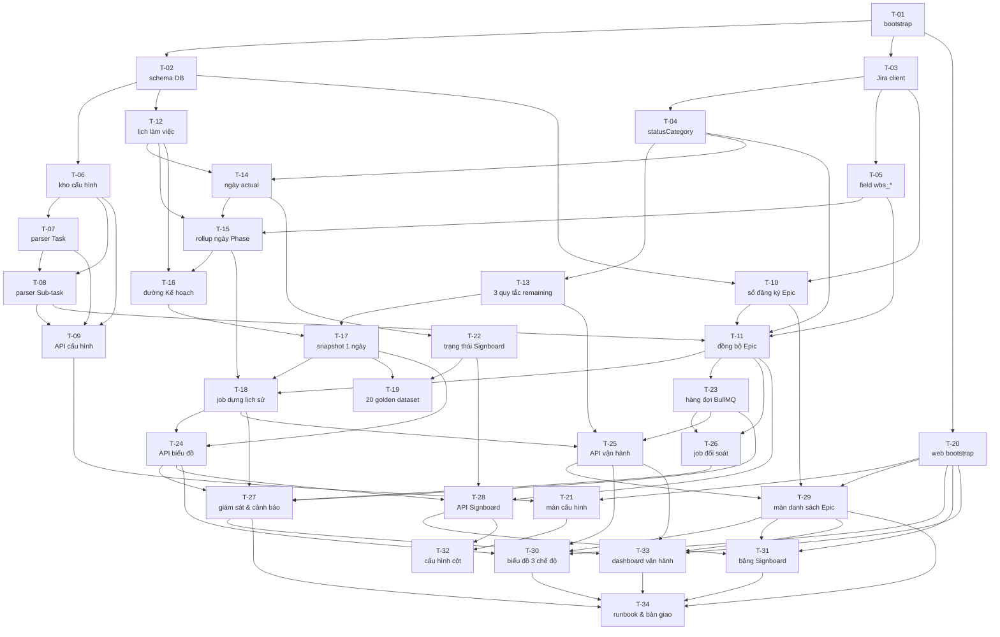

# Task cards — 4 giai đoạn gốc + bổ sung

34 card phủ **toàn bộ 12 tuần** (GĐ 1: 3 tuần, GĐ 2: 4.5 tuần, GĐ 3: 2 tuần, GĐ 4: 2.5 tuần).
**Cả 34 card đã làm xong** (`status: review`). Sau bàn giao có thêm các card
bổ sung T-35 (Signboard theo Sub-phase) và GĐ 5 — Lịch ngày nghỉ & kiểm tra
plan (T-36 → T-39, đã xong).

| Tài liệu | Vai trò |
|---|---|
| [PRD](../PRD_Burndown_Engine.md) | Nguồn sự thật về nghiệp vụ |
| [ARCHITECTURE.md](../ARCHITECTURE.md) | Cấu trúc thư mục, quy tắc phụ thuộc, bộ lệnh |
| [CONVENTIONS.md](./CONVENTIONS.md) | 14 quy ước bắt buộc, mọi card đều trích |
| [_TEMPLATE.md](./_TEMPLATE.md) | Mẫu card |

---

## 1. Bảng tổng hợp

### GĐ 1 — Nền tảng & Đồng bộ dữ liệu (xong)

| ID | Tiêu đề | Effort | Model | Phụ thuộc | Vùng chính |
|---|---|---|---|---|---|
| **T-01** | [Dựng monorepo, CI và bộ lệnh chuẩn](./T-01-bootstrap-monorepo.md) | medium | sonnet | — | toàn repo |
| **T-02** | [Schema PostgreSQL và migration đầu tiên](./T-02-database-schema.md) | high | sonnet | T-01 | `packages/db/prisma` |
| **T-03** | [Jira client — auth, phân trang, rate limit](./T-03-jira-client.md) | high | sonnet | T-01 | `packages/jira` |
| **T-04** | [Ánh xạ statusCategory](./T-04-status-category-mapping.md) | low | sonnet | T-03 | `engine/status` |
| **T-05** | [Ánh xạ custom field `wbs_*`](./T-05-jira-field-mapping.md) | medium | sonnet | T-03 | `packages/jira`, `config/` |
| **T-06** | [Kho cấu hình Phase — version + kế thừa](./T-06-phase-config-store.md) | high | opus | T-02 | `db/repositories`, `engine/config` |
| **T-07** | [Phân tách tiêu đề Task](./T-07-task-title-parser.md) | high | opus | T-06 | `engine/parser` |
| **T-08** | [Phân tách tiêu đề Sub-task](./T-08-subtask-title-parser.md) | high | opus | T-06, T-07 | `engine/parser` |
| **T-09** | [API cấu hình Phase + Xem thử](./T-09-phase-config-api.md) | high | sonnet | T-06, T-07, T-08 | `apps/api` |
| **T-10** | [Sổ đăng ký Epic + 7 API](./T-10-epic-registry.md) | high | sonnet | T-02, T-03 | `apps/api`, `db/repositories` |
| **T-11** | [Đồng bộ một Epic đầu-cuối](./T-11-epic-sync-pipeline.md) | high | opus | T-04, T-05, T-07, T-08, T-10 | `apps/worker` |

### GĐ 2 — Bộ máy dựng lại lịch sử & Màn hình cấu hình (xong)

| ID | Tiêu đề | Effort | Model | Phụ thuộc | Vùng chính |
|---|---|---|---|---|---|
| **T-12** | [Lịch làm việc và múi giờ](./T-12-working-calendar.md) | medium | opus | T-02 | `engine/calendar` |
| **T-13** | [Ba quy tắc tính khối lượng còn lại](./T-13-historical-remaining.md) | high | opus | T-04 | `engine/remaining` |
| **T-14** | [Ngày thực tế của Sub-task](./T-14-subtask-actual-dates.md) | medium | opus | T-04, T-12 | `engine/rollup` |
| **T-15** | [Tổng hợp ngày Phase + lịch sử dịch chuyển](./T-15-phase-rollup.md) | high | opus | T-05, T-12, T-14 | `engine/rollup` |
| **T-16** | [Đường Kế hoạch](./T-16-planned-line.md) | medium | opus | T-12, T-15 | `engine/planned` |
| **T-17** | [Dựng snapshot một ngày](./T-17-snapshot-builder.md) | high | opus | T-13, T-16 | `engine/snapshot` |
| **T-18** | [Job dựng lại lịch sử](./T-18-reconstruct-epic-job.md) | high | opus | T-11, T-15, T-17 | `apps/worker` |
| **T-19** | [20 golden dataset + property test](./T-19-golden-datasets.md) | high | opus | T-17, T-22 | `engine/test` |
| **T-20** | [Dựng app web](./T-20-web-bootstrap.md) | medium | sonnet | T-01 | `apps/web` |
| **T-21** | [Màn hình cấu hình Phase](./T-21-phase-config-screen.md) | high | opus | T-09, T-20 | `apps/web` |
| **T-22** | [Trạng thái Signboard + gộp ô](./T-22-signboard-status.md) | medium | opus | T-14 | `engine/signboard` |

### GĐ 3 — Job tự động & API (xong)

| ID | Tiêu đề | Effort | Model | Phụ thuộc | Vùng chính |
|---|---|---|---|---|---|
| **T-23** | [Hạ tầng hàng đợi BullMQ và vòng đời worker](./T-23-job-queue-infrastructure.md) | high | sonnet | T-11 | `apps/worker/queue` |
| **T-24** | [API đọc biểu đồ Burndown + cache](./T-24-burndown-read-api.md) | high | opus | T-17, T-18 | `apps/api`, `db/repositories` |
| **T-25** | [API vận hành Epic — giải thích số liệu](./T-25-epic-ops-api.md) | high | opus | T-13, T-18, T-23 | `apps/api` |
| **T-26** | [Job đối soát hằng tuần](./T-26-reconciliation-job.md) | medium | opus | T-11, T-23 | `apps/worker`, `engine/reconcile` |
| **T-27** | [Giám sát và cảnh báo — 11 ngưỡng](./T-27-observability-alerts.md) | high | sonnet | T-18, T-23, T-24, T-26 | `engine/alerts`, cả `api` lẫn `worker` |

### GĐ 4 — Giao diện & Bàn giao vận hành (xong)

| ID | Tiêu đề | Effort | Model | Phụ thuộc | Vùng chính |
|---|---|---|---|---|---|
| **T-28** | [API bảng Signboard](./T-28-signboard-api.md) | high | sonnet | T-11, T-22, T-24 | `apps/api`, `db/repositories` |
| **T-29** | [Màn hình danh sách Epic](./T-29-epic-list-screen.md) | medium | sonnet | T-10, T-20, T-25 | `apps/web/routes/epics` |
| **T-30** | [Biểu đồ Burndown 3 chế độ xem](./T-30-burndown-chart-screen.md) | high | opus | T-20, T-24, T-25, T-29 | `apps/web/routes/burndown` |
| **T-31** | [Bảng Signboard](./T-31-signboard-screen.md) | high | opus | T-20, T-28, T-29 | `apps/web/routes/signboard` |
| **T-32** | [Màn hình cấu hình cột Signboard](./T-32-signboard-column-config.md) | medium | sonnet | T-21, T-28 | `apps/web/routes/config-signboard` |
| **T-33** | [Dashboard giám sát vận hành](./T-33-ops-dashboard.md) | medium | sonnet | T-20, T-25, T-27, T-29 | `apps/web/routes/ops`, `apps/api` |
| **T-34** | [Runbook vận hành và bàn giao](./T-34-runbook-handover.md) | medium | sonnet | T-27, T-29, T-30, T-31, T-33 | `docs/`, `tools/smoke` |
| **T-35** | [Signboard nhóm cột theo Sub-phase](./T-35-signboard-sub-phase-layout.md) | medium | opus | T-22, T-28, T-31 | `apps/api`, `apps/web/routes/signboard`, `shared` |

> **T-35 là card bổ sung sau kế hoạch 34 card gốc** — thêm nhóm cột theo Sub-phase (`[Phase]` trước Function) cho bảng Signboard. Không có trong sơ đồ phụ thuộc bên dưới.

### GĐ 5 — Lịch ngày nghỉ & kiểm tra plan (bổ sung 2026-08, xong)

Bối cảnh: bảng `calendar_holiday` chưa từng có đường nạp dữ liệu ("card vận
hành" mà T-02/T-12 để lại), và màn Track new Epics gán cứng một lịch không tồn
tại — nên đường Kế hoạch cháy đều qua thứ 7/CN lẫn ngày lễ. Nghiệp vụ nền:
người VN làm, người JP (khách hàng) review, hai phía nghỉ khác ngày.

| ID | Tiêu đề | Effort | Model | Phụ thuộc | Vùng chính |
|---|---|---|---|---|---|
| **T-36** | [Import ngày nghỉ cho hai lịch VN / JP](./T-36-holiday-import.md) | medium | opus | T-02, T-12, T-23, T-24 | `apps/api`, `db/repositories`, `apps/web/routes/config-holidays` |
| **T-37** | [Kiểm tra plan rơi vào ngày nghỉ theo phía làm](./T-37-plan-conflict-check.md) | medium | opus | T-08, T-32, T-36 | `apps/api`, `apps/web`, migration `signboard_column.side` |
| **T-38** | [Sửa gán lịch cho Epic + cảnh báo lịch trên Burndown](./T-38-epic-calendar-fix.md) | low | opus | T-10, T-29, T-30, T-36 | `apps/web/routes/epics`, `apps/api`, `tools/db` |
| **T-39** | [Ngày làm bù (make-up workday)](./T-39-makeup-workday.md) | medium | opus | T-12, T-36 | `engine/calendar`, `db`, `apps/api`, `apps/web/routes/config-holidays` |

Ba card này không có trong sơ đồ phụ thuộc bên dưới.

---

## 2. Sơ đồ phụ thuộc

---

## 3. Làn sóng chạy song song

Card trong **cùng một làn sóng** không có phụ thuộc lẫn nhau và `touches` không chồng nhau — chạy song song được.

| Làn | Card | Song song | Ghi chú |
|---|---|---|---|
| **1** | `T-01` | 1 | Chặn mọi thứ. Phải xong trước |
| **2** | `T-02` · `T-03` · `T-20` | 3 | DB, Jira và web độc lập hoàn toàn |
| **3** | `T-04` · `T-05` · `T-06` · `T-10` · `T-12` | **5** | Làn rộng nhất |
| **4** | `T-07` · `T-13` · `T-14` | 3 | |
| **5** | `T-08` · `T-15` · `T-22` | 3 | T-08 nối tiếp T-07 trên cùng vùng `engine/parser` — đúng thiết kế |
| **6** | `T-09` · `T-11` · `T-16` | 3 | |
| **7** | `T-17` · `T-21` · `T-23` | 3 | |
| **8** | `T-18` · `T-19` · `T-26` | 3 | T-19 khoá hành vi toàn engine |
| **9** | `T-24` · `T-25` | 2 | Hai nhóm API đọc, tách file route riêng |
| **10** | `T-27` · `T-28` · `T-29` | 3 | Ba nhánh tách hẳn nhau: giám sát, API Signboard, màn hình Epic |
| **11** | `T-30` · `T-31` · `T-32` · `T-33` | **4** | Bốn màn hình, mỗi cái một thư mục route riêng |
| **12** | `T-34` | 1 | Runbook chỉ viết được khi mọi màn hình đã có thật |

**Đường găng:** `T-01 → T-03 → T-04 → T-14 → T-15 → T-16 → T-17 → T-18 → T-25 → T-29 → T-30 → T-34` — **12 card**.

Đáng chú ý: đường găng **không đi qua nhánh cấu hình** (`T-06 → T-07 → T-08 → T-09`) mà đi qua **nhánh tính toán thời gian**, rồi nối sang API vận hành và ba màn hình cuối. Muốn rút ngắn dự án thì tối ưu chuỗi `statusCategory → ngày actual → rollup → đường Kế hoạch → snapshot → job dựng lịch sử`, không phải chuỗi cấu hình.

Một điều đáng chú ý nữa: **T-29 (màn hình danh sách Epic) nằm trên đường găng** dù nghe như một màn hình phụ. Lý do đơn giản — không có nó thì không ai đưa được Epic vào hệ thống, nên mọi màn hình sau đó không có gì để hiện.

> Bảng làn sóng và đường găng trên được **tính tự động** từ trường `depends_on` của 27 card, không phải ước lượng bằng tay. Sửa `depends_on` thì phải tính lại. Bản kiểm tra cũng khẳng định **không có card nào trong cùng làn sóng đụng chung file**.

### Cảnh báo xung đột

| Vùng | Card đụng | Cách tránh |
|---|---|---|
| `packages/engine/src/parser/` | T-07, T-08 | **Không chạy song song.** T-08 dùng lại `normalize.ts` và `safe-regex.ts` của T-07 nên đã phụ thuộc T-07 — chạy tuần tự là đúng |
| `packages/shared/src/` | Gần như mọi card | **Mỗi card một file riêng**, chỉ thêm một dòng vào `index.ts`. Không gom type vào một file chung |
| `packages/db/prisma/` | T-02, T-10 | Card sau cần đổi schema → **tạo migration mới**, không sửa migration cũ. T-10 đã phải làm vậy để bổ sung hai cột `wbs_*` |
| `apps/api/src/routes/` | T-09, T-10, T-24, T-25 | Mỗi card một file route riêng, không chung file |
| `apps/worker/src/` | T-11, T-18, T-23, T-26 | T-23 chỉ đụng `queue/` và `main.ts`; T-26 chỉ đụng `jobs/reconcile-epic.job.ts` |
| `apps/web/src/routes/` | T-21, T-29 → T-33 | **Mỗi màn hình một thư mục con riêng.** T-20 đã dựng khung; card sau chỉ thêm thư mục và đổi đúng một dòng trong `app-routes.tsx` |
| `app-routes.tsx` + `nav-items.ts` | T-30 → T-33 | **Bốn card cùng làn sóng đều đụng hai file này** (mỗi cái thêm một dòng route và một mục điều hướng). Chạy song song thật thì sẽ xung đột — nhưng xung đột một dòng, gộp trong 30 giây. Đây là cái giá phải trả để có một chỗ duy nhất đọc ra được màn hình nào đã có thật |
| `apps/web/src/api/` | T-21, T-29 → T-33 | Mỗi nhóm endpoint một file hook riêng (`use-epics.ts`, `use-burndown.ts`, …), dùng chung `client.ts` |

---

## 4. Cột mốc

| Sau card | Kiểm chứng được điều gì |
|---|---|
| `T-11` | **Hết GĐ 1.** Đồng bộ được một Epic thật từ Jira vào PostgreSQL, tiêu đề đã phân tách |
| `T-18` | Dựng được đủ snapshot cho mọi ngày làm việc, chạy lại không nhân đôi |
| `T-19` | **Hết GĐ 2.** 20 golden dataset xanh — hành vi engine đã bị khoá |
| `T-21` | PM tự sửa cấu hình nhận diện Phase mà không cần dev |
| `T-24` | Frontend lấy được dữ liệu vẽ biểu đồ ở cả 3 chế độ xem, p95 ≤ 800ms |
| `T-27` | **Hết GĐ 3.** Đo được "job đêm ổn định 7 ngày" và "API p95 ≤ 800ms" — trước đó hai tiêu chí này không có cách nào kiểm chứng |
| `T-29` | PM tự đưa Epic vào hệ thống — cửa vào của cả sản phẩm |
| `T-31` | PM nhìn một Phase là biết function nào trễ ở khâu nào |
| `T-34` | **Hết GĐ 4, hết dự án.** DevOps ký nhận runbook, PM ký nhận UAT |

---

## 5. Quy ước dùng card

1. Nhận card → đổi `status: in_progress`, điền `owner` và `started_at`.
2. Đọc **cả** `prd_refs` trong frontmatter — PRD là nguồn sự thật, card chỉ trích phần liên quan.
3. **Không đụng file ngoài `touches`.** Cần đụng thêm → dừng lại, báo, cập nhật card trước.
4. Xong → `status: review`, điền `finished_at`, ghi 3–5 dòng vào mục *Đã làm gì*.
5. Mọi card đều phải qua checklist **C-14** trong CONVENTIONS.md.

> **Card không nói cách viết code.** Nó nói *phải làm được gì*, *quyết định nào đã chốt*, và *lỗi nào người trước đã vấp*. Cách cài đặt là việc của người làm.

### Điều rút ra từ GĐ 1

Ba lỗi chặn được tìm ra khi **làm**, không phải khi viết card:

| Lỗi | Card phát hiện | Vì sao card trước không thấy |
|---|---|---|
| `jira_issue` thiếu `wbs_start_date` / `wbs_end_date` | T-10 | Schema "trông đủ" cho tới khi có endpoint thật cần đọc từng Sub-task |
| `re2` chưa bao giờ chạy (`require` trong module ESM) | T-08 | Mọi test vẫn xanh; chỉ có lớp chống ReDoS là biến mất |
| Trường tên `toString` trùng `Object.prototype.toString` | T-11 | Chỉ lộ ra khi dữ liệu **thiếu** trường đó — test dựng dữ liệu đầy đủ luôn xanh |

Cả ba đều là **lỗi im lặng**. Bài học đưa vào các card sau: mục *Cạm bẫy đã biết* phải nêu rõ **lỗi nào không làm test đỏ**, vì đó mới là loại tốn thời gian nhất.

### Điều rút ra từ GĐ 2

| Lỗi | Card phát hiện | Vì sao khó lần ra |
|---|---|---|
| `pnpm typecheck` chưa bao giờ kiểm `apps/web` | T-20 | Root `tsconfig.json` không tham chiếu được tới project `noEmit`, nên `tsc --build` bỏ qua **cả một app** mà vẫn báo xanh |
| `pnpm typecheck` chưa bao giờ kiểm `packages/engine/test/` | T-19 | **Đúng lỗi trên, lần thứ hai.** Project engine chỉ khai `include: ["src/**/*.ts"]` |
| E2E chạy nhầm trên app của dự án khác | T-20 | `reuseExistingServer: true` + cổng mặc định 5173 của Vite. Test đỏ, nhưng đỏ vì lý do hoàn toàn khác với thứ đang kiểm |
| Playwright chặn nhầm mã nguồn của chính app | T-21 | Glob `**/api/**` khớp luôn `/src/api/client.ts`. Dấu vết duy nhất là một dòng console về MIME type |
| Ví dụ số trong card chia hết nên không chứng minh được gì | T-16 | 100 giờ chia 3 ngày ra số tròn, nên test "không làm tròn trong engine" xanh kể cả khi code có làm tròn |
| Dựng lại màn hình sau khi lưu xoá luôn thông báo "đã lưu" | T-21 | Đổi `key` để nạp bản mới cũng xoá sạch trạng thái mutation. Người dùng bấm Lưu rồi thấy không có gì xảy ra |

**Bốn trong sáu lỗi thuộc về bộ công cụ, không thuộc code nghiệp vụ.** Cùng một bài học lặp lại: *một lệnh báo xanh chỉ có nghĩa là nó chạy xong, không có nghĩa là nó đã kiểm thứ ta tưởng.* Trước khi tin một hàng rào nào đó, hãy **cố tình làm nó đỏ một lần**.

### Điều rút ra khi viết golden dataset (T-19)

Chín trên hai mươi bộ dữ liệu có kết quả tính tay **lệch với engine** ở lần chạy đầu. Cả chín lần đều là người viết test hiểu sai, không phải engine sai — và mỗi lần đều làm rõ thêm một điều mà tài liệu chưa nói hết.

Đó chính là giá trị của việc **tính tay thay vì chép đầu ra của code**. Chép đầu ra thì bộ test vẫn xanh 20/20 ngay lần đầu, và ba hiểu lầm kia sẽ nằm im trong đầu người viết cho tới lúc gây ra một bug thật.

### Điều rút ra từ GĐ 3 và GĐ 4

| Lỗi | Card phát hiện | Vì sao khó lần ra |
|---|---|---|
| Card sai, máy trạng thái đúng: `ACTIVE → BACKFILLING` không tồn tại | T-25 | Card viết dựa trên suy đoán về máy trạng thái; chỉ khi viết test mới lộ ra Epic đang chạy bình thường không cần đổi trạng thái |
| Hằng số tên `URL` che mất `URL` toàn cục | T-30 | 8/9 test đỏ với `URL is not a constructor` — thông báo chẳng liên quan gì tới thứ đang kiểm |
| `getByText('thêm được')` khớp luôn "không thêm được" | T-29 | Đếm ra 3 thay vì 2. Nếu nhãn viết hoa khác nhau thì test lại **xanh nhầm** |
| Regex `/pnpm ([a-z:]+)/` cắt `pnpm e2e` thành `pnpm e` | T-34 | Thiếu `0-9` trong lớp ký tự; test kiểm tài liệu tự nó bị lỗi |

**Ba trong bốn là lỗi của bộ test, không phải của sản phẩm.** Bài học lặp lại từ GĐ 2: hàng rào cũng cần được kiểm. Cách rẻ nhất là **cố tình làm nó đỏ một lần** trước khi tin nó.

### Ba ràng buộc được chặn bằng KIỂU DỮ LIỆU thay vì bằng ghi chú

Đây là mẫu lặp đi lặp lại ở GĐ 3 và có lẽ là điều đáng mang sang dự án khác:

| Ràng buộc | Cách chặn |
|---|---|
| Bộ giới hạn tốc độ Jira phải dùng Redis (C-7) | `buildJiraRateLimiter(redis)` **không có tham số nào** cho phép chọn bản in-memory |
| Job đối soát không được sửa dữ liệu | Cổng ghi **chỉ có hai phương thức**: ghi kết quả và đẩy job |
| Ô trống Signboard khác `NO_PLAN` | `{ present: false }` **không có trường `status`** — trộn lẫn là lỗi biên dịch |

Một dòng ghi chú thì người sau đọc hoặc không. Một API không cho làm sai thì không ai làm sai được.

### Lỗi im lặng nặng nhất của cả dự án — và nó lọt qua 790 test

Sau khi cả 34 card xanh, một **câu hỏi của người dùng** ("bấm Đồng bộ lại thì có tính lại toàn bộ không?") mới lôi nó ra.

API nhận `{from, to, full}` và đẩy đủ ba trường vào job. Worker khai kiểu nội dung job là `interface JobPayload { epicKey: string }`. Ba trường kia biến mất — không lỗi biên dịch, không lỗi chạy, không test nào đỏ. Runbook hướng dẫn `-d '{"full":true}'`, API trả `queued: true`, job chạy xong báo thành công, và **không có gì được dựng lại**.

| Vì sao không ai bắt được | |
|---|---|
| Test API | Lớp giả `enqueueSync(epicKey)` **bỏ luôn tham số thứ hai** — nội dung job không bao giờ được kiểm |
| Test worker | Gọi thẳng `reconstructEpic(deps, {from, to})` với dải ngày dựng sẵn, không đi qua chỗ dịch nội dung job |
| Test tài liệu | Kiểm `pnpm <lệnh>` có thật trong `package.json`, không kiểm được thân `curl` có nghĩa hay không |

Ba lớp test, mỗi lớp đúng phần của mình, và cái khe giữa chúng nuốt trọn ba trường dữ liệu.

**Cách vá — bằng kiểu dữ liệu, không bằng ghi chú:**

| Chỗ | Trước | Sau |
|---|---|---|
| Kiểu nội dung job | `interface JobPayload { epicKey }` — lời nói dối mà trình biên dịch tin | `type JobPayload = unknown`; đọc trường nào cũng phải qua `parseSyncJobPayload` |
| Hợp đồng HTTP | Khai riêng một bản zod ở `api-epic-ops.ts` | `syncJobPayloadSchema.omit({ epicKey: true })` — thêm trường vào yêu cầu mà quên thêm vào job là chuyện không xảy ra được |
| Lớp giả trong test | `enqueueSync(epicKey)` | Ghi lại cả nội dung job, và có test đối chiếu |

**Bài học:** một `interface` viết cho dữ liệu đến từ bên ngoài tiến trình (JSON trong Redis, thân HTTP, hàng đợi) **không phải là kiểm tra** — nó là một lời khẳng định không ai xác minh. Chỗ nào dữ liệu vượt ranh giới tiến trình thì chỗ đó phải `unknown` cộng một lần kiểm thật.

Và: **lớp giả bỏ qua tham số là một kiểu nói dối rất khó nhìn ra.** Nó làm test xanh trong khi thứ đang được kiểm chưa từng đi tới đích.

#### Vá xong tầng dưới thì lộ ra tầng trên

Hợp đồng API đã đúng, nhưng giao diện chỉ với tới **một** trong ba mức: `useResyncEpic` cố định `{ full: false }` ngay trong hàm, và nút bấm duy nhất nằm ở màn hình Giám sát, chỉ hiện cho Epic **đang lỗi**.

Tệ hơn: cả runbook lẫn màn hình Biểu đồ đều bảo *"bấm **Đồng bộ lại** ở màn hình Epic"*, mà màn hình Epic có bốn nút và **không nút nào tên như vậy**. Hướng dẫn chỉ tới hư không — tài liệu đọc vẫn xuôi, giao diện chạy vẫn tốt, chỉ người dùng là đi tìm mãi không ra.

Đã thêm hộp chọn ba mức và một hàng rào mới: `tools/arch-tests/docs.test.ts` quét mọi câu `Bấm **X** ở màn hình Epic` trong runbook rồi đối chiếu với nhãn nút thật trong `apps/web`. Đổi tên nút mà quên sửa tài liệu là đỏ ngay, kèm câu *"runbook chỉ tới nút X nhưng màn hình Epic không có nút nào tên vậy"*.

**Bài học:** hợp đồng API đúng **không có nghĩa** người dùng chạm tới được. Ba mức tồn tại trong schema mà chỉ một mức có nút bấm thì hai mức kia coi như không có. Và tài liệu nhắc tới nhãn trên giao diện cần được kiểm y như tài liệu nhắc tới tên lệnh.
